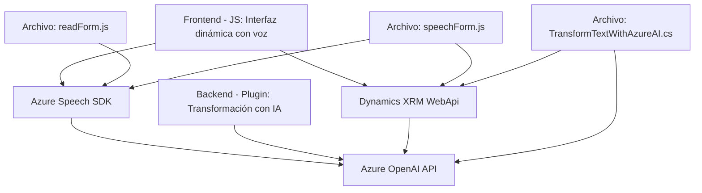

### Breve resumen técnico

El repositorio contiene componentes que corresponden a un sistema que integra reconocimiento de voz, síntesis de texto en voz, transformación de texto mediante IA (Azure OpenAI), y manipulación de datos y comunicación con el CRM de Dynamics 365. Está diseñado para mejorar la interacción de los usuarios con formularios dinámicos y APIs externas mediante tecnologías de voz e inteligencia artificial.

### Descripción de la arquitectura

1. **Tipo de solución:** 
   - Principalmente un **sistema híbrido** que combina **aplicación frontend** con funcionalidades avanzadas de reconocimiento y síntesis de voz, y la integración con un **plugin backend** en Dynamics CRM que transforma texto mediante el servicio Azure OpenAI.
   - También se integra con APIs personalizadas de Dynamics XRM que extienden la interacción con entidades CRM.

2. **Arquitectura:**
   - La solución está basada en un modelo **n-capas**:
     - **Capa de presentación:** Representada principalmente por los archivos frontend que manejan la interacción del usuario, el reconocimiento de voz y la síntesis de texto a voz.
     - **Capa de negocio:** Representada por el plugin backend que aplica reglas de transformación de texto mediante Azure OpenAI y las APIs personalizadas de Dynamics XRM.
     - **Capa de servicios:** Incluye dependencias externas como Azure Speech SDK, Azure OpenAI y APIs nativas de Dynamics CRM para llamadas de red.
   - Utiliza elementos acoplados con **servicios en la nube** (Azure Speech, Azure OpenAI) lo cual también sugiere un enfoque **decoupled** para ciertas funcionalidades.

3. **Dependencias o componentes externos presentes:**
   - **Azure Speech SDK:** Reconocimiento y síntesis de voz para frontend.
   - **Azure OpenAI API:** Transformación de texto en el backend.
   - **Dynamics 365 XRM WebApi:** Comunicación con el sistema CRM.
   - **CDN externo:** Para carga dinámica del SDK de voz en el navegador.

### Tecnologías usadas

1. **Lenguajes de programación:** 
   - JavaScript (para los archivos frontend).
   - C# (para el plugin backend).

2. **Frameworks/SDKs:** 
   - **Azure Speech SDK:** Sintetización y reconocimiento de voz.
   - **Azure OpenAI SDK/API:** Uso de GPT para normalización semántica.
   - **Dynamics 365 SDK:** Implementación de plugins con servicios XRM.

3. **Patrones de diseño utilizados:**
   - **Modularidad:** Separación clara de funciones con responsabilidades específicas.
   - **Service Integration:** Conexión con APIs externas (Azure Speech y OpenAI) para procesamiento de datos.
   - **Callback-driven pattern:** En la carga dinámica del SDK.
   - **Plugin Architecture:** Uso de `IPlugin` en Dynamics CRM.
   - **Microservicio externo:** Delegación a Azure OpenAI para transformación avanzada de datos.

---

### Diagrama Mermaid

---

### Conclusión final

La solución es un sistema híbrido de frontend y backend diseñado para mejorar la interacción con formularios dinámicos en Dynamics 365 utilizando tecnologías avanzadas como reconocimiento de voz, síntesis de texto y transformación semántica de datos mediante IA. Su arquitectura modular, basada en n-capas, permite una separación efectiva de responsabilidades, mientras que la integración con servicios externos como Azure Speech SDK y Azure OpenAI sugiere orientación hacia el uso de arquitecturas basadas en APIs.

Este enfoque es óptimo para aplicaciones empresariales donde se requiere un gran nivel de interactividad asistida y la integración con plataformas CRM (Dynamics). Algunas observaciones para mejorar:
- **Seguridad:** Evitar claves API hardcoded y optar por almacenamiento seguro como Azure Key Vault.
- **Resiliencia:** Incluir un manejo de errores más robusto para las dependencias externas (ej. Azure Speech y OpenAI).
- **Documentación adicional:** Incluir detalles específicos sobre el contexto de operación (ej. ejemplos de formularios compatibles).