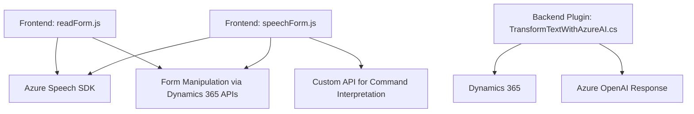

## Breve Resumen Técnico

El repositorio contiene diferentes archivos implementados con distintas responsabilidades. Estos archivos se enfocan en facilitar interacciones entre formularios de Microsoft Dynamics 365 y servicios externos, como Azure Speech SDK y Azure OpenAI. Identificamos dos componentes principales: un **frontend** basado en JavaScript (para entrada/salida de voz y manipulación de formularios) y un **backend/plugin** en C# (que extiende Dynamics 365 mediante lógica adicional).

---

## Descripción de Arquitectura

La arquitectura presenta una solución híbrida:
1. **Frontend (readForm.js y speechForm.js)**:
   - Implementación modular basada en funciones que definen la lógica de voz y manipulación de formularios desde el cliente.
   - Consumo de servicios en la nube utilizando el SDK de Azure Speech y APIs de Dynamics 365.

2. **Backend/Plugin (TransformTextWithAzureAI.cs)**:
   - Extensión de Dynamics 365 mediante plugins, integrando el servicio Azure OpenAI para transformar textos según normas definidas.

### Tipo de arquitectura:
- **N capas**: La solución presenta una separación entre cliente (frontend), servidor (Dynamics 365), y servicios en la nube (Azure).
- **Arquitectura orientada a servicios**: Dependencia en APIs y servicios externos, como Azure Speech SDK y Azure OpenAI.

---

## Tecnologías Usadas

1. **Frontend (JavaScript)**:
   - **SDK de Azure Speech**: Para sintetizar texto en voz y realizar reconocimiento de voz.
   - **Microsoft Dynamics 365 APIs**: Para manipulación de formularios dentro de Dynamics (Xrm.WebApi).

2. **Backend (C#)**:
   - **Microsoft Dynamics CRM SDK**: Extensión utilizando el framework proporcionado por Dynamics.
   - **JSON Handling**: Utilización de `System.Text.Json` y `Newtonsoft.Json` para el manejo de objetos JSON.
   - **Azure OpenAI API**: Llamadas HTTP para procesamiento de lenguaje natural.

---

## Diagrama **Mermaid**

---

## Conclusión Final

La solución implementada es un **sistema modular** compuesto por archivos JavaScript para la interacción del cliente, acompañado de un plugin en el servidor que amplía la funcionalidad de Dynamics 365. La arquitectura aprovecha servicios externos (Azure Speech y Azure OpenAI) para habilitar características avanzadas, como la síntesis de voz y procesamiento de lenguaje natural. Se adapta bien a escenarios empresariales donde se requiere acceso a formularios por interacción vocal y transformación de datos en tiempo real.

Este enfoque híbrido (con frontend dinámico y backend extendido) sigue el patrón de **n capas** y aprovecha servicios en la nube como parte de su arquitectura orientada a servicios.