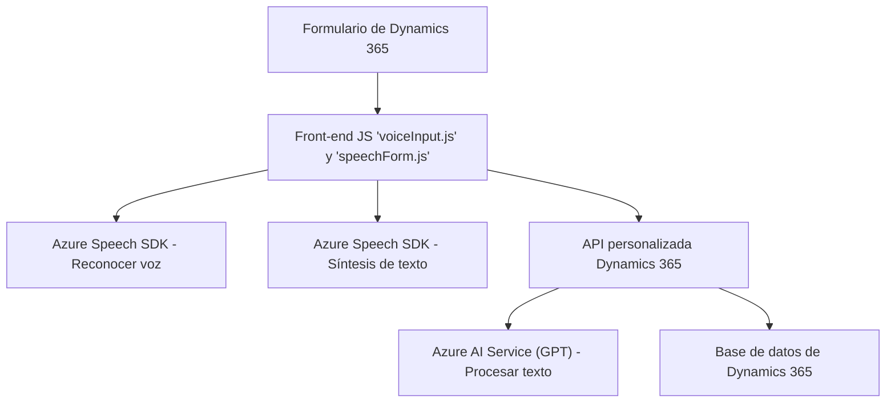

### Análisis y explicación detenida

#### Breve resumen técnico
El repositorio ofrece una solución que integra el reconocimiento de voz y procesamiento de texto en el contexto de formularios de **Microsoft Dynamics 365**. Hace uso del **Azure Speech SDK** y el **OpenAI Service** para realizar tareas avanzadas de síntesis y transformación textual. En general, parece estar diseñado para mejorar la accesibilidad y automatizar la entrada de datos en formularios.

---

### Descripción de arquitectura
La solución está organizada en tres partes:
1. **Frontend (JavaScript)**: Realiza operaciones relacionadas con el reconocimiento de voz y la manipulación de datos directamente sobre Dynamics 365. Usa el contexto del formulario (`executionContext`) para obtener y manipular información relevante del mismo. Además, está diseñado para interactuar con APIs externas como Azure Speech y, posiblemente, APIs personalizadas.

2. **Backend (Plugin en C#)**: Proporciona un Plugin para Dynamics 365 que emplea el servicio **Azure OpenAI**. Este transforma texto usando reglas predefinidas y devuelve un resultado en formato JSON para ser usado por el sistema. Sigue las reglas de diseño típicas de los plugins de Dynamics CRM.

---

### Arquitectura
La solución presenta una **arquitectura híbrida** compuesta por:
1. **Frontend cliente ligero**: Código JavaScript integrado en Dynamics 365, que interactúa directamente con los formularios en el navegador y en tiempo real.
2. **Backend con extensibilidad orientada a eventos**: El archivo `TransformTextWithAzureAI.cs` implementa un plugin para Dynamics 365, que actúa como un "extensión funcional" del backend del CRM, procesando datos y realizando llamadas a servicios externos.
   
A nivel conceptual, la solución podría clasificarse como una **arquitectura de n capas**:
- **Capa de presentación**: Código frontend para integración con el cliente.
- **Capa de negocio**: Lógica proporcionada por el plugin y Dynamics 365.
- **Capa de servicio**: Conexión a servicios externos como Azure OpenAI y Speech SDK.

---

### Tecnologías y patrones usados
1. **Tecnologías**
   - **Frontend**
     - JavaScript
     - Azure Speech SDK (obtenido de una URL específica)
     - Microsoft Dynamics 365 (contexto `formContext`, API).
   - **Backend**
     - Microsoft Dynamics SDK para desarrollo de Plugins (`Microsoft.Xrm.Sdk`, `Microsoft.Xrm.Sdk.Query`).
     - .NET Core o Framework con soporte para C#.
     - Azure OpenAI Service (procesamiento de texto avanzado).
     - `Newtonsoft.Json.Linq` y `System.Text.Json` para manipulación de JSON.

2. **Patrones**
   - **Event-driven**: Integración desencadenada con eventos en el contexto del formulario.
   - **Modularidad**: División del código en funciones con tareas específicas (S.O.L.I.D.).
   - **Factory Pattern**: (Posible en el Backend) para la gestión de instancias HTTP con Azure OpenAI.
   - **Dynamic Loader Pattern**: La carga del SDK de Azure Speech se realiza dinámicamente cuando es necesario.

---

### Dependencias o componentes externos
1. **Azure Speech SDK**: Para sintetizar texto a voz y realizar reconocimiento de voz.
2. **Azure OpenAI Service**: Para transformación de texto mediante aprendizaje automático (GPT táctico).
3. **Microsoft Dynamics SDK APIs**: Exposición para manejo de datos de formularios y flujo de trabajo mediante plugins.
4. **Navegador cliente**: Usa APIs del navegador para operaciones contextuales como cargar el SDK.

---

### Diagrama **Mermaid**
Diagrama para ilustrar la interacción entre componentes. Usa un enfoque `graph TD` para mantener claridad semántica en GitHub.

---

### Conclusión final
Este repositorio implementa una solución avanzada específicamente diseñada para trabajar con Dynamics 365, ofreciendo soporte para accesibilidad (reconocimiento de voz) y automatización (procesamiento de texto con Azure AI). La combinación de tecnologías líderes como **Azure Speech SDK** y **OpenAI Services** garantiza una capacidad robusta para manejar casos de uso complejos tanto en el lado del cliente como en el backend del CRM. La arquitectura modular y el uso de patrones de integraciones externas hacen de esta solución una implementación escalable y bien diseñada para entornos empresariales.