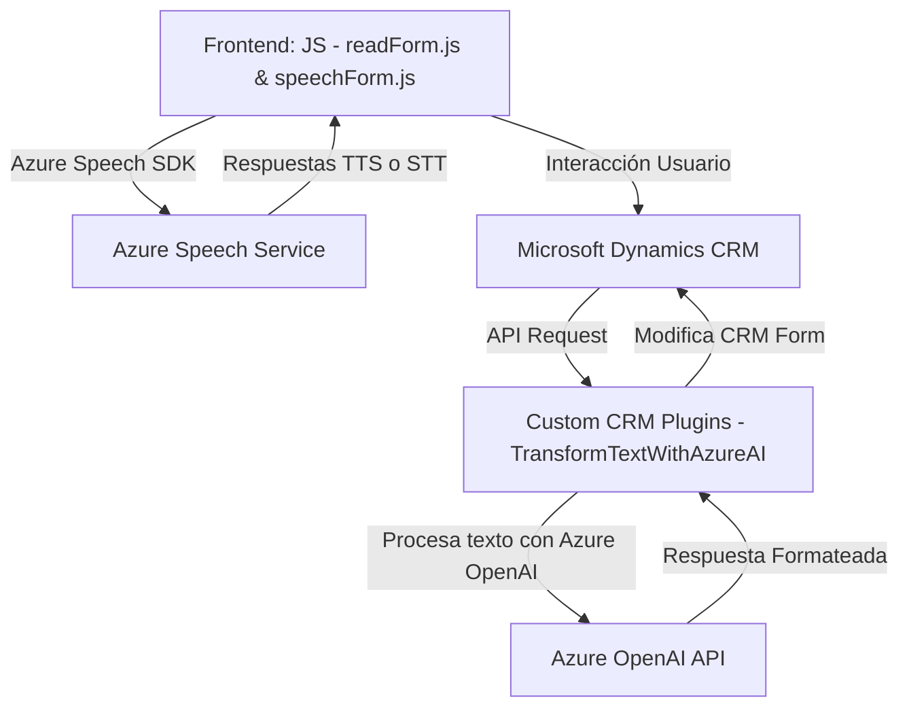

### Breve resumen técnico:
El repositorio presenta partes integradas de una solución enfocada en la interacción entre una interfaz web (frontend) y un entorno de Microsoft Dynamics CRM en combinación con servicios de Azure. Maneja comunicación basada en voz para input/output (Azure Speech SDK) y procesamiento de datos vía inteligencia artificial (Azure OpenAI).

---

### Descripción de Arquitectura:
La solución tiene elementos de **arquitectura multicapa mezclada con microservicios**:
- **Frontend**: Implementación en JavaScript que integra APIs externas (Azure Speech SDK y CRM Web API), actuando como una capa de consumo y presentación.
- **Backend CRM**: Plugins que actúan como microservicios para procesamientos específicos, como el trabajo con Azure OpenAI.
  
Aunque se organiza principalmente como una solución adherida al esquema Dynamics CRM, incluye componentes externos con patrones microservicio. Sin embargo, hay una clara dependencia centralizada en el entorno Dynamics CRM.

---

### Tecnologías, Frameworks y Patrones utilizados:
#### Tecnologías:
- **Frontend**: JavaScript con integración directa de servicios remotos como Azure Speech SDK.
- **Backend**: C# para la implementación de plugins dentro de Dynamics CRM, soportado por ASP.NET Framework.
- **Azure Speech SDK**: Para conversión de texto-a-voz y voz-a-texto.
- **Azure OpenAI API**: Usada en backend para IA avanzada.
- **Microsoft Dynamics CRM**: Base de la solución para el procesamiento y almacenamiento de datos.
  
#### Patrones:
- **Callback Pattern**: Uso en funciones para manejar asíncronía al cargar SDKs o hacer llamadas.
- **Builder Pattern**: Configuración de Azure Speech SDK.
- **Delegación**: Plugins como intermediarios que delegan el procesamiento relevante a servicios Azure.
- **Data Mapping**: Mapeos entre transcripciones y los atributos visibles/form context de CRM.
- **Microservices**: Interacción entre el frontend, los plugins del backend y APIs externas.

---

### Dependencias o componentes externos:
1. **Azure Speech SDK**:
   - Para síntesis de voz y reconocimiento de voz.
2. **Azure OpenAI API**:
   - Para procesamiento y estructuración avanzada de texto para lógica CRM.
3. **Microsoft Dynamics CRM WebAPI**:
   - Para interacción con datos y entidades del entorno CRM.
4. **Entorno local o nube de CRM**:
   - Los plugins dependen de Microsoft Dynamics y los servicios externos.
5. **Librerías .NET comunes**:
   - Uso de Newtonsoft JSON y HttpClient para requests y manejo de JSON.

---

### **Diagrama Mermaid válido (GitHub-compatible):**

---

### Conclusión final:
La solución presentada combina front-end dinámico con funcionalidades avanzadas de reconocimiento y síntesis de voz, además del backend en Microsoft Dynamics CRM con inteligencia artificial de Azure OpenAI. Se utiliza una estructura multicapa complementada con microservicios en las capas superiores (plugins y APIs). Es una implementación modular con una dependencia crítica en los recursos externos (Azure) y estructura centralizada en el entorno CRM.