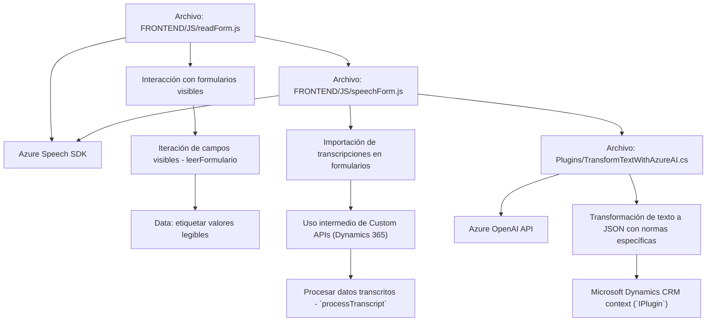

### Breve Resumen Técnico:
El repositorio parece ser parte de un sistema que integra capacidades de reconocimiento de voz, síntesis de voz y transformación de texto mediante IA con Microsoft Dynamics 365. Usa servicios de Azure para manejar lógica avanzada de inteligencia artificial, como Azure Speech SDK y Azure OpenAI. Se enfoca en la manipulación de formularios y texto estructurado dentro de un entorno empresarial CRM.

### Descripción de Arquitectura:
1. **Tipo de solución**: La solución es híbrida, donde existe una integración de frontend (scripts JavaScript para formularios y manejo de voz) y backend (plugins .NET en Dynamics 365). Está diseñada para extender las capacidades de Dynamics CRM con IA y APIs de Azure.
2. **Arquitectura predominante**: La arquitectura sigue un enfoque de **n capas**. 
   - La capa de presentación es manejada por scripts en el frontend.
   - La capa de lógica de negocio está implementada con plugins y procesamiento de datos (como el uso del plugin para Azure AI).
   - La capa de servicios integra APIs externas como Azure Speech SDK y Azure OpenAI.
   - Existe una fuerte presencia de **modularidad** y **patrones basado en eventos**.
3. **Patrones utilizados**:
   - **Orientación a eventos**: Principalmente en las interacciones con SDKs de reconocimiento y síntesis de voz.
   - **Integración de servicios externos**: La solución depende de Azure Speech SDK y OpenAI para expandir las capacidades del sistema.
   - **Modularidad**: Las funciones y clases manejan tareas específicas (p. ej., manejo de transcripción, aplicación de valores a formularios según tipos de datos).
   - **Plugin-based architecture**: En la capa de Dynamics CRM para extender funcionalidades mediante plugins personalizados.

### Tecnologías Usadas:
- Frontend:
  - **JavaScript**: Para manipulación y extracción de datos de formularios.
  - **Llamadas a APIs externas**: Azure Speech SDK (para síntesis y reconocimiento de voz).
  - Integración con Dynamics CRM (`Xrm.WebApi`).
- Backend:
  - **C#/.NET Framework**: Implementación de plugins de Dynamics CRM.
  - **Microsoft Dynamics SDK** (`Microsoft.Xrm.Sdk`): Interacción con el CRM.
  - **Azure OpenAI API**: Consumo de servicios de procesamiento y transformación de texto.
  - **HttpClient** y librerías de JSON (`Newtonsoft.Json.Linq`, `System.Text.Json`).
- Servicios Externos: 
  - **Azure Speech SDK**: Para reconocimiento y síntesis de voz.
  - **Azure OpenAI**: Para transformación de texto en JSON estructurado.

### Dependencias o Componentes Externos:
1. **Microsoft Dynamics 365 SDK**: Manipulación de datos del CRM y ejecución del plugin en el contexto específico de cada formulario.
2. **Azure SDKs**:
   - **Azure Speech SDK**: Para sintetizar voz y reconocer entradas por voz.
   - **Azure OpenAI API**: Para IA avanzada de procesamiento de texto.
3. **Librerías de manipulación de JSON**:
   - `Newtonsoft.Json.Linq` y `System.Text.Json`.
4. **HTTP Services**: Para consumir APIs externas.

### Diagrama Mermaid:

### Conclusión Final:
El repositorio muestra una solución robusta para la integración de capacidades de IA en un entorno empresarial (Dynamics 365). Usa una infraestructura híbrida de frontend y backend, con una arquitectura modular basada en n capas. La dependencia directa de servicios de Azure permite extensibilidad y escalabilidad mientras aprovecha el poder de la IA. La solución está bien estructurada y modular, lo cual es ideal para componentes reutilizables en entornos de CRM personalizados.