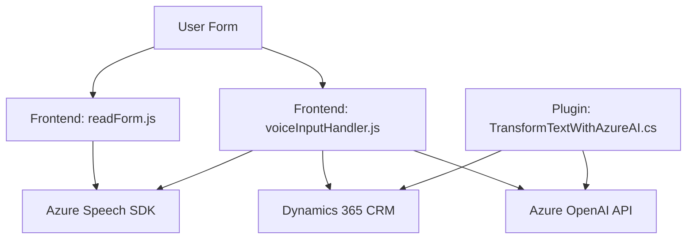

**Análisis de la solución presentada:**

---

### **Breve resumen técnico:**
- La solución consiste en un sistema modular que incluye un **frontend**, un **plugin de Dynamics CRM**, y una interacción avanzada con servicios externos mediante los SDK y APIs de **Azure Speech** y **Azure OpenAI**.
- Se implementan funcionalidades como síntesis de voz, transcripción, procesado de texto y automatización de mapeo y actualización de formularios en Dynamics 365.

---

### **Descripción de arquitectura:**
Este sistema está basado en una arquitectura **n-capas** con fuerte integración a servicios externos.  
1. **Frontend:** Contiene lógica de negocio para la síntesis de voz y transcripción, utilizando servicios como el SDK de Azure Speech, y actualiza formularios en Dynamics 365 mediante un mapa de campos.
2. **Backend/Plugin CRM:** Extiende funcionalidades del Dynamics CRM mediante plugins, usando Azure OpenAI para transformar y estructurar textos.

La arquitectura no es estrictamente microservicios ni monolítica; se alinea más con una arquitectura "modular distribuida" usando SDK y plugins de Dynamics.

---

### **Tecnologías usadas:**
- **Frontend:**  
  - JavaScript (para manipular DOM y cargar SDKs dinámicamente).
  - Azure Speech SDK (transcripción y síntesis de voz).
  - Dynamics CRM Web API y objetos del modelo como `executionContext`.

- **Backend/Plugins:**  
  - C# (`Microsoft.Xrm.Sdk`) para lógica del plugin.
  - Azure OpenAI SDK o REST API para transformar textos.
  - Dependencias de .NET (`System.Text.Json`) para manipular JSON.
  - HTTP Client para comunicación con APIs externas.

---

### **Diagrama Mermaid válido para GitHub**

---

### **Conclusión final:**
La solución es una arquitectura modular orientada a servicios (SOA), donde:
1. **Frontend** utiliza SDKs externos (Azure Speech) para mejorar la experiencia de usuario mediante voz y automatizaciones.
2. **Plugins** en el backend/capa CRM integran procesamiento de texto con Azure OpenAI, manejando datos estructurados.
3. Las dependencias externas (Azure Speech, Dynamics CRM API, Azure OpenAI) son cruciales, garantizando escalabilidad y funcionalidad avanzada.

Es una implementación robusta pero depende en gran medida de servicios en la nube (Azure). Las credenciales y puntos de acceso deben ser gestionados de forma segura, evitando exposición directa en el código.