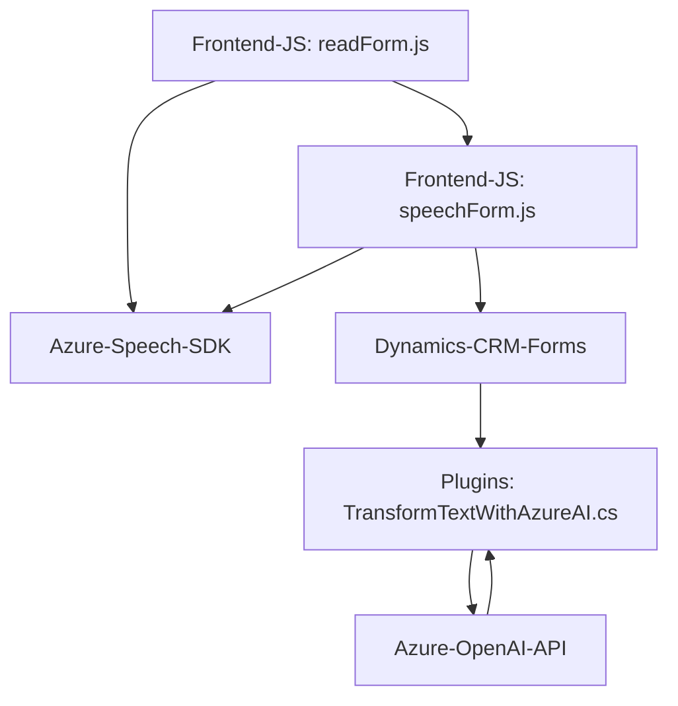

### Breve resumen técnico
El repositorio combina diferentes tecnologías para ofrecer funciones de entrada y salida de voz en un formulario, integradas con un sistema CRM basado en Microsoft Dynamics. Además, incluye un plugin que utiliza la API de Azure OpenAI para procesar y estructurar los datos. Se emplea Azure Speech SDK para funcionalidades de voz y Dynamics CRM para la gestión de formularios.

---

### Descripción de arquitectura
El sistema se basa en una arquitectura **multi-capa** y **cliente/servidor**:
1. **Capa de presentación (Frontend)**: Scripts JS interactúan directamente con el usuario a través de un navegador, facilitando las funcionalidades de entrada y salida de voz y su integración con formularios en Dynamics CRM.
2. **Capa de lógica (Servidor - Plugin)**: Plugins en Microsoft Dynamics CRM procesan texto con reglas específicas mediante la API de Azure OpenAI.
3. **Capa de integración**: Comunicación con servicios externos (Azure Speech SDK y Azure OpenAI API) para capturar voz y procesar texto.

El repositorio implementa módulos funcionales desacoplados para extracción, procesamiento y síntesis de datos.

---

### Tecnologías usadas
1. **Frontend**:
   - **JavaScript**: Desarrollo de la lógica de interacción en formularios y voz.
   - **Azure Speech SDK**: Entrada y salida de voz.
   - **Dynamics Form API**: Manejo del contexto y atributos de formularios en CRM.

2. **Backend (Plugins)**:
   - **C# (.NET)**: Implementación de la lógica del plugin.
   - **Microsoft Dynamics CRM SDK**: Desarrollo de plugins y acceso a los servicios de Dynamics CRM.
   - **Azure OpenAI API**: Procesamiento y transformación de texto.
   - **System.Text.Json**: Para manipulación de datos JSON.

3. **Integración**:
   - **HTTP Client**: Comunicación con servicios Azure.
   - **Newtonsoft.Json**: Procesamiento de estructuras JSON.

---

### Diagrama Mermaid válido para GitHub

---

### Conclusión final
Este repositorio está diseñado para interactuar de manera eficiente con un sistema CRM y facilitar el enfoque conversacional mediante entrada/salida de voz y procesamiento avanzado. La solución emplea una arquitectura multinivel, con una capa frontend para la interacción del usuario, una capa de negocio en el frontend y el backend (incluyendo los plugins en Dynamics CRM), y una capa de integración con servicios en la nube.

Fortalezas:
- Modularidad y desacople: Las funcionalidades de entrada/salida y procesamiento son independientes y reutilizables.
- Uso de servicios externos (Microsoft Azure Speech y OpenAI) garantiza escalabilidad y capacidades avanzadas.

Recomendación:
Se podrían mejorar los aspectos de configuración y manejo de dependencias, como manejo de errores más detallado y abstracción para el acceso a APIs externas, lo que brindaría mayor flexibilidad y consistencia en la implementación.