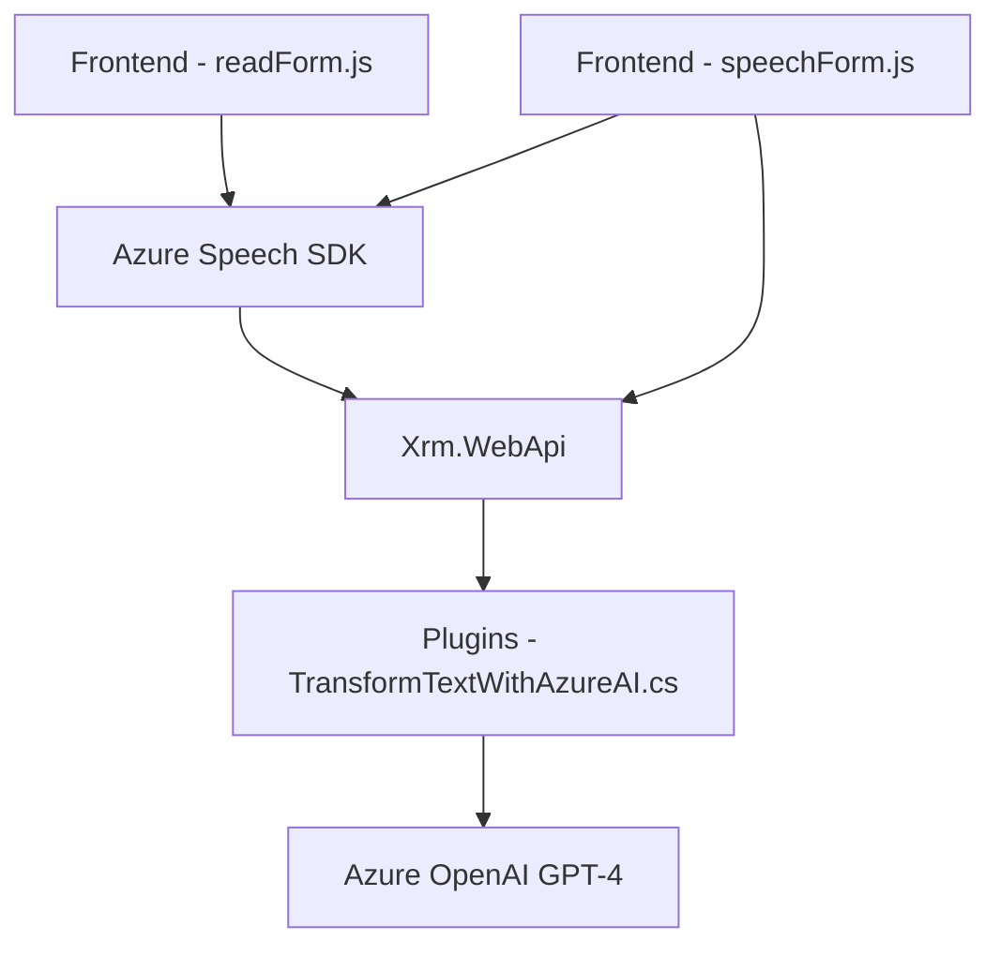

# Resumen técnico

Este repositorio es parte de un sistema de aplicaciones que integra capacidades de reconocimiento y síntesis de voz, así como transformación avanzada de texto, utilizando servicios de Azure Speech SDK y OpenAI de Azure. Los componentes están distribuidos en diferentes partes del sistema, incluyendo frontend y backend, para procesar datos dinámicos en formularios asociados a Microsoft Dynamics CRM.

---

# Descripción de la arquitectura

El sistema tiene una arquitectura **n-capas** con integración modular. Las capas están bien segmentadas:
1. **Frontend**:
   - Scripts desarrollados en JavaScript que implementan reconocimiento y síntesis de voz.
   - Se encargan de la interacción con el usuario y utilizan el Azure Speech SDK para la captura y reproducción de audio, generando una experiencia interactiva.
   - Llama a APIs personalizadas y procesa transcripciones de voz en tiempo real.
   
2. **Plugins de backend**:
   - Código escrito en C# que interactúa directamente con el entorno de Microsoft Dynamics CRM usando el patrón de plugins.
   - Su propósito es procesar texto mediante llamadas REST al servicio Azure OpenAI, transformándolo en JSON estructurado.

Este diseño permite desacoplamiento, modularidad, y escalabilidad. Además, aprovecha tecnologías de inteligencia artificial para enriquecer la funcionalidad.

---

# Tecnologías usadas

1. **Frontend**:
   - **JavaScript (ES6+)**: Scripts de alto nivel con funciones modulares y callbacks para manejar lógica avanzada.
   - **Azure Speech SDK**:
     - Reconocimiento y síntesis de voz.
     - URL de script incluido: `https://aka.ms/csspeech/jsbrowserpackageraw`.
   - **Browser APIs**: APIs modernas para acceder a micrófono y reproducir audio.

2. **Backend**:
   - **C# (.NET Framework)**: Plugins de Microsoft Dynamics CRM implementados con el interfaz `IPlugin`.
   - **HttpClient**: Realiza llamadas REST al servicio Azure OpenAI.
   - **Azure OpenAI Service**:
     - Modelos GPT-4o para transformación de texto.
     - Manipulación de texto y salida estructurada en JSON.
   - **JSON Manipulation**: Uso de `System.Net.Http`, `Newtonsoft.Json.Linq`, y `System.Text.Json`.

---

# Dependencias y componentes externos

1. **Servicios externos**:
   - **Azure Speech SDK**: Para síntesis y reconocimiento de voz en el frontend.
   - **Azure OpenAI**:
     - Transformación avanzada de texto en el backend.
     - Conexión garantizada mediante credenciales y endpoints RESTful.

2. **APIs asociadas a Microsoft Dynamics CRM**:
   - `IPluginExecutionContext`: Gestión del contexto de ejecución en Dynamics CRM.
   - `Xrm.WebApi`: Manipulación de datos del formulario en el frontend.

3. **Internas**:
   - Funcionamiento del *`formContext`* para acceder a datos de formulación dinámica en el frontend.

---

# Diagrama Mermaid

---

# Conclusión final

Este sistema combina integración avanzada de voz e inteligencia artificial en formularios de Microsoft Dynamics CRM. Utiliza tecnologías modernas como el **Azure Speech SDK** y **Azure OpenAI** para interactuar con usuarios, procesar transcripciones de voz, y transformar datos. Su arquitectura basada en **n-capas** con separación de responsabilidades asegura mantenibilidad y escalabilidad, mientras el uso de servicios en la nube amplía la capacidad del sistema para manejar complejidades como procesamiento de lenguaje natural.