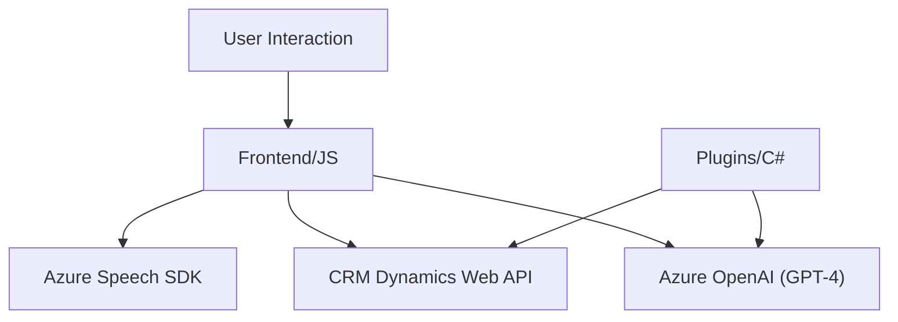

### Breve resumen técnico:
El repositorio analiza y procesa entradas de voz y datos de formularios utilizando la combinación de **Azure Speech SDK**, **Dynamics CRM Web API**, y **Azure OpenAI API**. Está compuesto por tres elementos funcionales que integran reconocimiento de voz, síntesis de texto y transformación inteligente de datos.

---

### Descripción de arquitectura:
1. **Tipo de solución:**  
   La estructura sugiere la implementación de un sistema híbrido:
   - **Frontend** basado en funciones en JavaScript para interactuar con formularios y reconocimiento de voz.
   - **Plugins** para la lógica empresarial integrada en Dynamics CRM.
   - Conexión **Backend/API** con Azure OpenAI.

2. **Patrones de diseño:**  
   - Modularidad funcional: Las funciones están separadas por responsabilidades específicas (lectura/extracción de datos, reconocimiento de voz, transformación).
   - Delegate pattern: Uso de callbacks para inicializar SDKs y ejecutar procesos asincrónicos.
   - API Integration: Conexión directa con servicios externos (Azure Speech y Azure OpenAI).

3. **Tipos de arquitectura:**  
   - Frontend: Forma parte de una solución de capa única (cliente web interactivo).
   - Backend/plugin: Seguiría una arquitectura orientada a eventos por ser parte del modelo de Plugins de Dynamics CRM.
   - Globalmente, la solución utiliza ambos enfoques: **monolito dentro del plugin** y **modelo distribuido/microservicios** para servicios de Azure y SDKs externos.

---

### Tecnologías usadas:
1. **Frontend:**  
   - Lenguaje: JavaScript ES6.  
   - Biblioteca externa: Azure Speech SDK.  
   - API del navegador: DOM manipulation y contextos de formularios (formContext/executionContext).

2. **Plugins Backend:**  
   - Lenguaje: C# (framework .NET).  
   - Dependencias API: `Microsoft.Xrm.Sdk` y `Newtonsoft.Json`.  
   - Servicio externo: Azure OpenAI (GPT-4).  
   - Interacción dinámica: CRM Dynamics Plugin architecture.

3. **Servicios de nube:**  
   - **Azure Speech SDK**: Para reconocimiento y síntesis de voz.  
   - **Azure OpenAI GPT-4**: Transformación textual a JSON.  
   - **CRM Dynamics Web API**: Interacción y operaciones con datos de formularios.

---

### Diagrama **Mermaid** válido para GitHub:

---

### Conclusión final:
La solución se construye como un sistema distribuido pero interdependiente. El módulo frontend gestiona la interacción entre el usuario y formularios, usando Azure Speech SDK para voz y puede interactuar con el plugin backend en Dynamics CRM. Los plugins extienden la funcionalidad mediante Azure OpenAI para transformar datos y cumplen roles dentro de Dynamics CRM.

El diseño aprovecha la potencia de servicios de nube como **Speech SDK** y **OpenAI**, mientras separa las responsabilidades del frontend, backend y servicios externos, lo que facilita escalabilidad y mantenimiento. Aunque parte del código usa patrones monolíticos en el plugin, tiene una integración efectiva en un entorno CRM moderno.