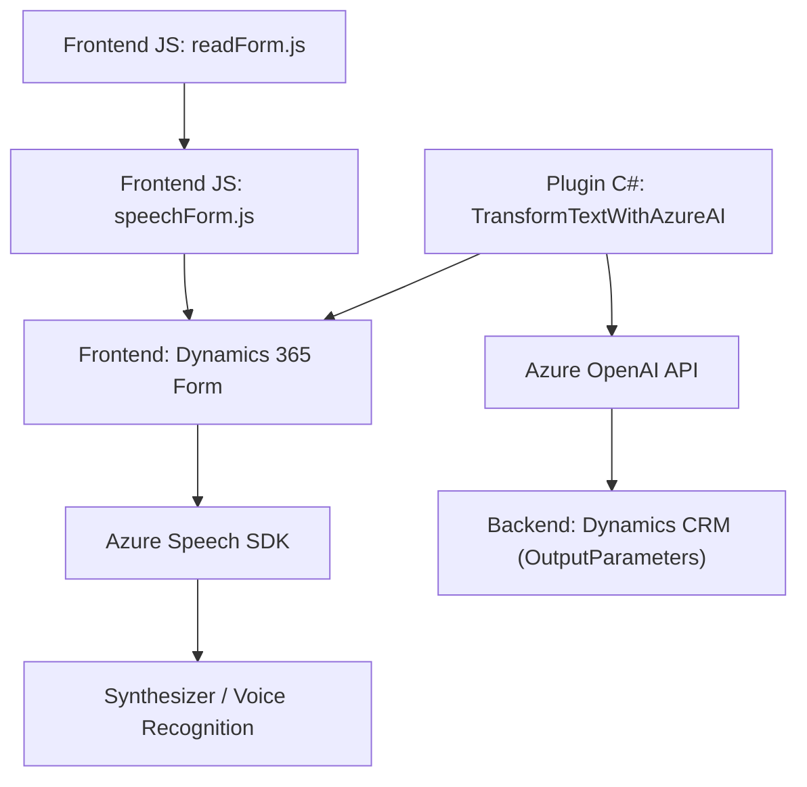

### **Análisis del repositorio**

#### **Breve resumen técnico**
El repositorio contiene tres archivos principales que están diseñados para integrar servicios de Azure, específicamente **Azure Speech SDK** y **Azure OpenAI API**, en formularios y procesos de la plataforma Microsoft Dynamics 365. Este sistema parece implementar funcionalidades relacionadas con el reconocimiento de voz, síntesis de texto a voz y procesamiento automático de entrada de voz en formularios mediante reglas preestablecidas o usando Inteligencia Artificial.

---

### **Descripción de la arquitectura**
La solución usa una arquitectura **multicapa con integración de servicios externos**. Se puede dividir en las siguientes partes:
1. **Frontend (Capas de presentación y lógica de negocio):**
   - Los archivos `readForm.js` y `speechForm.js` actúan como scripts que permiten interactuar directamente con el frontend de Dynamics 365.
   - Estas capas en el frontend reciben datos de formularios, procesan entradas de voz en tiempo real y transforman las interacciones para mejorar la accesibilidad y la automatización de tareas.
   
2. **Backend (Plugin Service Layer):**
   - El archivo `TransformTextWithAzureAI.cs` implementa un plugin dentro de Dynamics CRM con funciones backend que gestionan eventos de ejecución del CRM (como operaciones de creación o actualización de entidades) y que interactúa directamente con una API de Azure OpenAI. Esta capa se encarga de realizar la transformación de texto en el contexto de negocio y devolver información estructurada.

3. **Servicios Externos:**
   - Integración con **Azure Speech SDK** para funcionalidades de reconocimiento de voz y síntesis de texto a voz directamente en el frontend.
   - Conexión con Azure OpenAI API desde el backend para transformación avanzada de textos y generación de contenido estructurado.

-

### **Tecnologías usadas**
1. **Lenguajes:**
   - **Frontend:** JavaScript y uso de APIs específicas del modelo object-oriented de Dynamics (Xrm API).
   - **Backend:** Lenguaje C# utilizado para implementar el plugin de Microsoft Dynamics CRM.

2. **Frameworks y herramientas:**
   - **Microsoft Dynamics 365 API:** Para el contexto del formulario y la integración funcional dentro de Dynamics CRM.
   - **Azure Speech SDK:** Para reconocimiento de voz y síntesis de texto a voz en la capa de presentación.
   - **Azure OpenAI API:** Para el procesamiento y transformación de texto en el backend, utilizando tecnologías de inteligencia artificial (como GPT-4).

3. **Patrones arquitectónicos:**
   - **Modularización:** Cada funcionalidad está claramente dividida en funciones y clases con responsabilidades específicas en ambos scripts y plugin C#.
   - **Plug-in architecture:** La extensión de Dynamics CRM está implementada mediante un plugin que ejecuta lógica basada en eventos.
   - **Event-Driven Architecture:** Utilización de eventos del formulario dentro de Dynamics CRM para iniciar procesos, como la captura de voz y la actualización de campos.
   - **Dependency Injection:** Uso de servicios desde el `IServiceProvider` para gestionar la interacción con servicios externos y el contexto del sistema.
   - **SOA (Service-Oriented Architecture):** El sistema depende de servicios de terceros (Azure Speech y OpenAI API) como parte esencial de su lógica.

4. **Otros enfoques técnicos:**
   - **Lazy Loading:** Implementación de carga diferida para dependencias de SDK (Azure Speech).
   - **APIs personalizadas:** Gesto de comunicación directa con APIs para extender funcionalidades específicas en el entorno de Dynamics CRM.

---

### **Tipología de la solución**
La solución tiene características tanto de **frontend para Dynamics 365** como de **integración con CRM a través de plugins**, haciendo uso de una arquitectura basada en capas. No se puede caracterizar como un "monolito" o "microservicio", ya que está diseñado principalmente como una extensión de capacidades de Dynamics CRM mediante scripts frontend y un plugin backend orientado a APIs externas.

---

### **Diagrama Mermaid compatible**
El siguiente diagrama representa la relación principal entre los componentes y las interacciones con servicios externos:

---

### **Conclusión final**
Este repositorio tiene como objetivo extender las capacidades de Microsoft Dynamics CRM mediante una combinación de archivos frontend que integran accesibilidad (reconocimiento y síntesis de voz), junto con un plugin de backend que utiliza inteligencia artificial para transformar datos textuales. Las tecnologías utilizadas muestran un diseño orientado a integración con servicios de nube (Azure Speech, Azure OpenAI), acompañado de patrones arquitectónicos que facilitan la modularidad y la interacción basada en eventos.

La solución es adecuada para escenarios donde se requiere alta personalización en la entrada y procesamiento de datos en sistemas CRM, especialmente en aplicaciones empresariales de gestión de formularios y automatización avanzada.