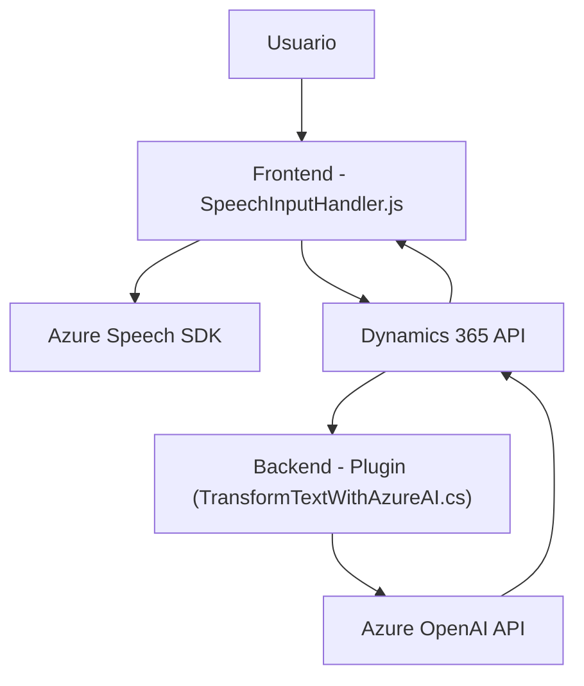

### Resumen Técnico

Este repositorio define una solución que integra funcionalidades como entrada y salida de voz, configuración y manipulación de formularios en Dynamics 365, y procesamiento de texto mediante servicios de Azure AI. Se trata de un sistema distribuido que interactúa tanto a nivel de cliente (frontend) como de servidor (plugins backend).

---

### Descripción de Arquitectura

La solución implementada usa una **arquitectura de múltiples capas**:
1. **Capa Cliente (Frontend)**: Define interfaces para manejar entrada y salida de voz mediante **Azure Speech SDK**. Usa scripts de JavaScript que interactúan directamente con los formularios de Dynamics 365 y consumen APIs.
2. **Capa Backend (Plugins)**: Desarrolla extensiones en Dynamics 365 mediante la interfaz `IPlugin`. Un plugin específico realiza llamadas a la API de Azure OpenAI para transformar texto, actuando como un microservicio interconectado al ecosistema CRM.
3. **Servicios Externos**:
   - **Azure Speech SDK**: Gestiona la captura de voz, transcripción de texto y síntesis de voz.
   - **Azure OpenAI API**: Realiza transformaciones avanzadas de texto con inteligencia artificial.

En términos de patrones, se observa una combinación de **modularidad**, **microservicios** y **patrones de integración**. La solución no utiliza un diseño estrictamente hexagonal ni de microservicios completo, pero expone ciertas características compatibles con esas filosofías (por ejemplo, interacción con APIs externas).

---

### Tecnologías Usadas

**Frontend**:
- **JavaScript/ES6**: Lenguaje principal utilizado para scripts.
- **Azure Speech SDK**: Para interactuar con sistemas de reconocimiento y síntesis de voz.

**Backend**:
- **Microsoft Dynamics 365 SDK** (`Microsoft.Xrm.Sdk`): Herramienta principal para extensión de formularios en Dynamics.
- **C#**: Lenguaje utilizado para los plugins backend.
- **Azure OpenAI API**: Servicio para procesamiento avanzado de texto con inteligencia artificial.
- **Dependency Injection**: Para conectar servicios como `IServiceProvider`.

**General**:
- **HTTP API**: Para invocaciones programáticas de Azure Speech y OpenAI API.

---

### Diagrama Mermaid

El siguiente diagrama describe los componentes y su interacción a nivel lógico:

---

### Conclusión Final

El repositorio define una solución híbrida orientada a la automatización de formularios en Dynamics 365 mediante entrada de voz y transformación de texto basada en artificial intelligence. La arquitectura combina capas de frontend, backend y servicios externos para garantizar funcionalidad fluida, escalable y extensible. Aunque no emplea estrictamente paradigmas como microservicios o arquitectura hexagonal, utiliza patrones clave como modularidad, integración API y desacoplamiento lógico, asegurando el cumplimiento de estándares modernos para soluciones distribuidas.