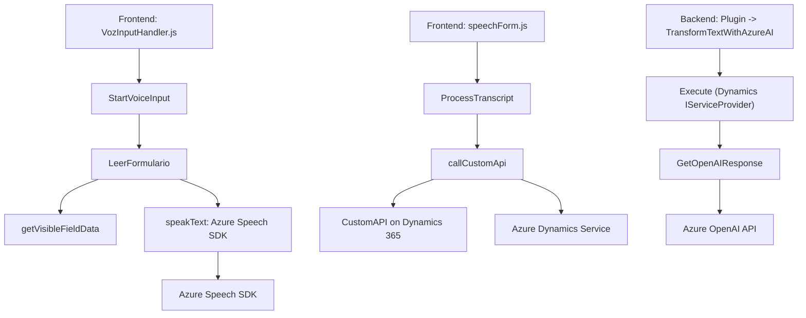

### Resumen técnico:
El repositorio parece ser una solución que combina frontend con backend (plugins de Dynamics CRM). Su principal objetivo es trabajar con integración de voz y texto mediante servicios de Azure Speech y Azure OpenAI, permitiendo funcionalidades automáticas como la entrada de voz para formularios y la transformación de texto según reglas específicas (con plugins y APIs externas).

---

### Descripción de la arquitectura:
La arquitectura es **modular y basada en integración de capas**, donde cada componente está dedicado a una responsabilidad específica:
1. **Frontend**: Manejo de voz mediante el SDK de Azure Speech, interactuando con formularios dinámicos de Microsoft Dynamics 365.
2. **Backend** (plugin de Dynamics CRM): Procesamiento del texto mediante reglas en Azure OpenAI y entrega de resultados como un JSON estructurado.

Aunque existen elementos de servicio independientes, la arquitectura en conjunto corresponde a un diseño de **arquitectura orientada a servicios (SOA)** con microservicios externos. El uso de Azure OpenAI y Azure Speech SDK representa comunicación directa con servicios de nube.

---

### Tecnologías utilizadas:
1. **Frontend**:
   - **JavaScript (Node-like)** para la lógica del cliente.
   - **Azure Speech SDK** integrado dinámicamente mediante solicitudes HTTP.
   - **Microsoft Dynamics API** (`Xrm.WebApi.online`) para interactuar con formularios.
   - Programación asíncrona (callbacks y promesas).
   
2. **Backend (plugin)**:
   - **Microsoft Xrm SDK**: Extensiones y servicios de Dynamics CRM.
   - **Azure OpenAI API** para procesamiento avanzado de textos con modelos GPT.
   - **Newtonsoft.Json:** Para manipulación de objetos JSON.
   - **REST API** mediante HttpClient para interactuar en servicios Azure.
   
3. Patrones aplicados:
   - **Plugin Pattern** en el backend.
   - **Modularización** y separación de responsabilidades por funciones en el frontend.
   - **Event-based architecture** con callbacks y eventos disparados mediante SDKs externos.

---

### Dependencias o componentes externos presentes:
1. **Azure Speech SDK**: Reconocimiento y síntesis de voz en el frontend.
2. **Azure OpenAI API**: Utilizado en el backend para transformar texto con modelos basados en GPT.
3. **Microsoft Dynamics Web API**: Interacción entre formularios y campos visibles.
4. **Newtonsoft.Json**: Para la manipulación de objetos JSON en el backend del plugin.
5. **HttpClient**: Comunicación REST con servicios externos (Azure).

---

### Diagrama Mermaid válido para GitHub:

---

### Conclusión final:
La solución está diseñada para interconectar distintas tecnologías relacionadas con voz, texto e interacción dinámica con formularios de Microsoft Dynamics 365. Se configura como una arquitectura orientada a servicios (SOA) con integración de microservicios externos. Su enfoque en modularización y separación de responsabilidades facilita tanto el mantenimiento como la escalabilidad. Sin embargo, sería recomendable adoptar mejores prácticas de seguridad para la gestión de claves API embebidas en el código y evaluar cómo manejar posibles fallos en entornos de red para garantizar mayor robustez.