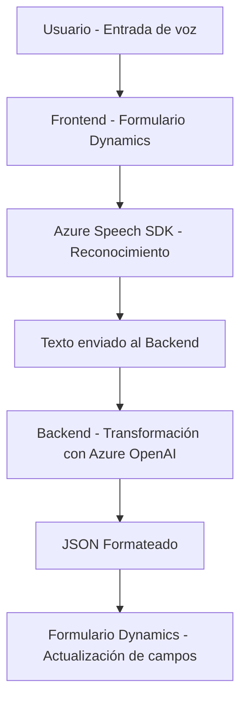

### Breve Resumen Técnico

El repositorio pertenece a una solución corporativa orientada a fortalecer la interfaz de formularios mediante el uso de voz como entrada y procesamiento con IA. Es una integración avanzada entre Dynamics CRM (para gestión de datos empresariales), Azure Speech SDK (para síntesis y reconocimiento de voz) y Azure OpenAI (para procesamiento inteligente automático). La solución se enfoca en procesar y transformar datos dentro de formularios en tiempo real o en respuesta a eventos, utilizando una mezcla de tecnologías de frontend (JavaScript) y backend (.NET/C#).

---

### Descripción de Arquitectura

La arquitectura principal parece ser una **n-capas** con módulos distribuidos conforme a su responsabilidad funcional:
1. **Presentación (Frontend):** En JavaScript, se facilita la interacción mediante voz y manipulación de formularios en Dynamics CRM con SDKs y APIs proporcionados por Azure y Microsoft.
2. **Lógica de negocio (Backend):** En .NET/C#, los plugins interpretan el input de formularios y procesan texto con reglas mediante IA.
3. **API o servicios externos (Integración):** Se integran servicios externos como Azure Speech SDK y OpenAI para reconocimiento de voz y procesamiento inteligente mediante aprendizaje automático.

Algunos componentes adoptan el patrón de arquitectura **evento-reacción**, como el procesamiento según el contexto del formulario o la interacción con servicios de IA.

---

### Tecnologías Usadas

1. **Frontend:** 
   - JavaScript modular.
   - SDKs del navegador, como Dynamics CRM JavaScript API (`Xrm.WebApi`) y Azure Speech SDK.
   - Patrones de eventos y callbacks.

2. **Backend:**
   - .NET Framework / C# utilizando `Microsoft.Xrm.Sdk` para integración directa con Dynamics CRM.
   - Peticiones HTTP mediante `HttpClient` para interactuar con Azure OpenAI API.
   - Manejo avanzado de JSON con `Newtonsoft.Json.Linq` y `System.Text.Json`.

3. **Servicios IA:**
   - **Azure Speech SDK:** Síntesis y reconocimiento de voz para manejar comandos hablados.
   - **Azure OpenAI (GPT):** Procesamiento y transformación avanzada de texto según reglas empresariales.

4. **Integración:** 
   - Dynamics CRM.
   - APIs RESTful externas (Azure Speech y OpenAI).

---

### Diagrama Mermaid

El siguiente diagrama representa la solución a gran escala, separando responsabilidades clave:

---

### Conclusión Final

Esta solución se enmarca dentro de un ecosistema corporativo basado en Dynamics CRM, mejorando la interacción mediante voz y proporcionando capacidades avanzadas de inteligencia artificial para facilitar la productividad. Con tecnología de Azure Speech SDK y OpenAI, la solución permite aplicaciones intuitivas y precisas integradas en una arquitectura **n-capas**, que potencialmente puede escalarse en entornos basados en microservicios.