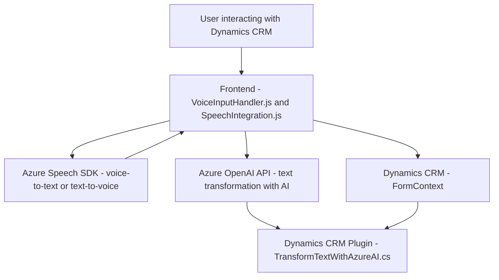

### Resumen técnico
El repositorio tiene una solución mixta que integra **sistemas de reconocimiento de voz** y **procesamiento de texto con inteligencia artificial (IA)**, orientada a su uso en **Dynamics CRM**. Utiliza componentes front-end en JavaScript para interacción del usuario y un plugin en C# para la lógica y el procesamiento avanzado con **Azure OpenAI API**.

---

### Descripción de la arquitectura
La arquitectura está basada en una combinación de principios **orientados a servicios** y **desacoplamiento funcional**, con integración de servicios externos como **Azure Speech SDK** y **Azure OpenAI API**. Contiene:
- **Frontend ligero**: Funciones JavaScript que interactúan con usuarios y gestionan la entrada/salida del formulario Dynamics CRM.
- **Integración con servicios externos** mediante llamadas a APIs de Azure (Speech SDK, OpenAI).
- **Plugin**: Se ejecuta como parte de la arquitectura de **plugins de Dynamics CRM** para eventos específicos del sistema.

Las responsabilidades están separadas en tres capas fundamentales:
1. **Frontend/UI:** Se encarga de capturar entrada de voz, gestionar datos visibles en formularios y proporcionar texto sintetizado.
2. **Servicios externos:** Azure Speech SDK para reconocimiento/síntesis de voz y Azure OpenAI API para transformación avanzada de texto.
3. **Backend/plugin:** Transformación especializada y comunicación con Dynamics CRM para almacenar o modificar datos del formulario.

La arquitectura predominante es **Service-Oriented mixed with plugins**, adaptada para trabajar sobre la plataforma Dynamics CRM, pero presenta características de **microservicios** debido a la desacopladura y la interacción con APIs externas.

---

### Tecnologías y patrones
1. **Tecnologías detectadas:**
   - **Frontend:** JavaScript, Azure Speech SDK, Dynamics CRM APIs (`Xrm.WebApi`).
   - **Backend/plugin:** C# (.NET Framework), Azure OpenAI API, Dynamics CRM SDK (`Microsoft.Xrm.Sdk`).

2. **Patrones usados:**
   - **Facade/Wrapper:** Para abstraer lógica de interacción con SDKs y APIs.
   - **Plugin-based Architecture:** Implementación sobre eventos definidos en Dynamics CRM.
   - **Event-driven Programming:** Uso de callbacks y eventos para iniciar flujos de procesamiento.
   - **Service-Oriented Architecture:** Desacoplamiento hacia servicios externos como Azure OpenAI y Speech SDK.
   - **Dependency Injection:** Uso de `IServiceProvider` para gestionar dependencias en el plugin.
   - **Delegation Pattern:** Uso consistente de funciones que delegan tareas a componentes externos o internos.

---

### Dependencias externas
- **Azure Speech SDK:** Para conversión de voz a texto y síntesis de texto a voz.
- **Azure OpenAI API:** Para transformar texto en JSON usando inteligencia artificial (GPT-4).
- **Dynamics CRM SDK:** 
  - Interacción con formularios CRM mediante `IOrganizationService` y `Xrm.WebApi`.
  - Integración de un plugin para la ejecución de lógica personalizada basada en eventos del sistema.
- **Bibliotecas estándar:** `System.Net.Http` y `System.Text.Json` para comunicación y procesamiento de datos JSON.

---

### Diagrama **Mermaid**

---

### Conclusión final
La solución combina un **entorno de programación mixta (JavaScript y C#)** con una fuerte dependencia de servicios en la nube de Azure. Implementa múltiples patrones que garantizan modularidad, asociación con APIs externas y separación de responsabilidades. Es adecuada para entornos donde Dynamics CRM es clave para el negocio y existe una necesidad de automatizar procesos mediante reconocimiento de voz e inteligencia artificial.

El diseño parece ser sólido, aunque presenta ciertas dependencias estrechas con Azure, lo que puede ser una limitación en cuanto a la flexibilidad tecnológica. Sin embargo, la solución proporciona un enfoque escalable y adaptable para aplicaciones CRM avanzadas que requieren interacción entre UI dinámica y procesamiento en la nube mediante IA.