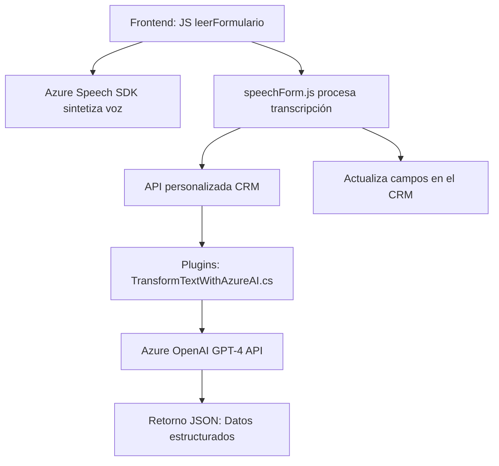

## Breve resumen técnico

Este repositorio combina un frontend dinámico que interactúa con formularios de CRM, plugins basados en C# para procesamiento de texto mediante Azure OpenAI, y servicios integrados con Azure Speech SDK para reconocimiento y síntesis de voz. Está diseñado para mejorar la experiencia del usuario al trabajar con formularios en entornos CRM, introduciendo capacidades avanzadas de procesamiento de voz e inteligencia artificial.

---

## Descripción de la arquitectura

### Tipo de solución:
- **API + Frontend**: Proporciona interacción entre un frontend basado en formularios dinámicos y servicios API.
- **Plugins en CRM Dynamics**: Transformación de texto utilizando servicios de IA en C#.

### Arquitectura general:
- Principalmente sigue un modelo **n-capas**:
  - **Front-end**: Funciones JavaScript para interactuar con Azure Speech SDK y dinámicas de formularios.
  - **Backend**: Plugins en C# para integración con Azure OpenAI.
  - **Servicios de terceros**: APIs de Azure Speech y OpenAI.
- **Elementos de microservicios** en el diseño:
  - Uso de servicios externos (Azure Speech y OpenAI) como microservicios.
  - Modularidad y separación de responsabilidades por componentes/plugin.

### Patrimonio arquitectónico:
- **Modularidad** y especialización de funciones.
- **Integración desacoplada**: Servicios externos con patrones de inyección de dependencias.
- **Facade Pattern**: Simplificación del acceso a APIs externas.

---

## Tecnologías usadas

### Frameworks y librerías:
1. **Frontend (JavaScript)**:
   - **Azure Speech SDK** para capacidad de reconocimiento y síntesis de voz.
   - Funciones para interacción con formularios y generación de campos dinámicos.

2. **Backend (C#)**:
   - **Dynamics CRM SDK** para integración directa en sistemas CRM.
   - **Azure OpenAI** para procesamiento avanzado de texto natural.
   - **Microsoft.Xrm.Sdk** para desarrollos personalizados en plugins.
   - **Newtonsoft.Json.Linq**, **System.Text.Json**: Manejo avanzado de JSON.

### Dependencias externas:
- Mediante el Azure Speech SDK y Azure OpenAI como servicios integrados:
  - `SpeechSDK.AudioConfig`, `SpeechSDK.SpeechConfig`.
  - API GPT-4 de OpenAI.

---

## Diagrama **Mermaid**

---

## Conclusión final

El repositorio representa una integración efectiva entre tecnologías AI basadas en la nube y un sistema CRM para transformar datos y mejorar la experiencia del usuario. La arquitectura modular y la separación de responsabilidades permiten que cada componente se enfoque en un aspecto del flujo de trabajo. El uso de patrones como Facade y n-capas asegura la escalabilidad y mantenibilidad del sistema.