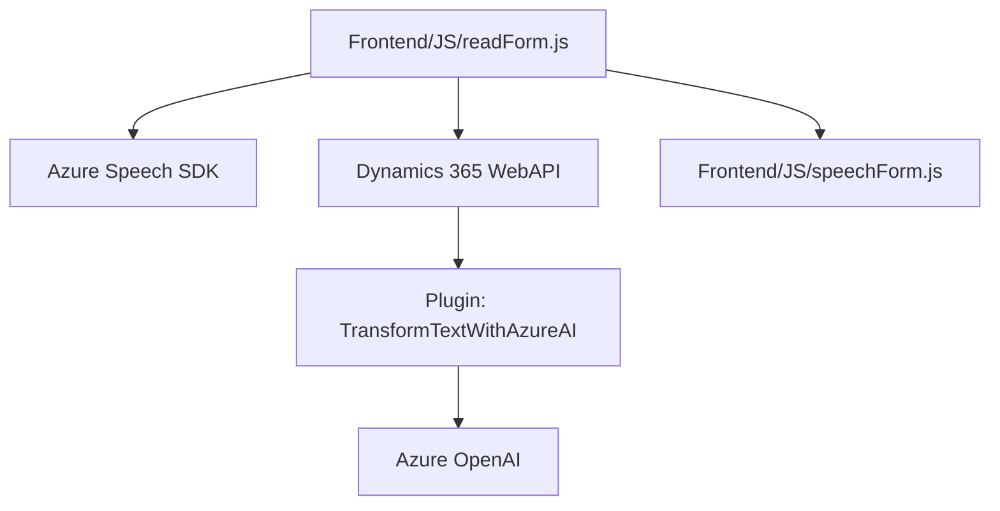

## Breve Resumen Técnico
El repositorio contiene múltiples archivos; todos están enfocados en la interacción entre un frontend implementado en JavaScript y un backend con Dynamics 365, además de la integración con servicios externos como Azure Speech SDK y Azure OpenAI. Se emplea programación modular y patrones comunes para la comunicación entre servicios, además de la adopción de una arquitectura desacoplada.

---

## Descripción de la Arquitectura
El sistema es una solución de integración de servicios en una arquitectura **cliente-servidor con enfoque de múltiples capas**:
1. **Front-end**: Es responsable de la captura y procesamiento de datos desde el cliente, usando JavaScript para la manipulación de formularios CRM (Dynamics 365) y APIs externas. Incluye módulos específicos para la síntesis de voz y el reconocimiento de voz con Azure Speech.
2. **Back-end/Plugins**: Define lógica específica que interactúa con Dynamics CRM y llama a una API externa (Azure OpenAI) en formato JSON para la transformación inteligente de texto.
3. **Servicios Externos**: Azure Speech SDK para síntesis y reconocimiento de voz, y Azure OpenAI para el procesamiento avanzado de transcriptos de voz.

### Componentes Arquitectónicos:
- **Cliente (Frontend)**:
  - Procesa datos de formularios (campos visibles y entradas de los usuarios).
  - Ejecuta reconocimiento de voz mediante Azure Speech SDK.
  - Aplica transcripciones de voz a formularios del entorno CRM.
  - Utiliza una API personalizada en Dynamics 365 para transformar texto mediante IA.
- **Backend (Plugins)**:
  - Proporciona lógica personalizada que interactúa con el CRM y servicios externos.
  - Implementa un plugin que transforma texto con normas específicas en JSON utilizando Azure OpenAI.

---

## Tecnologías Usadas
1. **Frontend**:
   - **JavaScript**: Lenguaje principal para la lógica del frontend.
   - **Dynamics 365 SDK (`Xrm.WebApi`)**: Para llamadas API dentro del entorno de CRM.
   - **Azure Speech SDK**: Para síntesis y reconocimiento de voz.
2. **Backend**:
   - **C# y .NET Framework**: Usados para desarrollar plugins personalizados en Dynamics CRM.
   - **Azure OpenAI**: Para transformar texto y realizar tareas avanzadas de IA.
   - **System.Net.Http**: Para realizar llamadas API REST.
   - **Newtonsoft.Json y System.Text.Json**: Para manejo de JSON en las solicitudes/respuestas.

---

## Diagrama Mermaid

---

## Conclusión Final
La solución es una integración avanzada que utiliza módulos de frontend en JavaScript, enlaces de APIs personalizados, y lógica adicional a través de plugins en C#. Además, emplea capacidades externas como Azure Speech SDK para reconocimiento/síntesis de voz y Azure OpenAI para la transformación inteligente de texto. El sistema adopta una arquitectura cliente-servidor con patrones de múltiples capas para separar la interfaz, los servicios externos y la lógica del negocio.