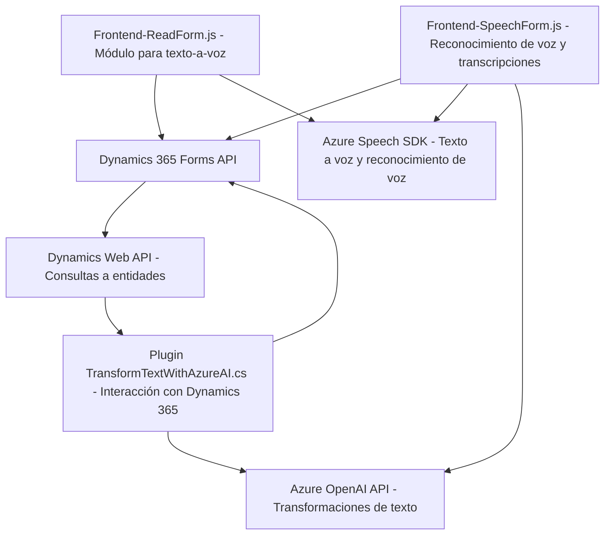

### Breve Resumen Técnico
El repositorio contiene tres archivos principales relacionados con la interacción entre una interfaz front-end basada en Dynamics 365 y servicios de nube de Azure. Utiliza una combinación de JavaScript para las funciones front-end y C# para implementar extensiones de lógica backend como plugins en Dynamics CRM. La solución busca enriquecer la experiencia del usuario agregando soporte para texto a voz (speech synthesis) y reconocimiento de voz (speech recognition), integrándolo con la inteligencia artificial (Azure AI) para el procesamiento de datos.

---

### Descripción de la arquitectura
La arquitectura mostrada en el repositorio se puede clasificar como una **arquitectura de n capas** que sigue principios de **Service-Oriented Architecture (SOA)** y patrones de diseño como el **Facade Pattern**. La aplicación se divide en diversas capas de funcionalidad:
1. **Capa de Presentación (Frontend)**:
   - Utiliza archivos JavaScript para interactuar con la interfaz de usuario de Dynamics 365, gestionando el flujo de datos entre el cliente y los backends relacionados con IA y síntesis, así como la manipulación directa de formularios.
   
2.  **Capa de Lógica Empresarial (Plugin)**:
    - El archivo `.cs` implementa funcionalidades extensibles para transaccionar datos en Dynamics 365. Utiliza servicios externos para procesar texto con la API de Azure OpenAI.
    
3. **Capa de Servicios Externos (Azure API)**:
   - Hace uso del Azure Speech SDK para reconocimiento y síntesis de voz.
   - Se integra con Azure OpenAI API para realizar transformaciones en texto (e.g., estructuración en JSON).

Esta arquitectura también refleja una orientación hacia microcomponentes, donde cada capa encapsula funcionalidades específicas, pero aún está más cerca de una solución basada en n capas debido a la naturaleza de su implementación en Dynamics 365.

---

### Tecnologías Usadas
1. **Frontend**:
   - **JavaScript**
   - **Azure Speech SDK**: Reconocimiento y conversión de texto a voz.
   - **Dynamics 365 Form Context API**

2. **Backend**:
   - **C#** sobre **.NET Framework** (plugin).
   - **Microsoft Dynamics CRM SDK**.
   - **System.Net.Http**: Para realizar llamadas HTTP a servicios externos.
   - **Azure OpenAI API**: Transformación de texto y uso de IA.

3. **Patrones de diseño**:
   - **Facade Pattern**: Para simplificar operaciones complejas en el front-end.
   - **Plugin Pattern**: En el backend para extender funcionalidades.
   - **Service-Oriented Architecture**: Dependencia en servicios externos, como Azure Speech SDK y Azure OpenAI API.
   - **Decorators**: Funciones específicas se encargan de definir comportamientos para determinados tipos de datos (e.g., números, texto, etc.).

---

### Arquitectura y Dependencias Externas
La solución puede clasificarse como una mezcla entre arquitectura n-capas (por la separación entre frontend, lógica de negocio y servicios externos) y Service-Oriented Architecture (SOA), debido a la integración con APIs. A pesar de ser modular, sigue estando en mayor medida vinculado a la infraestructura de Dynamics CRM y APIs específicas.

#### Dependencias o Componentes Externos:
- **Azure Speech SDK**: Funcionalidades de reconocimiento y síntesis de voz.
- **Dynamics 365 Form Context API**: Para interactuar con formularios en Dynamics 365.
- **Azure OpenAI API**: Procesamiento avanzado de texto mediante inteligencia artificial.

No parece haber otras dependencias en el repositorio más allá de librerías internas.

---

### Diagrama Mermaid

---

### Conclusión Final
La solución constituye una integración sólida entre Dynamics 365 y servicios en la nube de Azure. Utiliza una estructura modular orientada a servicios con fuerte énfasis en las interacciones API y sigue patrones de diseño adecuados para mantener la lógica separada y reutilizable. Sin embargo, su dependencia de servicios externos, la arquitectura nativa de Dynamics 365 y requerimientos específicos de configuración hacen que no se trate de una arquitectura completamente desacoplada como la de microservicios.

En general, esta solución es adecuada para escenarios empresariales en los que se necesita extender las capacidades de plataformas CRM con IA y funciones enriquecidas de voz. Ideal para contextos donde las operaciones basadas en formularios son críticas para los procesos de negocio.