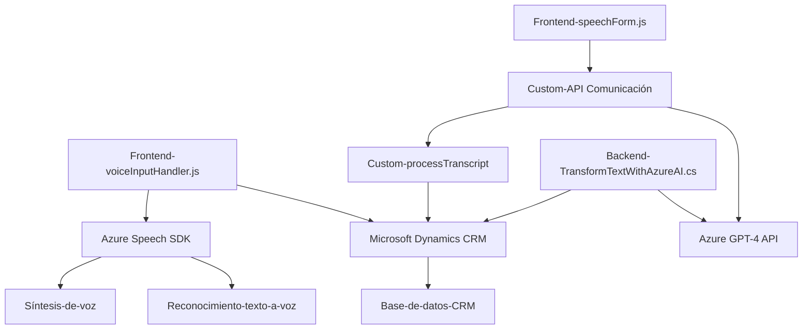

### Breve resumen técnico:
El repositorio se centra en integrar **Azure Speech SDK** y **Azure OpenAI** para enriquecer formularios dinámicos en un sistema CRM (Dynamics 365). Los archivos analizados implementan funcionalidades como:
1. Reconocimiento y síntesis de voz para manipular formularios.
2. Procesamiento de comandos de voz mediante inteligencia artificial.
3. Plugins en C# para transformar texto usando un modelo de IA configurado en Azure.

---

### Descripción de arquitectura:
La solución utiliza una arquitectura **n-capas**, donde se segmentan las funcionalidades en:
1. **Frontend:** Archivos en JS (`readForm.js`, `speechForm.js`) que interactúan con el SDK de Azure Speech y exportan datos del formulario. Aquí también se procesan comandos de voz aplicados a campos visibles del formulario.
2. **Backend:** Plugin en C# (`TransformTextWithAzureAI.cs`) que actúa dentro de Dynamics CRM, conectado al endpoint de Azure OpenAI, para procesamiento avanzado de texto.
3. **Servicios externos:** Integración con servicios como Azure Speech SDK y OpenAI para cubrir el reconocimiento de voz, síntesis de texto, y procesamiento de texto mediante GPT.

La arquitectura sigue principios de modularización, delegación de tareas y componentes especializados, permitiendo escalabilidad y soporte para extensiones futuras.

---

### Tecnologías usadas:
1. **Azure Speech SDK:** 
   - Servicios de síntesis y reconocimiento de voz.
   - Componentes como `AudioConfig` y `SpeechConfig` para personalizar la implementación.
2. **Azure OpenAI API:** 
   - Utilización del modelo GPT-4 para el procesamiento del lenguaje natural.
   - Endpoint configurado para solicitudes HTTP POST desde el plugin.
3. **Microsoft Dynamics CRM SDK:** 
   - Interfaces `IPlugin` y `IOrganizationServiceFactory` para trabajar con entidades de la base de datos CRM.
4. **JavaScript (browser-based SDK):**
   - Usado para interfaz de usuario y conexión con el SDK de Azure Speech.
5. **C# (.NET):**
   - Backend para extensiones de Dynamics 365 mediante plugins.

---

### Dependencias o componentes externos:
1. **Azure Services:**
   - **Speech SDK:** Gestor para el reconocimiento y síntesis de voz.
   - **OpenAI API:** GPT-4 modelo desplegado para procesar texto en tiempos de ejecución.
   - **Cloud configurations:** Almacén de claves API y configuración del proyecto en Azure.
2. **Microsoft Dynamics CRM Plugin Framework:** Servicios como `IPlugin` y `IOrganizationService`.
3. **System y Newtonsoft.Json:** Librerías para el manejo de datos JSON, HTTP y entidades CRM.

---

### Diagrama Mermaid:

---

### Conclusión final:
La solución es una implementación basada en **Microsoft Dynamics 365** que utiliza servicios de **Azure Speech SDK** y **Azure OpenAI** para dotar de capacidades avanzadas de reconocimiento y síntesis de voz, además de procesamiento textual (GPT-powered). Los archivos de frontend actúan como orquestadores de esta funcionalidad, mientras que el componente backend extiende un sistema CRM mediante plugins para integrarse con potentes herramientas de inteligencia artificial. La arquitectura es modular y conforme al diseño de software de **n-capas**, con un buen uso de APIs externas y separación de responsabilidades entre frontend y backend.