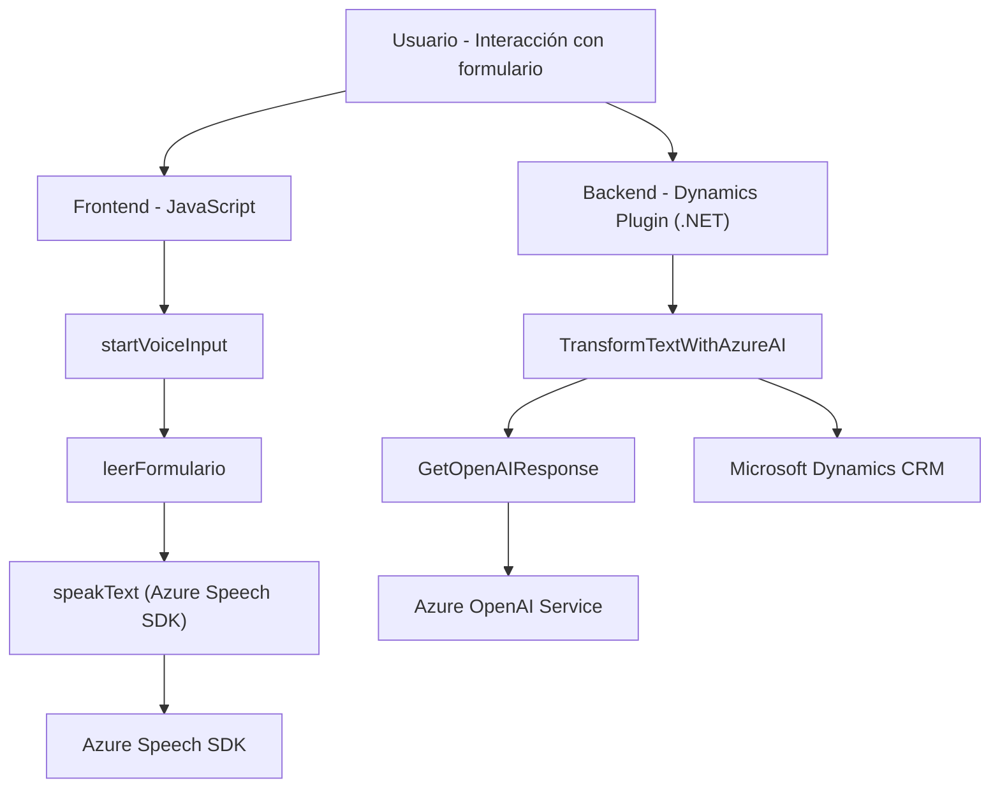

### Breve resumen técnico
Este repositorio implementa una solución integrada que utiliza **Azure AI** para el procesamiento de texto y voz. Los archivos se orientan hacia dos tareas principales: la síntesis de voz a partir de formularios, y la incorporación de entrada/voz en formularios con un _plugin_ para Dynamics CRM.

### Descripción de arquitectura
- **Arquitectura general:** La solución describe una arquitectura compuesta basada en el patrón **n-capas** con la interacción entre un `Frontend` en JavaScript y un `Backend` en C# para el _plugin_.
- La comunicación con servicios externos (Azure OpenAI y Speech SDK) muestra integración con APIs externas mediante un **API Gateway**.
- Se usan patrones como `Facade` y `Module` en el frontend, mientras que el backend utiliza el **Plugin Pattern**, específico de Dynamics CRM.

---

### Tecnologías usadas
- **Frontend (JavaScript):**
  - DOM API: Para manipulación y mapeo de atributos de formularios.
  - **Azure Speech SDK:** Herramienta de Microsoft para la síntesis y transcripción de voz.
- **Backend (C#):**
  - Plataforma de **Microsoft Dynamics CRM** mediante implementación de _plugins_.
  - **Azure OpenAI API:** Para procesamiento inteligente y generación de estructuras JSON.
  - Dependencias utilizadas:
    - **System.Net.Http**: Para comunicación con APIs externas.
    - **Newtonsoft.Json** y **System.Text.Json**: Para manipulación de datos JSON.

### Diagrama Mermaid válido para GitHub

---

### Conclusión final
La solución implementa una integración moderna entre la tecnología de frontend (formulario web basado en JavaScript y Azure Speech SDK) y el backend corporativo (Dynamics CRM y Azure OpenAI). Su arquitectura distribuida utiliza APIs externas, y los patrones como `Facade` facilitan la modularización y escalabilidad. Es una solución bien estructurada y fácilmente expandible, con un enfoque hacia la automatización de procesos en formularios y una efectiva comunicación con servicios de inteligencia artificial y procesamiento de voz.