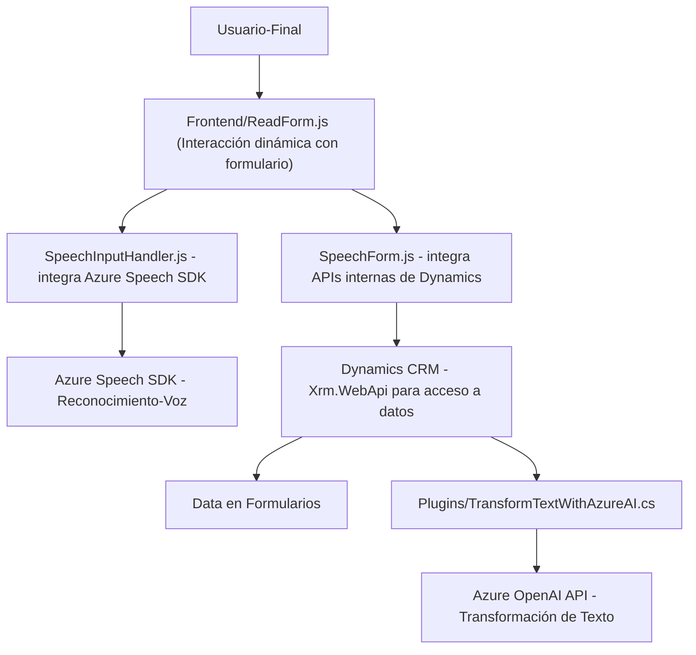

### **Breve resumen técnico**

El repositorio parece estar diseñado para proporcionar interacción avanzada con formularios en Dynamics CRM usando capacidades de Inteligencia Artificial, procesamiento de lenguaje natural, y síntesis/reconocimiento de voz. También incluye funciones de transformación textual con Azure OpenAI mediante un plugin desarrollado en C# para Dynamics CRM.

---

### **Descripción de Arquitectura**

La solución representa una arquitectura híbrida que combina una integración Backend (plugin en C# para Dynamics CRM), API externas (Azure OpenAI), y una capa cliente (frontend en JavaScript) para comunicación directa con usuarios.  

- **Tipo de arquitectura:**  
  Arquitectura en capas híbrida.  
    - **Frontend**: Implementación altamente interactiva con dependencia de Azure Speech SDK para tareas de reconocimiento/síntesis de voz y mapeo dinámico en formularios.  
    - **Backend**: Utiliza el modelo de plugins dentro de Dynamics CRM para extender capacidades nativas y llamadas a la API de Azure OpenAI.  
    - **API externa**: Se apoya en Azure Speech SDK y Azure OpenAI para completar tareas de reconocimiento y transformación.  
  Aunque no es específicamente una arquitectura de microservicios, aprovecha servicios externalizados.

- **Patrones utilizados:**  
  - **Patrón de integración con SDKs:** Carga dinámica de dependencias para interacción con Azure Speech SDK y Azure OpenAI.  
  - **Patrón de capas:** División clara entre frontend (interacción del usuario/formulario) y backend (plugins para gestión CRM y procesamientos avanzados).  
  - **Encapsulación modular:** Funciones y clases diseñadas para responsabilidades específicas (lectura, síntesis, transcripción, transformación y manipulación de datos).  
  - **API Gateway:** Centralización de llamadas a APIs externas (Azure Speech y Azure OpenAI).

---

### **Tecnologías usadas**

1. **Frontend**
   - **JavaScript:** Lógica de interacción con formularios y conexión con Azure Speech SDK.  
   - **Azure Speech SDK:** Reconocimiento y síntesis de voz.  
   - **Dynamics CRM Xrm.WebApi:** Interacción con APIs internas para manipular datos del formulario.  

2. **Backend**
   - **C# (.NET):** Plugins para Dynamics CRM que interactúan con la API de OpenAI.  
   - **Azure OpenAI Service:** Transformación de texto según normas previamente definidas.  
   - **APIs de Dynamics CRM:** Manipulación de datos a nivel del sistema CRM.  

3. **Externa**
   - **Azure Speech SDK:** Reconocimiento y síntesis de voz.  
   - **Azure OpenAI API:** Procesamiento avanzado de texto con capacidades de inteligencia artificial.  

---

### **Diagrama **Mermaid** válido y sin subgraphs**

---

### **Conclusión final**

La solución combina múltiples tecnologías para habilitar una experiencia avanzada en Dynamics CRM centrada en interacción con formularios mediante voz y procesamiento de datos. Usa un diseño modular, empleando funciones especializadas y patrones como integración con SDKs y una arquitectura en capas. Las dependencias clave incluyen Azure Speech SDK para reconocimiento de voz y síntesis, así como Azure OpenAI para procesamiento de texto. Esto permite construir una solución que mezcla capacidades de inteligencia artificial con CRM, optimizando interacciones del usuario final y automatizando tareas cotidianas.