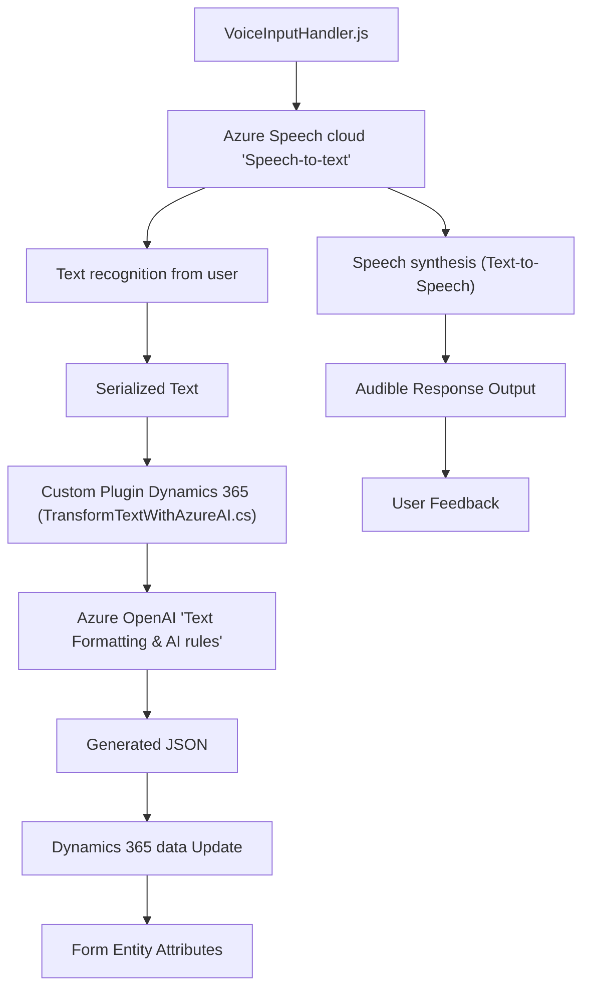

### Breve Resumen Técnico  
El conjunto de archivos en el repositorio describe una solución compuesta por un **backend en C#** para Microsoft Dynamics CRM y un **frontend en JavaScript** que integra el servicio de Azure AI y Azure Speech SDK. La funcionalidad está orientada a mejorar la interacción con formularios mediante reconocimiento y síntesis de voz, así como procesamiento semántico de texto con reglas personalizadas usando la API de Azure OpenAI.

### Descripción de Arquitectura  
La arquitectura es híbrida, con una combinación de **microservicios** y una **arquitectura de servicios** soportada por Dynamics CRM y APIs externas en la nube (Azure). Hay múltiples componentes que se comunican entre sí:  
1. **Frontend (VoiceInputHandler.js y SpeechForm.js):** Web-based JavaScript modules para interactuar con usuarios a través de reconocimiento de voz y síntesis de texto hablado. Utilizan el Azure Speech SDK y la librería de Dynamics 365 para acceder al modelo de dominio del formulario y aplicar valores al mismo.  
2. **Backend (TransformTextWithAzureAI.cs):** Un plugin que se ejecuta sobre Dynamics CRM y utiliza el modelo de extensibilidad de este para realizar transformaciones de texto con la ayuda de Azure OpenAI API.  

El diseño global muestra que las llamadas API y los SDK son la base de la interacción entre cliente y servidor. El patrón usado en el backend tiene referencias al patrón de **Command Pattern** (dado el modelo que el plugin utiliza para ejecutar una acción definida en un contexto específico) y **microservicios**, ya que delega funciones particulares a servicios en la nube. El frontend, por su parte, presenta rasgos de una **arquitectura modular** con componentes autónomos que funcionan como piezas independientes de una solución integral.

### Tecnologías Usadas  
1. **Frontend:**  
   - **JavaScript**: Base del desarrollo en los módulos interactivos que procesan texto, voz y comunicación con APIs.  
   - **Azure Speech SDK**: Con fines de síntesis (text-to-speech) y reconocimiento de voz (speech-to-text).  
   - **Dynamics 365 Client API**: Permite interacción con formularios y datos en Dynamics.  
   - **JSON Manipulation**: Para el intercambio de datos estructurados entre las partes cliente y servicio especializado.  
   - **Callbacks y Promesas**: Gestión asincrónica en la carga dinámica del SDK y llamadas API.  

2. **Backend:**  
   - **C#**: Lenguaje principal para el desarrollo del plugin.  
   - **Microsoft Dynamics CRM SDK**: Para extensibilidad y operaciones de datos en el ambiente de Dynamics.  
   - **Azure OpenAI Service**: Procesamiento y transformación avanzada de texto.  
   - **HTTP Client Libraries**: Manejo de solicitudes externas al Azure OpenAI.  
   - **JSON Libraries (`System.Text.Json`)**: Procesamiento de respuestas en formato JSON.  

3. **Arquitectura de Servicios:**  
   - Integración bidireccional con APIs personalizadas, SDK externos y la plataforma Dynamics CRM.  
   - Delegación de responsabilidades entre componentes frontend, backend y servicios en la nube.  
   - Enfoque modular y desacoplado, soportando interacción dinámica entre los distintos módulos.

### Diagrama Mermaid (100% compatible con GitHub markdown):  

### Conclusión Final  
La solución presentada está diseñada para manejar interacciones avanzadas entre usuarios y formularios de Dynamics CRM mediante dos tecnologías clave de Azure: Speech SDK para entrada/salida de voz y OpenAI para procesamiento de datos en base a IA. La integración con APIs y SDKs asegura extensibilidad y modularidad, haciendo que la arquitectura sea robusta y dinámica. Aunque se observa dependencia directa de servicios externos, las técnicas utilizadas optimizan el flujo y la experiencia de usuario en aplicaciones empresariales.