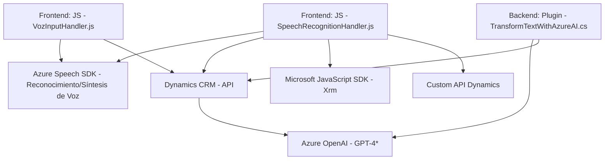

### Breve Resumen Técnico
El repositorio incluye componentes de frontend en JavaScript que interactúan con formularios web y el servicio Azure Speech SDK, además de un plugin desarrollado en C# que utiliza Azure OpenAI para transformar texto como parte de Dynamics CRM.

---

### Descripción de Arquitectura
La solución implementa una arquitectura híbrida basada en **n-capas**. El frontend utiliza comunicación directa con servicios externos (Azure SDK y Dynamics APIs), mientras que el backoffice, desarrollado como un plugin para Dynamics CRM, emplea un **Plugin Design Pattern** que extiende la funcionalidad de dicho CRM con procesamiento externo en Azure OpenAI. El diseño se centra en modularidad y funciones especializadas, delegando tareas al SDK de Azure y a APIs externas.

---

### Tecnologías Usadas
1. **Frontend**:
   - **JavaScript**:
     - Funcionalidad de обработnamiento y síntesis de voz.
   - **Azure Speech SDK**:
     - Cargado dinámicamente para operaciones de reconocimiento y síntesis de voz.
   - **Dynamics 365 API**:
     - Integración directa para la actualización de campos del formulario.
   - **Azure OpenAI (GPT)**:
     - Soporte para procesamiento inteligente de texto JSON mediante APIs externas.

2. **Backoffice (Plugin)**:
   - **C#**:
     - Desarrollo del plugin como extensión para Dynamics CRM.
   - **Azure OpenAI**:
     - Comunicación con modelos GPT-4 a través de un endpoint REST para la transformación de texto.
   - **.NET Framework**:
     - Uso de clases de Dynamics CRM y herramientas de integración (.NET).

---

### Diagrama Mermaid
El siguiente diagrama refleja los componentes y dependencias:

---

### Conclusión Final
La solución demuestra un diseño bien estructurado, enfocándose en un modelo híbrido de integración directa entre el frontend, el backend como parte de Dynamics CRM, y servicios externos de Azure (Speech SDK, OpenAI). El uso de SDKs, APIs, y plugins ofrece una arquitectura extensible que puede manejar tareas avanzadas como reconocimiento y síntesis de voz, además de transformación de texto usando IA.

Sin embargo, se identificaron áreas de mejora:
1. Externalización de claves sensibles como `apiKey`.
2. Potencial simplificación o refactorización de dependencias innecesarias (`Microsoft.SqlServer.Server`).
3. El frontend podría beneficiarse de una mayor encapsulación en clases para robustez y escalabilidad.

Este diseño es una buena solución para sistemas que requieren alta capacidad de interacción humana y soporte avanzado de IA. Es ideal para aplicaciones empresariales con extensiones en Dynamics CRM y servicios inteligentes en Azure.