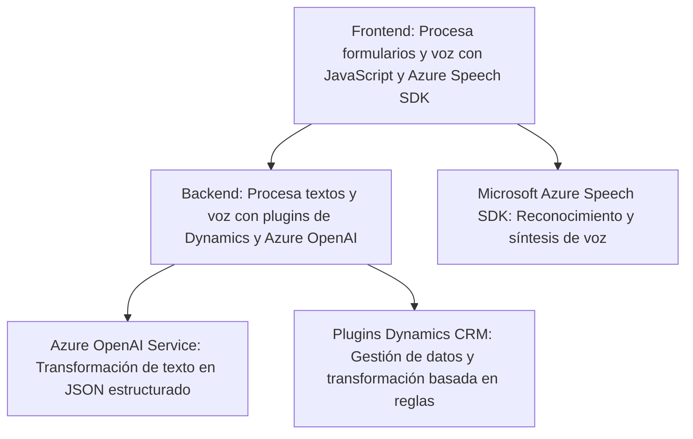

### Breve Resumen Técnico

Este repositorio contiene componentes diseñados para integrar soluciones con funcionalidades específicas relacionadas con procesamiento de formularios, reconocimiento de voz, y transformación de texto con servicios de inteligencia artificial (Azure AI y Azure Speech SDK). La solución está orientada a manejar entrada de datos desde formularios y voz, procesar esa entrada y devolver resultados significativos, utilizables en un entorno de aplicaciones empresariales como Dynamics CRM.

---

### Descripción de Arquitectura

La estructura global del sistema sugiere una arquitectura de **n-capas**, complementada con patrones de integración de servicios. Cada módulo o archivo parece tratar con una funcionalidad específica:
- **Frontend:** Procesa datos de formularios y voz, delega el análisis de texto a servicios externos como el Azure OpenAI y Azure Speech SDK, y organiza funciones como mapeo y conversión de valores.
- **Backend:** Implementado principalmente como plugins de Dynamics CRM, que interactúan con servicios externos para transformar datos y acoplar los resultados al sistema CRM.

Este diseño facilita la separación de responsabilidades:
1. **Capa de presentación**: Gestiona la interacción con formularios y voz en el lado cliente mediante JavaScript.
2. **Integración**: Conectividad con servicios externos, como el SDK de Azure Speech y Azure OpenAI.
3. **Backend lógico**: Expone APIs y plugins sobre Dynamics CRM para el procesamiento backend.

---

### Tecnologías Usadas

1. **Frontend**:
   - **JavaScript**: Lenguaje principal para el manejo del funcionamiento del frontend.
   - **Azure Speech SDK**: Para convertir texto en voz y para realizar reconocimiento de voz.
   - **Dynamic Loading**: Carga condicional de Azure Speech SDK para optimizar la integración.

2. **Backend**:
   - **C# en Dynamics CRM Plugins**: Para la implementación de lógica personalizada en Dynamics CRM.
   - **Azure OpenAI Service**: Utilizado para la transformación de texto en JSON basado en reglas preestablecidas.
   - **APIs externas (Custom de Dynamics)**: Integra APIs personalizadas como transformaciones de texto.

3. **External Dependencies**:
   - **Newtonsoft.Json**: Para el manejo de serialización/deserialización de JSON.
   - **Microsoft Dynamics SDK**: Para integrar la lógica con el sistema CRM.
   - **Azure SDKs**: Para interactuar con servicios de Azure.

---

## Diagrama Mermaid

---

### Conclusión Final

La solución parece ser una integración entre un frontend basado en formularios/voz y procesamiento avanzado con servicios de Azure (Speech SDK y OpenAI Service). A nivel técnico, el diseño está basado en una arquitectura de **n-capas** con patrones de servicio y adaptación a servicios externos. Los archivos del repositorio muestran una modularidad considerable en las funcionalidades, con claras divisiones de responsabilidad entre las capas frontend y backend. 

La arquitectura es apropiada para sistemas empresariales como Dynamics CRM, y la integración con Azure AI y Speech SDK aporta capacidades avanzadas de reconocimiento de voz y procesamiento de lenguaje natural. Sin embargo, es importante considerar la gestión de errores y tiempos de respuesta de los servicios externos para garantizar la robustez del sistema, especialmente en operaciones en tiempo real como el procesamiento de voz.