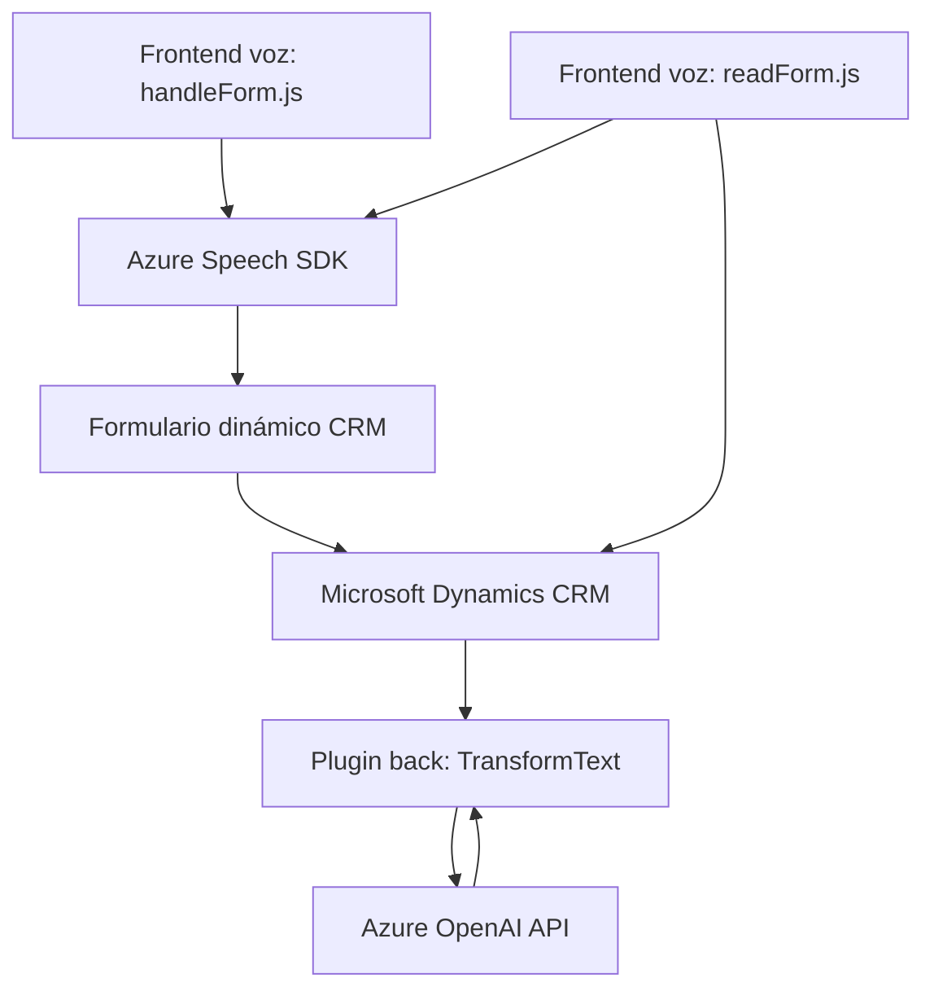

### Resumen técnico

Este repositorio muestra múltiples archivos que implementan funcionalidades para integrar servicios de reconocimiento y síntesis de voz (Azure Speech SDK) con sistemas CRM (probablemente Microsoft Dynamics). También introduce un plugin que aprovecha la API de Azure OpenAI para transformar texto y devolver datos estructurados en formato JSON. En términos generales, la solución orquesta interacción entre formularios dinámicos, reconocimiento de voz y procesamiento de texto basado en inteligencia artificial.

---

### Descripción de arquitectura

1. **Tipología de solución**: La solución parece ser una **extensión para Microsoft Dynamics CRM** que integra funcionalidades como interacción con formularios dinámicos, procesamiento de voz y texto estructurado.
2. **Arquitectura**:
   - **N capas**: La arquitectura implementada podría clasificarse como "n capas":
     - Presentación: Archivos en **FRONTEND/JS** controlan la lógica UI/UX del CRM.
     - Lógica de negocio: **Plugins/TransformTextWithAzureAI.cs** encapsula lógica personalizada en Dynamics CRM.
     - Persistencia y servicios: Actualización dinámica con integración directa a la base de datos del CRM mediante *organization services (Xrm)*.
   - **Microservicio integrado**: La llamada al servicio externo (Azure OpenAI API) introduce características de un microservicio consumidor.
3. **Patrones funcionales**:
   - Modularity: División clara entre frontend y backend.
   - Plugins extendibles: El uso de Dynamics CRM plugins para definir procesos autónomos que operan sobre eventos CRM es evidente.
   - Separación de responsabilidades: Cada archivo o componente maneja una funcionalidad específica (procesamiento de voz, texto, integración API).

---

### Tecnologías usadas

1. **Frontend:**
   - **JavaScript**: Lógica mínima de manipulación de DOM y eventos (ejemplo: `ensureSpeechSDKLoaded`).
   - **Azure Speech SDK** (JS) para funciones de síntesis y reconocimiento de voz.

2. **Backend:**
   - **C#**: Implementación de plugins con la librería oficial de Dynamics CRM (Microsoft.Xrm.Sdk).
   - **Azure Cognitive Services (OpenAI)**: Procesamiento y transformación avanzada de texto (API personalizada).

3. **Dependencias/Servicios externos:**
   - Microsoft Dynamics Web API para interacciones directas con el CRM.
   - Azure Speech SDK para reconocimiento y síntesis de voz.
   - Azure OpenAI para manipulación de texto.

---

### Diagrama Mermaid

---

### Conclusión final

El repositorio refleja una solución extendida para Microsoft Dynamics CRM con integración avanzada de servicios de reconocimiento de voz y procesamiento de texto estructurado basado en inteligencia artificial. El diseño modular y la utilización de servicios externos complementan la arquitectura de **n capas**. Además, el uso del patrón de plugin propio de Dynamics CRM y las capacidades asincrónicas muestran un diseño adaptado a flujos empresariales dinámicos.