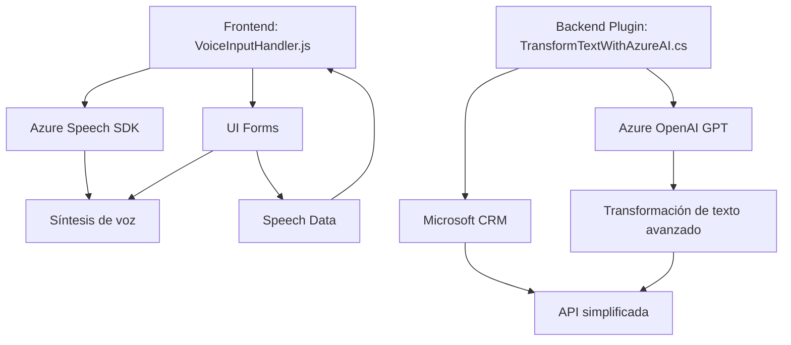

### 1. Breve resumen técnico
Se trata de una solución que combina una capa frontend para la interacción de usuarios en formularios y una capa backend con un plugin para Microsoft Dynamics CRM. Los archivos tienen como objetivo principal proporcionar funcionalidades de síntesis de voz, entrada de datos por voz, y transformación de texto mediante Azure Cognitive Services y Azure OpenAI GPT respectivamente.

---

### 2. Descripción de arquitectura
La solución tiene dos componentes principales: frontend basado en JavaScript y un plugin backend en C# para Dynamics CRM. La arquitectura representada aquí parece orientada a una **n-capas**, donde:
- La **capa de presentación (frontend)** en JavaScript actúa como la interfaz de usuario (UI) facilitando síntesis de voz y capturas desde entradas por voz.
- La **lógica de negocio (backend)** basada en la implementación de un plugin CRM conecta con servicios (Azure Speech SDK y OpenAI GPT) para realizar la transformación estructurada del texto.
  
---

### 3. Tecnologías usadas
#### Frontend:
1. **JavaScript**:
   - Funciones modulares de procesamiento de datos y síntesis de voz.  
2. **Azure Speech SDK**:
   - Utilizado en tiempo de ejecución para realizar síntesis de voz con texto extraído de formularios.
3. **DOM API**:
   - Manejo y manipulación de elementos HTML dinámicamente.

#### Backend:
1. **Microsoft Dynamics CRM SDK**:
   - Usado para implementar plugins con lógica de negocio en el framework CRM.
2. **Azure OpenAI GPT**:
   - Procesamiento avanzado del texto mediante servicios de la API GPT alojada en Azure.
3. **HTTP Client & JSON Parsing**:
   - Dependencias para enviar y analizar respuestas de una API REST Azure OpenAI.
4. **Newtonsoft.Json**:
   - Manejo de estructuras más complejas en los datos JSON devueltos.

#### Patrones:
- **Carga dinámica de dependencias** (en el frontend): Permite cargar el SDK solo si es necesario.
- **Modularización de funciones**: División lógica de responsabilidades por método.
- **Desacoplamiento** entre la capa de UI y lógica de negocio: La transformación y síntesis de datos están aislados.
- **Responsabilidad única** a nivel de clase/método.

---

### 4. Dependencias externas
La solución depende de múltiples servicios y frameworks:
- **Azure Speech SDK**: Síntesis de voz.
- **Azure OpenAI GPT**: Transformación avanzada de texto con un modelo de IA.
- **Microsoft Dynamics CRM SDK**: Ejecución de métodos y eventos en CRM.
- **API del DOM**: Carga y manipulación dinámica en el frontend.
- **Servicios REST externos**: Para realizar llamadas a API configurada en OpenAI.

---

### 5. Diagrama Mermaid

---

### 6. Conclusión Final
Este proyecto se puede clasificar como una solución basada en una arquitectura de n-capas con una clara separación de responsabilidades:
1. **Frontend**: Implementa interacción basada en voz para formularios en una estructura dinámica utilizando Azure Speech SDK.
2. **Backend Plugin**: Ejecuta procesamiento avanzado de texto con integración directa a servicios de IA mediante Azure OpenAI en el ecosistema de Microsoft Dynamics CRM.

La solución utiliza patrones bien definidos de integración modular y desacoplamiento entre la capa de presentación y la lógica de negocio. Sin embargo, podría beneficiarse de mejoras como la adopción de principios DDD (Arquitectura Hexagonal o Ports & Adapters) si el sistema crece en complejidad.