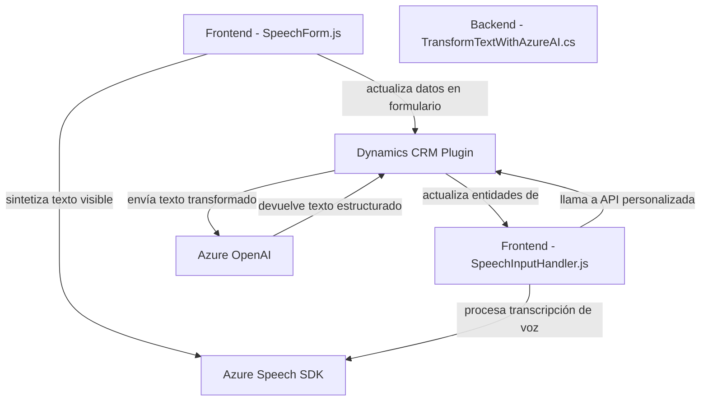

### Breve resumen técnico
El repositorio contiene archivos esenciales para una solución de reconocimiento y sintetización de voz en una aplicación integrada con Microsoft Dynamics CRM. Utiliza servicios externos como el Azure Speech SDK y Azure OpenAI para la transformación de texto y síntesis de voz. Aunque cada archivo tiene una función específica, en conjunto permiten una interacción dinámica y accesible mediante voz con formularios en aplicaciones empresariales.

---

### Descripción de la arquitectura
La solución tiene una estructura modular con tres componentes principales:
1. **Frontend**:
   - Archivos en la carpeta `/FRONTEND/JS` conforman lógica de reconocimiento de voz, integración con formularios y síntesis de texto visible. Organizados por funciones específicas que incluyen la inicialización del SDK, manejo de formularios y gestión asincrónica.
2. **Backend/Plataforma**:
   - Un archivo .NET plugin (`TransformTextWithAzureAI.cs`) es utilizado en Dynamics CRM para transformar datos textuales según estándares predefinidos, delegando la lógica al servicio Azure OpenAI.
3. **Servicios Externos**:
   - Integración con Azure Speech SDK para la síntesis de voz y reconocimiento.
   - Uso de Azure OpenAI para procesamiento avanzado y transformación de texto.

La solución combina patrones de arquitectura basados en:
- **N Capas/Modular**: El frontend gestiona la interfaz y lógica dinámica. El backend (plugin) procesa información y aplica lógica empresarial desde Dynamics CRM.
- **Integración con APIs externas**: Los servicios de Azure (Speech SDK y OpenAI) son parte esencial del funcionamiento.

---

### Tecnologías usadas
1. **Frontend**:
   - **Azure Speech SDK**: Para reconocimiento y síntesis de voz.
   - **Dynamics 365 Web API**: Gestiona la interacción con entidades y datos del CRM.
   - **JavaScript**: Organiza funciones modulares y gestiona eventos asincrónicos.
2. **Backend/Plataforma**:
   - **C#/.NET Framework**: Implementa un plugin CRM compatible.
   - **Microsoft.Xrm.Sdk**: Desarrollo extensible de aplicaciones en Dynamics CRM.
   - **Azure OpenAI API**: IA avanzada para transformar y estructurar texto.
3. **Patrones**:
   - Modularidad: Separación de lógica por responsabilidad.
   - API Wrapper: Encapsula integración Azure Speech y Dynamics 365.
   - Basado en eventos: Funciones asincrónicas activadas por eventos en el frontend.

---

### Diagrama Mermaid

---

### Conclusión final
La solución presentada es una **arquitectura modular de N capas** integrada fuertemente con servicios externos a través de APIs. Las principales características incluyen:
- Un frontend que proporciona síntesis y captura de voz para formularios mediante Azure Speech SDK.
- Un backend que actúa como un plugin de Dynamics CRM, extendiendo capacidades con transformaciones de texto mediante Azure OpenAI.
- Integración de APIs externas como Azure Speech SDK y Dynamics 365 Web API.

Es ideal para aplicaciones empresariales centradas en accesibilidad, optimización mediante voz y lógica avanzada de transformación de texto. La modularidad permite mantener alta cohesión y baja dependencia entre las capas, mientras que la integración con servicios externos asegura escalabilidad y capacidades avanzadas.