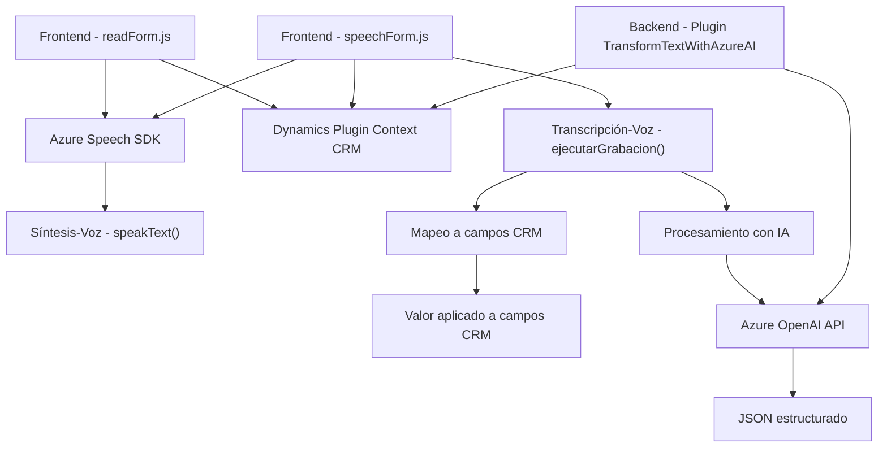

### Breve Resumen Técnico:
El repositorio presenta tres componentes principales:
1. **Frontend/JS/readForm.js**: Un archivo en JavaScript que implementa la síntesis de voz dinámica para campos visibles en un formulario CRM utilizando el Azure Speech SDK.
2. **Frontend/JS/speechForm.js**: Otro archivo en JavaScript, enfocado en la entrada de voz del usuario, transcripción mediante el Azure Speech SDK y el mapeo de campos mediante lógica específica de negocio.
3. **Plugins/TransformTextWithAzureAI.cs**: Implementa un plugin para Dynamics CRM que consume Azure OpenAI Service para transformar texto en objetos JSON según normas definidas.

### Descripción de Arquitectura:
1. **Tipo de Solución**:
   - La solución combina una **aplicación frontend** (JS para la web) con un **plugin de backend** (C# en Dynamics CRM). Es un sistema que integra **API externas** y funcionalidades de síntesis/transcripción de voz en formularios web dinámicos (probablemente CRM).

2. **Tipo de Arquitectura**:
   - **Arquitectura de N-Capas**:
     - La lógica se divide entre capas de presentación (Formularios dinámicos en JavaScript) y de negocio (Plugins en C# para Dynamics CRM).
     - Además, los servicios externos (Azure Speech SDK y OpenAI) funcionan como una capa separada de integración.
   - Uso de **Arquitectura Orientada a Servicios (SOA)**: Dependencia de APIs externas como Azure Speech SDK y Dynamics Web API.
   - Se observa modularidad funcional, lo que se podría interpretar como un diseño inspirado en **arquitectura hexagonal**:
     - **Puertos**: Dinámica en el acceso de datos (formularios visibles, transcripciones).
     - **Adaptadores**: Plugins y funcionalidad para interactuar con APIs externas.
   
### Tecnologías y Frameworks Usados:
- **Frontend**:
  - **JavaScript** con una arquitectura modular basada en funciones.
  - **Azure Speech SDK** para síntesis y transcripción de voz.
  - **Dynamics Web API** para integraciones con campos y lógica del formulario CRM.
- **Backend Plugin**:
  - **C#** con **Microsoft Dynamics SDK** para funcionalidad personalizada.
  - **Azure OpenAI** para procesamiento de texto y generación de formatos específicos.
  - **Microsoft.NET** Framework.
  - Dependencias de JSON (*Newtonsoft*) y solicitudes HTTP para la comunicación con servicios externos.

### Dependencias y Componentes Externos:
1. **Azure Speech SDK** para transcripción y síntesis de voz.
2. **Dynamics Web API** para la interacción con formularios y datos en el sistema CRM.
3. **Azure OpenAI Service** para procesamiento avanzado y transformación de texto en JSON.
4. **Newtonsoft.Json** y **System.Text.Json** para manejar estructuras JSON en las respuestas de APIs.

---

### Diagrama Mermaid Compatible con GitHub Markdown:

---

### Conclusión Final:
La solución presentada combina tecnologías frontend y backend para una integración completa con sistemas CRM (probablemente Dynamics). En el lado de cliente, se emplea JavaScript para procesar datos de formularios y hacer uso de Azure Speech SDK, mientras que en la parte del backend se utiliza un plugin programado en C# para interactuar con Azure OpenAI y transformar entradas textuales. 

Esta arquitectura basada en **N-capas** con características modularizadas muestra un diseño eficiente, preparado para manejar datos dinámicos y cumplir con requerimientos empresariales centrados en la automatización de interacción con usuarios (entrada/salida de voz y datos). La dependencia de servicios externos, como Azure Speech y OpenAI, refuerza la escalabilidad y capacidades avanzadas del sistema.