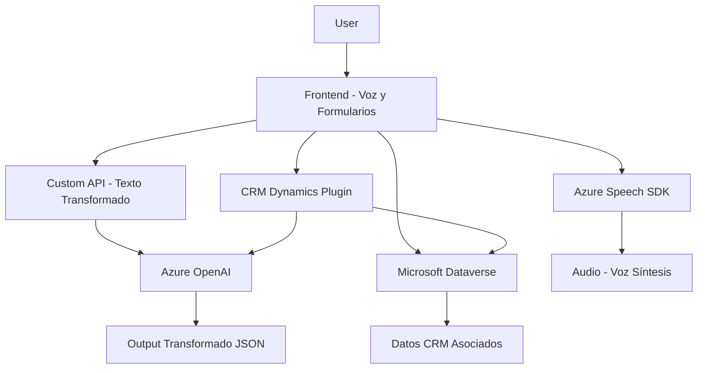

### **Resumen técnico**
El repositorio presenta funcionalidades orientadas al reconocimiento de voz, síntesis de texto a voz, transformación de texto con IA y mapeo dinámico de datos en formularios CRM. Utiliza el servicio Azure Speech SDK y Azure OpenAI, integrando servicios externos de Microsoft como Dataverse y Dynamics CRM. Además, incluye un plugin para lógica avanzada en Dynamics CRM.

### **Descripción de arquitectura**
- **Nivel de arquitectura:** Este sistema combina una arquitectura **de integración de servicios externos** con paradigmas **modulares y basada en eventos**. Cada archivo maneja dominios específicos (frontend, API personalizada, lógica del plugin).  
- **Componentes principales:**  
  - **Frontend:** Se encarga de la interacción de usuarios y formularios, incluye Azure Speech SDK para entrada/salida de voz.  
  - **API personalizada:** Transformación avanzada de texto mediante Azure OpenAI.  
  - **Plugin CRM:** Extiende las capacidades del sistema Dynamics CRM mediante personalizaciones específicas que interactúan con servicios externos.

### **Tecnologías usadas**
- **Frontend:** JavaScript, Azure Speech SDK.
- **Backend:**  
  - **API personalizada:** .NET, Azure OpenAI, Dynamics CRM SDK.  
  - **Plugin:** Dynamics CRM SDK, HttpClient para consumo de servicios externos (REST API de Azure OpenAI).  
- **Servicios externos:** Microsoft Dataverse, Azure Speech SDK, Azure OpenAI.

### **Diagrama Mermaid**

### **Conclusión final**
Este repositorio representa una solución con varios componentes integrados. Desde una interfaz de usuario que soporta interacción por voz hasta el uso de inteligencia artificial para transformar datos, se ve un diseño modular robusto. Se utiliza una arquitectura híbrida, orientada por un diseño modular distribuido a través de una API y un plugin especializado para Dynamics CRM. Esta solución es adecuada para manejos avanzados de interacciones entre voz, IA y CRM modernos, con posibilidad de escalar funcionalmente.