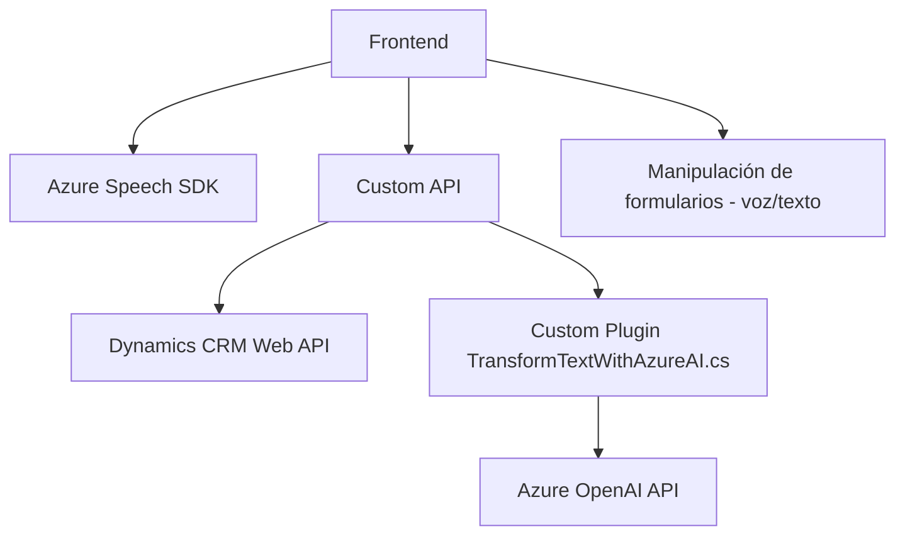

### Breve resumen técnico
El repositorio contiene tres archivos principales:  
1. **Frontend/JS**: Scripts para manipulación y procesamiento de datos dinámicos en formularios, integrando Microsoft Azure Speech SDK para entrada y salida de voz.  
2. **Plugin (TransformTextWithAzureAI.cs)**: Un plugin para Dynamics CRM que usa Azure OpenAI para convertir texto en JSON estructurado.  

Esta solución parece ser un sistema que combina accesibilidad (interacción por voz) con inteligencia artificial (procesamiento de lenguaje natural), mientras permite la manipulación de datos en tiempo real (formularios). Enfocado a integrarse con Microsoft Dynamics CRM, es probable que parte de un sistema CRM extendido.

---

### Descripción de arquitectura
1. **Arquitectura del frontend**:
   - Modular, basado en un enfoque _evento dinámico_ y la dependencia de APIs externas (Azure Speech SDK).
   - No parece tener componentes de almacenamiento, centrándose en manipulación local de datos en memoria.
   - **Patrón observador**: Con callbacks para interacción con SDK externo.
   - Uso de API personalizada para datos relacionados con formularios.

2. **Backend/Plugins**:
   - Implementación de extensibilidad en Microsoft Dynamics CRM mediante **Plugin Pattern**.
   - **Arquitectura basada en servicios**: Utiliza servicios externos como Azure OpenAI y Web API de Dynamics CRM para transformar y consumir datos.
   - **Sincronización con eventos del sistema** de Dynamics CRM (usando IPlugin).

La arquitectura general parece **orientada a n-capas**, con la capa de presentación (frontend JS), lógica de negocio (plugin y custom API), y acceso a servicios externos (Azure SDK/AI).

---

### Tecnologías usadas
- **Frontend**:
  - **Azure Speech SDK**: Para procesar entrada y salida de voz en aplicaciones web.  
  - **JavaScript**: Manipulación de DOM y lógica para formularios interactivos.
  - **Custom API en Dynamics CRM**: Comunicación entre frontend y servicios backend en Dynamics CRM.

- **Backend/Plugins**:
  - **Microsoft Dynamics CRM SDK**: Interfaces como `IPlugin`, `IOrganizationService`, y sus extensiones.  
  - **Azure OpenAI**: Uso de GPT para procesamiento de texto.  
  - **ASP.NET / .NET Framework**: Estructura del plugin.

---

### Dependencias o componentes externos
1. **Azure Speech SDK** (en frontend):  
   Proporciona capacidades de entrada y salida de voz mediante servicios en la nube.

2. **Dynamics CRM SDK**:
   - Manejo de eventos y manipulación de datos dentro del ecosistema CRM.
   - Interacción con API personalizada para dinámica de formularios y CRM Web APIs.

3. **Azure OpenAI**:
   - Servicio externo para la generación de contenido estructurado en JSON desde texto libre.
   - Configurado según normas específicas definidas en el plugin.

4. **Custom API**:
   - Extensión personalizada en Dynamics CRM (probablemente backend en .NET Core o Node.js).

---

### Diagrama Mermaid válido para GitHub

---

### Conclusión final
Este proyecto muestra una arquitectura n-capas que integra tecnologías modernas de accesibilidad (Azure Speech SDK), inteligencia artificial (Azure OpenAI), y manipulación dinámica de formularios en sistemas CRM extendidos. Su diseño modular, junto con la orientación hacia servicios externos, refuerza la robustez y la capacidad de integración en diversos entornos corporativos. Sin embargo, para una mayor escalabilidad y mantenimiento, se podría expandir a una arquitectura hexagonal o microservicios, separando los módulos de interacción por voz, inteligencia artificial y backend de CRM.