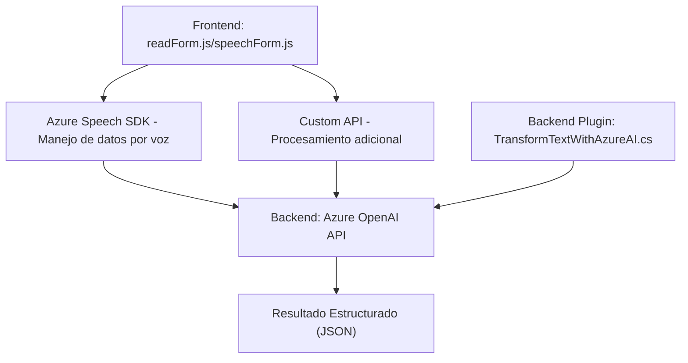

### Breve Resumen Técnico
El repositorio parece ser parte de una solución que integra una experiencia de usuario interactiva en un sistema de formularios, abordando aspectos de accesibilidad y procesamiento de lenguaje natural. Incluye archivos de frontend para manipular datos visuales y establecer conexiones con Azure Speech SDK y Azure OpenAI. También contiene un plugin para extender una instancia de Dynamics CRM mediante integración con Azure OpenAI.

---

### Descripción de Arquitectura
La arquitectura es un diseño híbrido compuesto por:
1. **Microservicios**: Los módulos dedicados a la integración con el Azure Speech SDK y Azure OpenAI API representan servicios específicos que se pueden gestionar y escalar por separado.
2. **Integración SOA (Service-Oriented Architecture)**: Los servicios externos, como Azure Speech SDK y Azure OpenAI API, enfatizan la comunicación en tiempo real con APIs externas para realizar tareas de síntesis y procesamiento de datos.
3. **N-capas** en el plugin para Dynamics CRM: Se utiliza una arquitectura basada en capas dentro del entorno de Microsoft Dynamics CRM, donde el plugin actúa como un componente especializado en lógica de negocio.

Los módulos del frontend interactúan indirectamente con el backend del sistema y servicios de terceros como Azure Speech SDK y Azure OpenAI API, creando una integración fluida entre el procesamiento del cliente y las operaciones del servidor.

---

### Tecnologías, Frameworks y Patrones en Uso
#### Tecnologías y Frameworks:
1. **Frontend**:
   - **JavaScript** para las integraciones con formularios y SDK.
   - **Azure Speech SDK**: Para síntesis de voz y reconocimiento de texto por voz.
   - **Custom API** para ampliación de funcionalidades (posibilidad de otras integraciones con servicios de procesamiento de datos).
   
2. **Backend**:
   - **Microsoft Dynamics CRM Plugin**: Extensión de funcionalidad para Dynamics.
   - **Azure OpenAI API**: Procesamiento avanzado de texto utilizando inteligencia artificial.

#### Patrones Observados:
1. **Encapsulación**: Lógica modular y funciones bien definidas para la manipulación de datos y extracción de valores (ej., `getVisibleFieldData`, `applyValueToField`).
2. **Delegación**: Uso del patrón delegado en el frontend para callbacks en el contexto de carga de dependencias del Azure Speech SDK.
3. **Programación Reactiva**: Empleo de promesas para la gestión asincrónica en los módulos frontend y backend.
4. **Adaptador**: Ajuste de datos entre los formularios y las APIs externas.
5. **Repositorio**: El mapeo de campos y el manejo del contexto de los formularios en Dynamics CRM puede considerarse análogo al patrón repositorio.
6. **SOA**: Interacción con APIs de Azure para delegar la lógica de negocio especializada.

---

### Dependencias o Componentes Externos
1. **Azure Speech SDK**:
   - Sintetización de voz y reconocimiento de voz desde texto proporcionado.
   - Endpoint: `https://aka.ms/csspeech/jsbrowserpackageraw`.
   - Key y Región: Parámetros configurados para acceso al servicio.

2. **Azure OpenAI API**:
   - Transformación de texto en JSON estructurado mediante GPT-4 basado en aprendizaje profundo.
   - Endpoint: `https://openai-netcore.openai.azure.com/`.
   - Autenticación por API Key.

3. **Librerías usadas en el backend (Dynamics Plugin)**:
   - **Newtonsoft.Json** y **System.Text.Json**: Para el manejo y serialización de datos en JSON.
   - **System.Net.Http**: Comunicación con APIs externas.

---

### Diagrama **Mermaid** para GitHub Markdown
El siguiente diagrama muestra la interacción principal entre los componentes del sistema.

---

### Conclusión Final
Esta solución, que combina la integración de inteligencia artificial mediante el procesamiento de datos por voz y texto, está dirigida a mejorar la accesibilidad en formularios y sistemas CRM. Su arquitectura híbrida, basada en microservicios y n-capas, permite escalabilidad y flexibilidad al integrar servicios externos como Azure Speech y OpenAI. Bien diseñada y enfocada a aplicaciones empresariales que utilizan Microsoft Dynamics y Azure, esta solución demuestra cómo una combinación de frontend, backend y servicios externos puede ofrecer una experiencia enriquecedora al usuario.