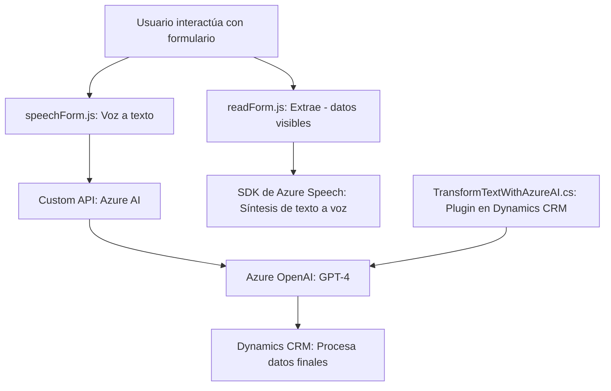

### Breve resumen técnico:
El repositorio tiene componentes dedicados a procesar datos de formularios basados en entrada y salida de voz (JavaScript), integrando el SDK de Azure Speech y una API personalizada para enriquecer la experiencia del usuario. Además, incluye un plugin de Dynamics CRM en C#, que interactúa con Azure OpenAI para transformar texto según las reglas del usuario.

---

### Descripción de arquitectura:
La solución implementa:
1. **Frontend JavaScript (readForm.js y speechForm.js)**: Manejo de datos de formularios mediante entrada / salida de voz y procesamiento por IA.
2. **Plugins en C# (TransformTextWithAzureAI.cs)**: Enriquecimiento de datos a través de una API externa (Azure OpenAI) en el contexto del Dynamics CRM.

**Patrón arquitectónico general:**  
La arquitectura es **orientada a servicios**, integrando dependencias externas como SDKs y APIs, y sigue principios de modularización y desacoplamiento a nivel de componentes. La integración en Dynamics CRM sigue el patrón de **plugin architecture**, permitiendo ejecutar lógica personalizada dentro del flujo de negocio.

---

### Tecnologías usadas:
1. **Frontend:**
   - **SDK de Azure Speech**: Manejo de síntesis y reconocimiento de voz.
   - **JavaScript**: Para lógica de procesamiento voz-texto y sincronización con formularios.
   - **Integración con Custom API**: Para enriquecer datos utilizando servicios externos (Azure AI).

2. **Backend/Plugins:**
   - **C# (Dynamics CRM)**: Para lógica de negocio y transformación de texto.
   - **Azure OpenAI API**: Uso del modelo GPT-4 para enriquecer y ajustar datos.
   - **Microsoft Dynamics SDK**: Interacción con entidades del CRM.

**Otros recursos comunes:**  
- HTTP Cliente (para interacciones con APIs externas).
- JSON parsing librerías (`System.Text.Json`, `Newtonsoft.Json.Linq`).

---

### Diagrama Mermaid (estructurado y válido para GitHub):

---

### Conclusión final:
El repositorio representa una solución **orientada a servicios** con capacidades avanzadas de interacción basada en voz y enriquecimiento de datos mediante inteligencia artificial. Está diseñado para usarse en entornos como formularios gestionados en Dynamics CRM, empleando componentes altamente cohesionados y dependencias como **Azure Speech SDK** y **Azure OpenAI API**.

- **Arquitectura:** Modular, centrada en servicios con apoyo de SDKs y plugins.
- **Patrones utilizados:** Lazy loading, plugin architecture, desacoplamiento y consumo de APIs externas.
- **Integración:** Diseñado para integrarse con tecnologías de Microsoft como Dynamics CRM y servicios de Azure.

Es adaptable para escenarios accesibles, formularios dinámicos y automatización de procesos empresariales.