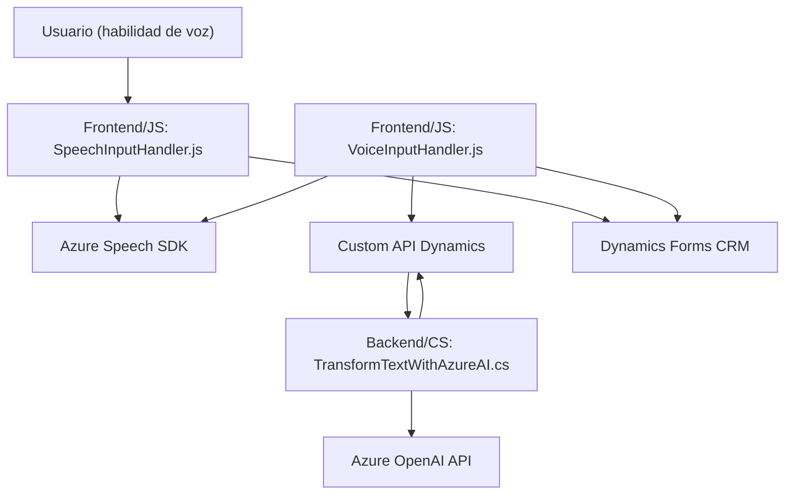

---

### Breve Resumen Técnico

El repositorio consiste en una solución integrada en Dynamics 365, que utiliza herramientas basadas en Inteligencia Artificial para reconocimiento de voz y transformación de texto, y aprovecha funcionalidades avanzadas de accesibilidad y procesamiento automático de datos mediante APIs externas (por ejemplo, Azure Speech SDK y Azure OpenAI). Está relacionado con formularios y plugins de Dynamics CRM, incluyendo tanto un frontend en JavaScript como un backend en C#.

---

### Descripción de Arquitectura

La solución presenta una arquitectura **orientada a servicios** con integración de herramientas de IA, arquitectura modular y patrones de plug-ins. Los componentes principales funcionan juntos para lograr:

1. **Frontend JS**:
   - Interacción directa con formularios en Dynamics 365.
   - Entrada de voz -> Reconocimiento de texto -> Procesamiento -> Respuesta en formato accesible.

2. **Backend C#**:
   - Transformación de datos con Azure OpenAI.
   - Procesamiento avanzado de texto y generación de estructuras JSON.

### Arquitectura Inferida:
La solución está diseñada bajo los principios de **Service-Oriented Architecture (SOA)**, con dependencia de múltiples servicios externos como Azure Speech y OpenAI, además del núcleo empresarial Dynamics 365. Cada archivo presenta módulos con alta cohesión y responsabilidad única, siguiendo prácticas de arquitectura modular.

---

### Tecnologías Usadas

1. **Frontend**:
   - **JavaScript**: Funcionalidades de lectura, síntesis y entrada de voz.
   - **Azure Speech SDK**: Procesamiento de voz y síntesis de audio.

2. **Backend**:
   - **C#**: Desarrollo del plugin de Dynamics CRM.
   - **Microsoft Dynamics CRM SDK (`IPlugin`)**: Integración con la plataforma CRM.
   - **Azure OpenAI API**: Transformación de texto con modelos de IA generativa.

3. **Patrones de Diseño**:
   - **Service-Oriented Architecture (SOA)**: Integración eficiente de servicios externos.
   - **Callback Pattern**: Para comportamientos asincrónicos en SDKs.
   - **Plugin Architecture**: Extensibilidad del CRM mediante `IPlugin`.
   - **Factory Pattern**: Uso e instanciación de SDKs únicos.
   - **Data Mapper**: Mapeo de datos formateados a atributos del formulario.

---

### Dependencias y Componentes Externos

1. **Servicios Externos**:
   - Azure Speech SDK para interacción voz-texto.
   - Azure OpenAI API para transformación y procesamiento de texto.

2. **Componentes Internos**:
   - Dynamics 365 (entidades de CRM, contexto de ejecución, servicios organizacionales).
   - APIs propias de Dynamics (`Xrm.WebApi`, `formContext`).

---

### Diagrama Mermaid

A continuación se presenta el diagrama **Mermaid** que describe la interacción entre los componentes principales del sistema. 

---

### Conclusión Final

La solución combina servicios de inteligencia artificial (Azure Speech y OpenAI) con las capacidades de Dynamics CRM para ofrecer una funcionalidad avanzada de accesibilidad y procesamiento de datos. Su arquitectura modular basada en **SOA** facilita la integración de sistemas externos y el desarrollo de superficies especializadas como el reconocimiento de voz y la transformación de texto. Los patrones implementados apoyan un diseño robusto, escalable y adecuado para plataformas empresariales.

