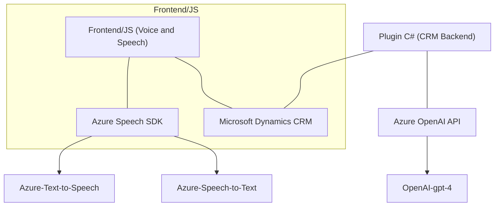

## Breve resumen técnico

El repositorio en cuestión mezcla funcionalidades de interacción por voz y procesamiento textual utilizando servicios de inteligencia artificial (Azure Speech SDK y Azure OpenAI). El propósito general parece ser facilitar que usuarios interactúen con formularios de un sistema CRM mediante entrada por voz, transformación textual asistida por IA, y síntesis de voz para mejorar la accesibilidad.

---

## Descripción de arquitectura

La solución comprende tres componentes principales:
1. **Captura y síntesis de voz (Frontend JS)**:
   - JavaScript en el cliente para integrar Azure Speech SDK y recolectar datos de formularios visibles, transcribiendo voz y leyendo datos en voz.
   - Enfoque modular con funciones independientes para manejar diferentes aspectos (captura, procesamiento y síntesis).

2. **Procesamiento textual avanzado en el backend (Plugin C#)**:
   - Plugin de Dynamics CRM que utiliza la API de Azure OpenAI para transformar texto siguiendo reglas específicas.
   - Manejo exclusivo de texto desde y hacia el contexto CRM (modelo plugin estándar basado en `IPlugin`).

3. **Conexión entre servicios y APIs de terceros**:
   - Metodología de integración con servicios externos de Azure: Speech SDK y OpenAI.
   - Uso claro de asincronía frente a las operaciones de red/externas (APIs).

### Patrón arquitectónico:
1. **Arquitectura de N capas**:
   - La solución sigue el modelo clásico de N capas con una separación clara de frontend, backend/plugin, y servicios API externos.
   - Aunque está estructurado para funcionar dentro de un monolito CRM (Dynamics 365), la interacción asincrónica con servicios externos como Azure Speech SDK y Azure OpenAI introduce elementos de arquitectura hexagonal o de microservicios.

---

## Tecnologías usadas
- **Frontend**
  - Lenguaje: JavaScript (ECMAScript).
  - Librerías y SDKs: Azure Speech SDK.
  - Servicios: Azure Speech-to-Text, Azure Text-to-Speech.

- **Backend Plugin**
  - Lenguaje: C#.
  - Framework: .NET (específicamente para Dynamics CRM, incluido `Microsoft.Xrm.Sdk`).
  - Integración: Azure OpenAI (modelo GPT-4o) vía REST API.

- **Patrones de desarrollo**
  - Modularidad: Módulos altamente cohesivos y reutilizables.
  - Capa de abstracción mediante funciones y clases para encapsular responsabilidades (e.g., interacción con SDK y procesamiento de campos/formularios).
  - Asincronía: Uso de `Promise` y `async/await` en toda la solución.
  - Integración externa: Mediante solicitudes HTTP (RESTful) con autorización (Azure keys).

---

## Dependencias o componentes externos
1. **Azure Speech SDK**:
   - Servicios Text-to-Speech y Speech-to-Text de Azure para procesar y sintetizar voz.
   - Integración web (JavaScript).
   - Carga dinámica desde URL (`https://aka.ms/csspeech/jsbrowserpackageraw`).

2. **Azure OpenAI**:
   - Uso del modelo GPT-4o para procesamiento y generación de texto en JSON estructurado.
   - Se utiliza desde el plugin en el backend.

3. **Microsoft Dynamics CRM/Dataverse API**:
   - Contexto CRM (`executionContext`, `Xrm.WebApi`) se utiliza en las funciones frontend.
   - Plugin aprovecha `IPluginExecutionContext` y `IOrganizationService` de Dynamics.

4. **Newtonsoft.Json o System.Text.Json**:
   - Manejo de estructuras JSON en la comunicación con OpenAI.

---

## Diagrama **Mermaid**

---

## Conclusión final

La solución integra tecnologías avanzadas (Azure Speech SDK y OpenAI) con un sistema CRM (Dynamics 365), utilizando una arquitectura funcional compatible con **n capas** pero con elementos que podrían ser adaptados fácilmente a un modelo más distribuido como microservicios o arquitectura hexagonal. Se prioriza la modularidad en la estructura, con claras separaciones entre frontend, backend y servicios externos mediante funciones específicas. La elección de tecnologías como JavaScript, C#, y Azure, junto a buenas prácticas como la asincronía y el encapsulamiento, hacen que la solución sea escalable y adecuada para aplicaciones modernas.

Sin embargo, este diseño depende fuertemente de integraciones con servicios en la nube, lo cual podría ser una limitación en entornos desconectados o con restricciones de conectividad, y evidencia aspectos sensibles (manejo de credenciales) que deben mejorarse para adecuarse a estándares de seguridad actuales.