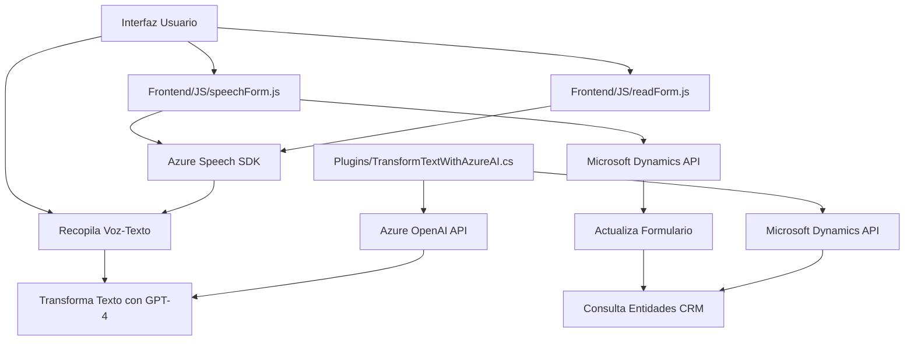

### Breve resumen técnico
El repositorio consiste en una integración entre tecnologías de IA de Azure (Speech SDK y OpenAI) y aplicaciones CRM basadas en Microsoft Dynamics. Combina lógica de frontend con control de voz y procesamiento dinámico de formularios y envuelve una funcionalidad de backend usando plugins .NET para aplicar transformaciones avanzadas mediante AI. 

---

### Descripción de arquitectura
#### Arquitectura general:
- **Cliente-Servidor:** Hay una interacción entre los componentes frontend basados en JavaScript y el backend alojado en Dynamics CRM.
- **Event-driven:** Uso de eventos como voz capturada o entrada de texto para disparar procesos.
- **Integración híbrida:** Combina varias capas: presentación, lógica de negocio mediante plugins en Dynamics, y servicios externos (Azure OpenAI y Azure Speech).

#### Componentes:
1. **Frontend (JavaScript)**: Procesa formularios y realiza interacciones como entrada de voz y reconocimiento de comandos, en conjunto con Azure Speech SDK.
2. **Backend (Plugins)**: Implementa lógica avanzada para transformar texto usando Azure OpenAI en plugins .NET.
3. **Azure Cognitive Services**: Utilizado para reconocimiento de voz y síntesis de voz en tiempo real.
4. **Integración con Dynamics CRM**: Utiliza APIs internas de Dynamics para interactuar con datos del sistema.

Es una arquitectura **n capas**, claramente diseñada con separación de responsabilidades: Frontend, Backend y capa de servicios externos. Aunque tiene integración de estándares de microservicios para los servicios de Azure AI, el núcleo de la lógica CRM indica un enfoque monolítico.

---

### Tecnologías usadas
1. **Frontend**:
   - Lenguaje: JavaScript.
   - Azure Speech SDK: Para la síntesis y reconocimiento de voz.
   - Microsoft Dynamics Web API (`Xrm.WebApi`): Para la interacción con datos del CRM.

2. **Backend**:
   - Lenguaje: C#.
   - Framework: .NET (Microsoft Dynamics Plugin SDK).
   - Azure OpenAI (GPT-4): Transformación de texto en formato JSON por IA.
   - Newtonsoft.Json y System.Text.Json: Procesamiento de datos JSON.
   - System.Net.Http: Comunicación REST con Azure OpenAI.

3. **Servicios Externos**:
   - **Azure Speech SDK**: Creación dinámica de voz e implementación de recolector de comandos.
   - **Azure OpenAI API**: GPT para formateo estructurado de datos.
   
4. **Patrones de diseño**:
   - Single Responsibility Principle (SRP): Separación de funcionalidades.
   - Callback Pattern: En el frontend, garantiza la carga del Speech SDK antes de continuar.
   - API Integration: Comunicación REST con servicios Azure OpenAI y Dynamics CRM.

---

### Diagrama Mermaid válido para GitHub

---

### Conclusión final
El sistema implementado en el repositorio es una solución híbrida con foco en accesibilidad mediante inteligencia artificial y capacidades de integración directa con Microsoft Dynamics CRM. La arquitectura sigue el patrón n capas con separación de frontend (interacción directa), backend (plugins .NET), y servicios integrados (Azure Speech / OpenAI). Es eficaz para casos como manejo dinámico de formularios por voz y mejora la experiencia del usuario al hacer accesible los datos mediante sintetizadores y transformaciones avanzadas.

Aunque puede escalar bien en su integración con otras tecnologías de Azure, tiene dependencias fuertes en Dynamics CRM y posibles vulnerabilidades como la inclusión directa de claves internas para servicios externos (Azure). Sin embargo, su modularidad permite extender dicha arquitectura con facilidad.