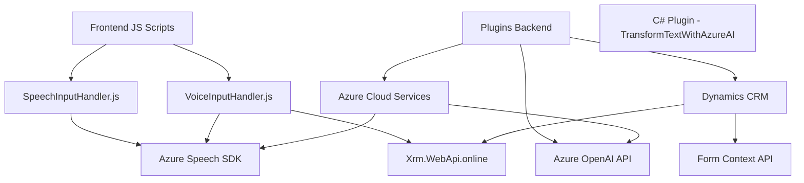

### Breve resumen técnico
El repositorio presenta una solución enfocada en la integración de APIs y SDKs de Azure para la manipulación avanzada de voz y texto. En términos generales, el código implementa funcionalidades de síntesis de voz, reconocimiento de voz, y transformación de texto mediante el servicio Azure OpenAI. Este conjunto de archivos constituye una solución típica para sistemas integrados en un entorno Dynamics 365, enfocada en mejorar la interacción mediante voz y optimizar los procesos de entrada y salida de datos basada en formularios.

### Descripción de arquitectura
La arquitectura del repositorio es modular y fusiona elementos de integración con APIs externas, características propias del desarrollo front-end JavaScript, y extensiones dinámicas basadas en el ecosistema de Dynamics CRM. Aunque tiene componentes separados como plugins y scripts front-end, la solución no se descompone en servicios independientes. Por lo tanto, es un **sistema monolítico** de **n capas**, dado que integra lógica de negocio, acceso a servicios externos y procesamiento de datos en diferentes capas tecnológicas coordinadas.

### Tecnologías usadas
1. **Front-end:**
   - **Lenguaje:** JavaScript.
   - **APIs utilizadas:** Azure Speech SDK para síntesis y reconocimiento de voz.
   - **Frameworks:** Adopta una arquitectura modular, pero no se utiliza un framework JS específico.
   - **Dynamics 365:** Para manipular contextos de formularios y APIs de manipulación de datos (`Xrm.WebApi`).

2. **Back-end:**
   - **Lenguaje:** C#, integrándose con Dynamics CRM mediante Plugins (.NET Framework/Standard).
   - **APIs externas:** Azure OpenAI API para transformación de texto.
   - **Librerías:** `System.Net.Http`, `System.Text.Json`, `Newtonsoft.Json.Linq`.

3. **Azure Cloud Services:**
   - **Azure Speech SDK:** Síntesis de voz y reconocimiento de voz.
   - **Azure OpenAI API:** Conversaciones y transformaciones de texto con inteligencia artificial.

4. **Arquitectura del código:**
   - Modularidad: Funciones bien definidas para manejar cada operación (manipulación de voz, carga dinámica de SDK, formas, etc.).
   - Estructura de capas: Front-end para la interacción del usuario (voz y formularios) y back-end para la lógica de negocio y procesamiento de texto.

### Diagrama Mermaid válido para GitHub

### Conclusión final
El repositorio presenta una solución monolítica de tipo n capas, que aprovecha la modularidad y los servicios de Azure Cloud (Speech SDK y OpenAI API) junto con las capacidades de Dynamics 365 para facilitar la interacción entre usuarios y sistemas utilizando comandos de voz y procesamiento de texto avanzado. Aunque está diseñado con funciones bien segmentadas y desacopladas, no se considera una arquitectura de microservicios debido a que todas las funcionalidades están concentradas en un marco común sin separación evidente en servicios independientes.

La elección de Azure Speech SDK y OpenAI API sugiere que el proyecto enfatiza el desarrollo basado en IA y servicios cognitivos, lo cual es ideal en entornos que requieren interacción inteligente y procesamiento automatizado.