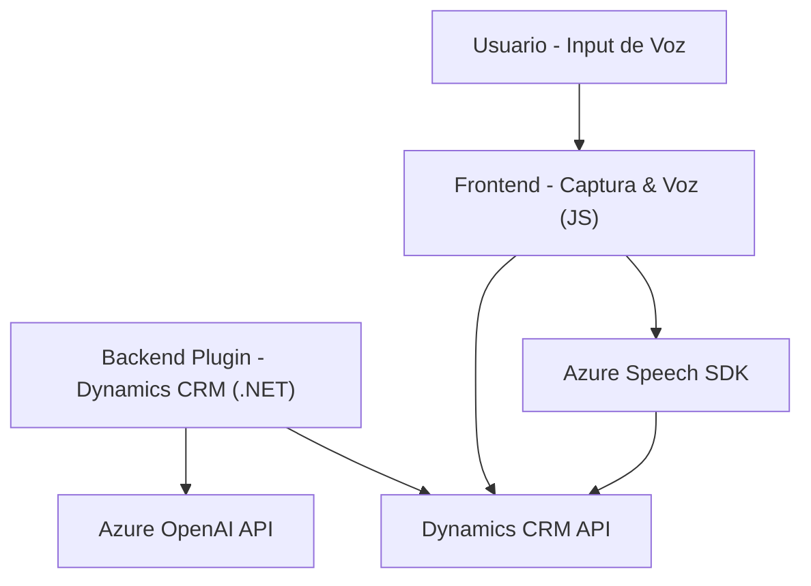

### Breve resumen técnico:
El repositorio presentado consiste en una suite tecnológica diseñada para proporcionar **interacción por voz y texto**, principalmente enfocada en formularios y transcripciones en **Microsoft Dynamics CRM**. Utiliza **Azure Speech SDK** para reconocimiento y síntesis de voz. Además, se integra con **Azure OpenAI** para realizar transformaciones textuales avanzadas mediante IA.

---

### Descripción de arquitectura:
La arquitectura de la solución es **n capas**, distribuida en las siguientes responsabilidades:
1. **Frontend (JS)**: 
   - Captura de datos desde formularios CRM.
   - Uso de reconocimiento de voz y síntesis para generación y procesamiento de texto basado en interacción por voz.
2. **Backend (Plugins)**:
   - Extensión de funcionalidades para Dynamics CRM mediante plugins .NET, que transforman datos y realizan tareas complejas con el soporte de **Azure OpenAI**.
3. **Microservicio externo (CRM API)**:
   - Utiliza APIs de Dynamics para realizar llamadas personalizadas desde el cliente o plugins.

Principales características detectadas:
- **Integración dinámica de SDKs**: El sistema carga el SDK de Azure Speech dinámicamente, mejorando la experiencia al evitar dependencias rígidas.
- **Procesamiento asíncrono**: Ambos sistemas, tanto el frontend como el backend, están diseñados para manejar procesamiento de voz o texto de forma asíncrona y eficiente.
- **Reutilización modular**: Cada archivo opera mediante funciones y clases segmentadas con operaciones específicas (principio SOLID: Single Responsibility).

---

### Tecnologías usadas:
1. **Frontend**:
   - **Azure Speech SDK**: Reconocimiento y síntesis de voz.
   - **JavaScript**: Manipulación de DOM y carga condicional de dependencias.
   - **Dynamics CRM Web APIs**: Para la interacción con datos del formulario.

2. **Backend**:
   - **C# (.NET)**: Plugins desarrollados para operaciones extendidas en Dynamics CRM.
   - **Azure OpenAI API (GPT-4)**: Transformación avanzada de textos en JSON estructurados mediante prompt engineering.
   - **Newtonsoft.Json / System.Text.Json**: Manejo de objetos JSON para respuestas de la API OpenAI.

3. **Patrones detectados**:
   - **Arquitectura n capas**: Separación entre presentación (frontal), integración lógica (API CRM), y ejecución asíncrona mediante plugin backend.
   - **Carga dinámica de SDKs** en frontend.
   - **Event-driven programming**: Se utiliza callbacks para gestionar eventos.

---

### Diagrama Mermaid 100% compatible con GitHub Markdown:

---

### Conclusión final:
La solución presentada es una integración avanzada basada en **Microsoft Dynamics CRM** combinada con funcionalidades AI de Azure. Tiene un enfoque modular y desacoplado siguiendo principios de **n capas**, permitiendo procesar datos tanto a nivel interactivo (Frontend JS con voz) como en automatización extendida (Backend CRM con Azure OpenAI). Se destacan las buenas prácticas en modularidad, desacoplamiento y la utilización dinámica de dependencias.