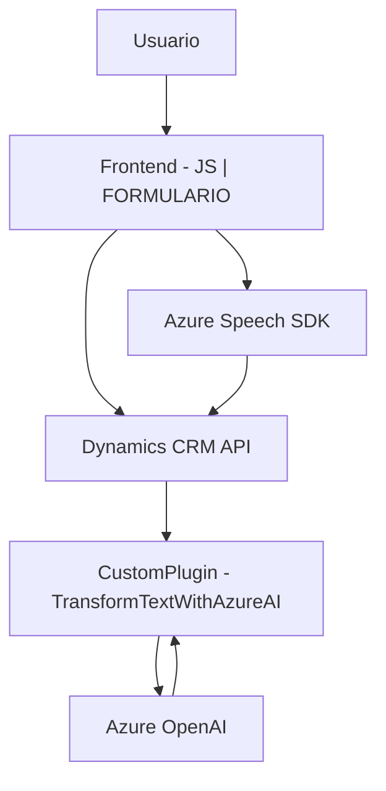

### Breve resumen técnico
El repositorio analiza la funcionalidad de conversión de datos a texto hablado y entrada de voz en formularios CRM basados en Dynamics 365, con integración al Azure Speech SDK y OpenAI de Azure. Además, implementa un plugin en Dynamics CRM que utiliza modelos de OpenAI para procesamiento de texto según reglas predefinidas.

---

### Descripción de la arquitectura
1. **Tipo de solución**: Solución híbrida con enfoque en una **aplicación cliente (frontend)** integrada en un sistema CRM, complementada por un **plugin de servidor** basado en Dynamics.
2. **Tipo de arquitectura**: Predominantemente arquitectura **n-capas**:
   - Capa **presentación**: Formulario y lógica de procesamiento con JavaScript para la interfaz y funcionalidades asociadas.
   - Capa **business logic (BLoC)**: Plugin de Dynamics 365 que aplica reglas y utiliza OpenAI.
   - Capa **data**: API de Dynamics CRM y servicios externos como Azure OpenAI y Azure Speech SDK.
3. **Patrones usados**:
   - **Modularidad** para cada archivo y método.
   - **Cliente-Servidor** para la comunicación entre las capas de frontend y el plugin basado en APIs.
   - **Repositorio** para manejar inserciones, consultas y modificaciones en Dynamics CRM.
   - **Carga dinámica de dependencias** como el Azure Speech SDK.

---

### Tecnologías usadas
1. **Frontend**: JavaScript (integrado con Dynamics 365), funcionalidades adaptadas para sintetizar y procesar voz.
   - Framework o librerías externas: Azure Speech SDK.
2. **Plugins (backend)**: C#:
   - Dependencias: `Microsoft.Xrm.Sdk`, Azure OpenAI (API de OpenAI), API para interacción externa con CRM.
   - Servicio externo de inteligencia artificial: GPT-4 o equivalente de Azure OpenAI.
   - Serialización JSON (`Newtonsoft.Json` y `System.Text.Json`).
3. **Plataforma CRM**: Dynamics 365
   - API personalizada (`trial_TransformTextWithAzureAI`) para operaciones específicas.

---

### Dependencias o componentes externos presentes
1. **Azure Speech SDK**: Para la síntesis y reconocimiento de voz en el frontend.
2. **Azure OpenAI API**: Plugin dinámico utiliza este modelo para transformar texto de usuario.
3. **Dynamics 365 WebAPI**: Lógica de negocio y gestión de datos sobre CRM.
4. **Newtonsoft.Json**: Para trabajar con estructuras JSON en el plugin.
5. **System.Net.Http**: Para realizar solicitudes HTTP a servicios como OpenAI.

---

### Diagrama Mermaid:

---

### Conclusión final
El repositorio representa una solución integrada que utiliza tecnologías de Microsoft y Azure para extender funcionalidades de Dynamics CRM con capacidades avanzadas de interacción por voz y procesamiento de texto con IA. La estructura de la solución está modularizada para cumplir con buenas prácticas de software: código claro y responsabilidad separada en capas y servicios. Aunque depende de múltiples servicios externos, como Azure Speech y OpenAI, la solución se mantiene robusta y extensible mediante patrones como carga dinámica y separación de intereses en lógica cliente-servidor.