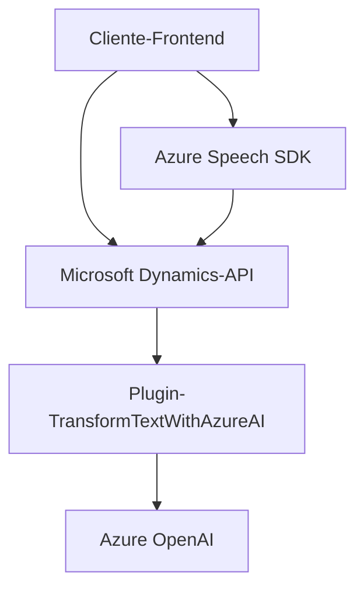

### Breve Resumen Técnico:
El repositorio presentado parece estar relacionado con el desarrollo de una solución centrada en la integración de formularios dinámicos de **Microsoft Dynamics CRM** con servicios de **Azure Speech SDK** y **Azure OpenAI**. Combina un frontend basado en JavaScript para voz y formularios dinámicos, plugins en C# para la parte servidor y lógica empresarial, y servicios en la nube para reconocimiento de voz y procesamiento mediante inteligencia artificial (GPT-4). Se enfoca en crear una experiencia de usuario que permita tanto la síntesis de voz de formularios dinámicos como el procesamiento de entrada de voz en tiempo real.

---

### Descripción de Arquitectura:
El sistema utiliza una arquitectura híbrida basada en **n capas/microservicios**:
1. **Capa Cliente (Frontend)**:
   - Compuesta por archivos de JavaScript que implementan la lógica de voz, extracción de datos del formulario y comunicación con APIs externas.
   
2. **Capa Servidor** (Microsoft Dynamics CRM Plugins):
   - Contiene lógica empresarial personalizada con plugins para transformar datos usando Azure AI y procesamiento de datos CRM.

3. **API Externas (Servicios en la nube)**:
   - **Azure Speech SDK** para reconocimiento y síntesis de voz.
   - **Azure OpenAI** para análisis y transformación avanzada de texto.

---

### Tecnologías Utilizadas:
- **Frontend**:
  - *Azure Speech SDK*: Para transformación de texto a voz y reconocimiento de comandos de voz.
  - *Microsoft Dynamics CRM API*: Para manipulación dinámica de formularios y entidades.
  - *JavaScript (Functions)*: Para procesar, normalizar y manejar eventos de entrada/salida.

- **Backend (Plugins)**:
  - *C#:* Desarrollo de plugins para Dynamics.
  - *Microsoft Dynamics SDK*: Contexto del plugin (IPlugin).
  - *Azure OpenAI (GPT-4)*: Uso de inteligencia artificial para procesamiento de texto.
  - *HttpClient*: Para realizar solicitudes HTTP al servicio Azure OpenAI.
  - *Newtonsoft.Json*: Manejo avanzado de JSON.

---

### Dependencias o Componentes Externos:
1. **Azure Speech SDK**: Proporciona la funcionalidad de síntesis y reconocimiento de voz.
2. **Microsoft Dynamics CRM**: Contextos de formulario y APIs para la manipulación de datos.
3. **Azure OpenAI (GPT-4)**: Para análisis semántico y transformación de texto en JSON estructurado.
4. **Externos potenciales**:
   - *Frontend libraries/frameworks*: Aunque no se mencionó explícitamente, pueden incluirse bibliotecas para gestionar eventos dinámicos y mejorar la interfaz.
   - *Azure Active Directory (AAD)*: Posiblemente integrando autenticación para acceder a APIs seguras como OpenAI o Speech SDK.

---

### Diagrama Mermaid:

---

### Conclusión:
Este repositorio implementa una solución híbrida con un enfoque basado en **n capas/microservicios**: utiliza una capa de presentación (Frontend JS), una capa empresarial (Plugins de Dynamics CRM) y servicios externos como **Azure Speech SDK** y **Azure OpenAI GPT-4**. La arquitectura promueve la modularidad y facilita la integración con múltiples APIs externas; además, permite procesar datos dinámicos tanto desde formularios como de interacción por voz, mejorando la experiencia del cliente. Sin embargo, la integración está fuertemente acoplada a las tecnologías de **Microsoft/Azure**, lo cual puede complicar la migración a otras plataformas en el futuro.