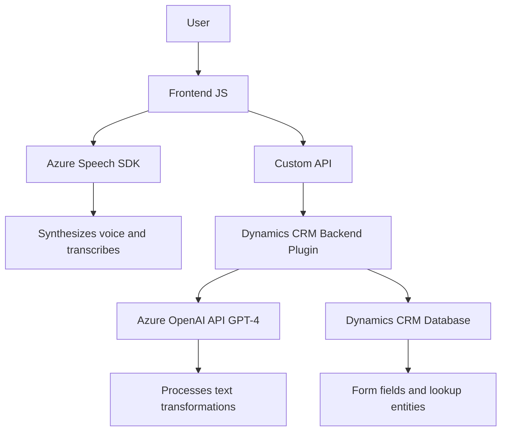

### Breve resumen técnico
El repositorio contiene una solución híbrida que incluye un **frontend** basado en JavaScript y un **plugin backend** diseñado para Dynamics CRM utilizando .NET y conexión con servicios de **Azure OpenAI**. El objetivo de la solución es habilitar la interacción mediante voz, trabajando en conjunto con formularios de Dynamics CRM y enriqueciendo la funcionalidad con tecnologías como el **Azure Speech SDK** y la **API GPT de Azure** para procesamiento de datos.

---

### Descripción de arquitectura
La arquitectura de la solución se basa en un **modelo de n capas**, donde las responsabilidades están distribuidas entre el frontend, que maneja la interacción del usuario y la integración de servicios de síntesis/reconocimiento de voz, y el backend, que actúa como un punto de procesamiento central para la transformación de texto mediante Azure OpenAI.

#### Componentes funcionales:
1. **Frontend (JavaScript)**:
   - Procesa los formularios, extrae datos de campos visibles y traduce la información a voz utilizando Azure Speech SDK.
   - Opera transcripciones de voz e interactúa con APIs personalizadas y servicios backend.
   
2. **Backend (C# Plugin)**:
   - Procesa los datos del formulario con reglas de negocio específicas y llama a la API de Azure OpenAI para hacer transformaciones avanzadas en el texto.

#### Patrones usados:
- **`Patrón n capas`**: Separación clara entre interacción del cliente (frontend) y procesamiento del negocio en plugin backend.
- **`Integración de servicios externos`**: Dependencia de Azure Speech SDK para el frontend y API GPT de Azure para el backend.
- **`Middleware y orquestación`**: El backend actúa como middleware entre el CRM, el API GPT y otros sistemas.

---

### Tecnologías usadas
1. **Frontend (JavaScript)**:
   - Base en **JavaScript** con integración dinámica de scripts.
   - **Azure Speech SDK** para síntesis y reconocimiento de voz.
   - Dependencia de APIs personalizadas relacionadas con Dynamics CRM (`Xrm.WebApi.online.execute`).

2. **Backend (Plugin en C#)**:
   - **Microsoft Dynamics CRM SDK** para interacción directa con la API de CRM.
   - **Azure OpenAI API** para transformación de datos basada en GPT-4.
   - **Newtonsoft Json** y métodos nativos para manejo de estructura JSON.
   - Funcionalidad asincrónica mediante `HttpClient`.

---

### Dependencias o componentes externos
1. **Azure Speech SDK**: Reconocimiento y síntesis de voz desde el frontend.
2. **Dynamics CRM SDK/API**: Proporciona el contexto del formulario y la ejecución de plugins para backend.
3. **Azure OpenAI API**: Procesamiento de texto con modelos GPT-4 bajo reglas específicas.
4. **Servicios de suscripción Azure**:
   - Clave API y región específicas requeridas.
   - Integración con endpoints para AI en tiempo real.

---

### Diagrama **Mermaid** para GitHub Markdown

---

### Conclusión final
La solución es una arquitectura **modular basada en n capas** que combina un frontend interactivo, capaz de usar reconocimiento de voz vía **Azure Speech SDK**, y un backend plugin en C# que habilita el procesamiento avanzado de datos textuales usando **Azure OpenAI**. La dependencia de los servicios de Azure brinda escalabilidad, pero también establece un fuerte acoplamiento con esa infraestructura. Es una solución eficiente, reutilizable y adaptable a requerimientos dinámicos típicos de los entornos empresariales de Dynamics CRM, pero podría beneficiarse de una mayor desacoplamiento tanto en el frontend como en el backend para facilitar versiones futuras.