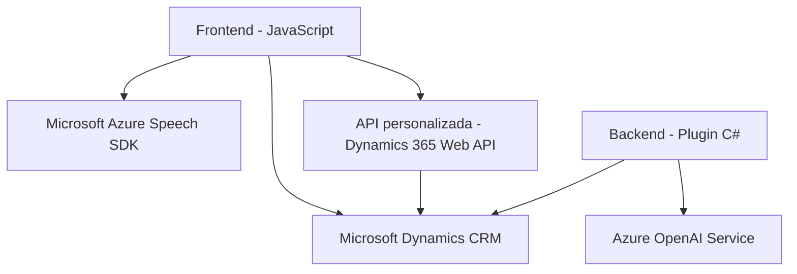

### **Análisis técnico detallado**

#### **Breve resumen técnico**
El repositorio parece ser una solución híbrida que combina un **frontend** basado en JavaScript y un **backend/plugin** de Microsoft Dynamics CRM. Utiliza tecnologías como **Microsoft Azure Speech SDK** para entrada/salida de voz, y **Azure OpenAI Service API** para procesos de inteligencia artificial.

---

### **Descripción de arquitectura**
Este sistema tiene una arquitectura **combinada basada en capas** que interactúa con APIs externas para proporcionar servicios específicos. El frontend utiliza JavaScript para manipular formularios en la interfaz de usuario, y el backend/plugin amplía las funcionalidades de Microsoft Dynamics CRM con capacidades de transformación de datos mediante servicios de Azure.

1. **Frontend:**
   - Funciona como una **capa de presentación** interactiva, con funcionalidades como entrada de voz, procesamiento de comandos verbales y síntesis de voz.
   - Los patrones identificables incluyen **event-driven** (callbacks para carga de SDKs y reconocimiento de voz) y **facade pattern** para encapsular el uso de SDKs y APIs externas.

2. **Backend/Plugins:**
   - El plugin en C# actúa como una **capa de lógica de negocio**, siendo independiente de la capa de presentación.
   - Sigue el patrón de **Service-Oriented Architecture (SOA)** delegando la lógica al servicio externo (Azure OpenAI).

---

### **Tecnologías usadas**
1. **Frontend:**
   - **JavaScript**: Lógica interactiva en la capa de presentación.
   - **Microsoft Azure Speech SDK**: Sintetización y reconocimiento de voz en tiempo real.
   - Integración con **Microsoft Dynamics 365 Web API**.

2. **Backend:**
   - **C#**: Plugins personalizados de CRM para lógica comercial avanzada.
   - **Microsoft.Xrm.Sdk**: Para integración directa con el entorno CRM.
   - **Azure OpenAI Service**: Transformación de texto basada en inteligencia artificial.
   - **Newtonsoft.Json** y **System.Text.Json**: Manejo y transformación de datos JSON.

3. **Externo:**
   - **Azure APIs** (Speech SDK, OpenAI).

---

### **Dependencias o componentes externos**
1. **Azure Speech SDK**: Utilizado en frontend para sintetización y reconocimiento de voz.
2. **Azure OpenAI Service**: Utilizado en backend para transformación avanzada de texto.
3. **Dynamics 365 Web API**: Acceso a datos internos del entorno Microsoft Dynamics.
4. **Plugins de Microsoft CRM**: Extensión del modelo CRM estándar.

---

### **Diagrama Mermaid**

---

### **Conclusión final**
La solución representa una arquitectura híbrida basada en capas, con una integración fuerte de APIs externas para interacción avanzada de voz e inteligencia artificial. Este diseño promueve la separación de responsabilidades entre el frontend y backend, y el uso de servicios externos aporta flexibilidad y escalabilidad.

#### **Ventajas:**
- Modularidad en la integración de servicios (Speech SDK, OpenAI).
- Backend orientado a servicio, permitiendo aislación de lógica y escalabilidad.
- Utilización nativa de Microsoft Dynamics CRM, extendiendo su funcionalidad.

#### **Desafíos:**
- Alta dependencia en servicios externos (Azure Speech SDK, OpenAI).
- Potenciales problemas de latencia debido a la comunicación entre APIs externas.
- Requiere configuraciones robustas de seguridad y red para las integraciones.

Este diseño es ideal para soluciones empresariales que necesitan aprovechar tecnologías modernas como IA y entrada/salida de voz.