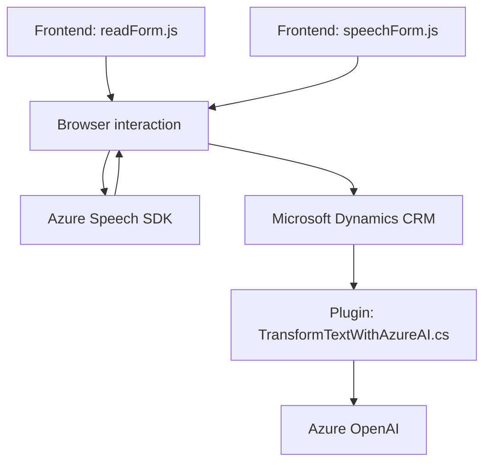

### Breve resumen técnico
El repositorio contiene archivos relacionados con frontend (integración y visualización en el navegador) y un plugin para Microsoft Dynamics CRM. Estos componentes trabajan conjuntamente para proporcionar una solución que interactúa entre la interfaz de usuario y servicios externos, particularmente Azure Speech SDK y Azure OpenAI. La funcionalidad incluye la conversión de texto a voz, reconocimiento de voz, y transformación de texto basada en IA para aplicaciones empresariales en un entorno de CRM.

---

### Descripción de arquitectura
La arquitectura general parece ser **modular basada en n-capas**, donde cada componente tiene una responsabilidad delineada:
1. **Capa de presentación (Frontend):** Archivos como `readForm.js` y `speechForm.js` gestionan la interacción con el usuario utilizando JavaScript en el navegador. Aprovechan las capacidades de Azure Speech SDK para la generación de voz y reconocimiento de voz.
2. **Capa de negocio (Plugin):** El archivo `TransformTextWithAzureAI.cs` encapsula la lógica de negocio para interacción con Azure OpenAI API, validación de texto y transformación hacia objetos JSON estructurados.
3. **Capa de integración (CRM y APIs externas):** Usa el SDK de Microsoft Dynamics para interactuar directamente con los datos del CRM, mientras integra servicios externos como Azure Speech y OpenAI.

La combinación entre el frontend dinámico y el plugin representa una arquitectura híbrida al usar servicios externos, típicamente denominada como **arquitectura de integración en n capas**.

---

### Tecnologías usadas
1. **Frontend:**
   - **JavaScript:** Para lógica de cliente y manipulación del DOM.
   - **Azure Speech SDK:** Para generación de voz y reconocimiento de comandos de voz.
   - **HTML/DOM API:** Manipulación del formulario en el navegador.

2. **Backend:**
   - **Microsoft Dynamics SDK:** Para interacciones con el sistema CRM.
   - **Azure OpenAI API:** Para transformación y análisis avanzado de texto.
   - **C# (.NET Framework/Standard):** Lenguaje para el plugin Dynamics.

---

### Dependencias y componentes externos
1. **Azure Speech SDK:** Biblioteca cargada dinámicamente dentro del navegador para síntesis y reconocimiento de voz.
2. **Azure OpenAI API:** Consumida en el plugin `TransformTextWithAzureAI` para transformación de texto con modelos GPT.
3. **Microsoft Dynamics SDK (`Microsoft.Xrm.Sdk`):** Utilizado en el plugin para operaciones específicas del CRM.
4. **APIs externas del CRM:** Como `trial_TransformTextWithAzureAI`, para procesamientos adicionales.
5. **Navegadores modernos:** Los scripts requieren compatibilidad con navegadores que soporten JavaScript dinámico y acceso al DOM.

---

### Diagrama Mermaid 100% compatible con GitHub Markdown

---

### Conclusión final
La solución implementada en el repositorio combina elementos de frontend con plugins en un entorno de Microsoft Dynamics CRM, aprovechando servicios externos como Azure Speech SDK y OpenAI para ofrecer funcionalidades avanzadas de interacción usuario-sistema mediante texto, voz y APIs AI. Aunque actualmente se sigue una arquitectura n-capas que resulta funcional y eficiente en un entorno corporativo, se recomienda:
1. Refactorizar el frontend para adoptar patrones como **MVVM (Model-View-ViewModel)** usando frameworks modernos como React o Vue.js para mejorar la separación de concerns.
2. Implementar mecanismos seguros para el manejo de claves de API y datos sensibles mediante variables de entorno o sistemas de configuración encriptados.
3. Evaluar una transición hacia una arquitectura de **microservicios** si los requisitos escalan en términos de módulos independientes y crecimiento de la solución.