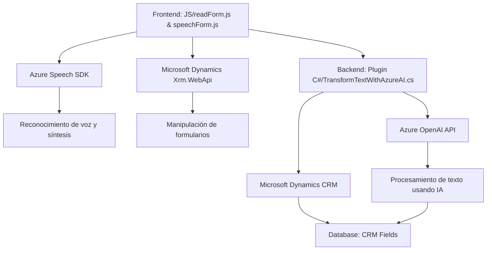

### Breve resumen técnico
El análisis de los tres archivos revela que el repositorio está diseñado para integrar servicios de reconocimiento de voz y procesamiento de texto con un enfoque en accesibilidad y mejora de formularios. Utiliza tecnologías de Microsoft como Azure Speech SDK y Dynamics CRM, además de Azure OpenAI, para proporcionar capacidad de síntesis de voz, transcripción, transformación avanzada de texto y integración de datos en formularios.

---

### Descripción de arquitectura
1. **Tipo de solución**:  
   - Es una solución **client-server** con enfoque en integración de **servicios inteligentes**. Incluye un **frontend modular** en JavaScript para interacción de formularios y un backend desarrollado como **plugin** para Dynamics CRM, extendido con capacidades de IA y Azure Speech.

2. **Arquitectura general**:  
   - **Frontend**: Modular con enfoque en **n-capas**, incluyendo capa lógica para análisis de formularios y capa de integración con Azure.
   - **Backend/plugin**: Arquitectura **orientada a servicios** (SOA), donde cada plugin es un servicio desacoplado que cumple tareas específicas.
   - Ambos módulos están fuertemente gobernados por patrones de integración con APIs externas y soporte para tareas específicas.

---

### Tecnologías usadas
1. **Frontend**:  
   - Principal lenguaje: **JavaScript**.
   - Servicios y librerías: 
     - **Azure Speech SDK** (procesamiento de voz y API).
     - **Microsoft Dynamics Xrm.WebApi** (integración DOM/cliente con Dynamics).
   - Usabilidad avanzada con enfoque accesibilidad mediante síntesis de voz y gestión vía IA.

2. **Backend**:  
   - Lenguaje: **C#**.  
   - Framework: **Dynamics CRM Plugin Framework** (extendido mediante Integration API).  
   - Servicios y librerías: 
     - **Azure OpenAI Service** (procesamiento y generación JSON desde texto).  
     - **System.Net.Http** para consumo de APIs RESTful.  
     - **Newtonsoft.Json** y **System.Text.Json** para manejar datos JSON.

---

### Dependencias o componentes externos
1. **Azure Speech SDK**:
   - Servicios de reconocimiento y síntesis de voz.
   - Configuración dinámica mediante claves (`azureKey` y `azureRegion`).

2. **Azure OpenAI**:
   - Llamadas REST API, regras específicas para transformar texto dinámico utilizando capacidades de IA.

3. **Microsoft Dynamics CRM**:
   - Dependencias internas como `Xrm.WebApi.online` en el frontend para manipulación de formularios y ejecución de plugins en el backend.

4. **HTTP Handlers**:
   - Gestores de conexión para integrar datos de terceros desde REST APIs.

---

### Diagrama Mermaid
Aquí está un diagrama simplificado que muestra las relaciones entre los componentes frontend, backend y servicios externos:

---

### Conclusión final
Este repositorio combina componentes frontend y backend para proveer una solución completa de accesibilidad e integración inteligente con formularios mediante tecnologías AI y servicios de voz. El frontend actúa como una capa interactiva modular, mientras que el backend se estructura como un plugin especializado que gestiona operaciones de procesamiento extendidas por IA. La elección de Microsoft Dynamics CRM y Azure servicios garantiza la escalabilidad y la potencia de la solución en escenarios de negocio.