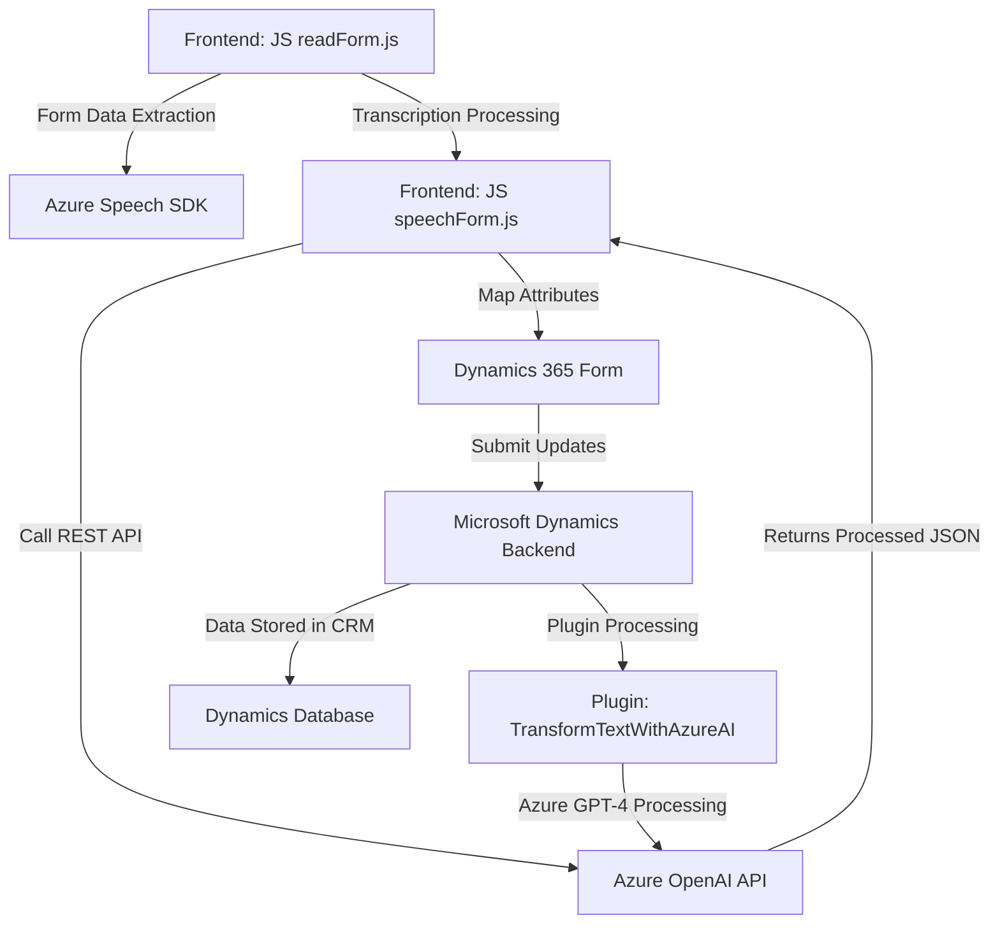

### Breve resumen técnico:
El repositorio combina funcionalidades en JavaScript y C# para crear una solución **híbrida** que integra capacidades de reconocimiento y síntesis de voz mediante Azure Speech SDK y procesamiento avanzado de texto basado en inteligencia artificial (GPT-4 hospedado en Azure OpenAI). Está diseñado para interactuar con formularios en Dynamics 365 y enriquecerlos con funciones basadas en voz e IA.

### Descripción de arquitectura:
La arquitectura sigue un enfoque **cliente-servidor** con una clara separación entre capas:
1. **Frontend JavaScript (readForm.js, speechForm.js):** Facilita comunicación entre el usuario, Azure Speech SDK y Dynamics 365, procesando datos del formulario y transcripciones.
2. **Backend Microsoft Dynamics Plugin (TransformTextWithAzureAI.cs):** Procesa los datos usando Azure OpenAI y transforma textos mediante reglas personalizadas.
3. **Servicios Externos:** Azure Speech SDK y Azure OpenAI se utilizan como proveedor de funcionalidades avanzadas para reconocimiento de voz y procesamiento de texto. Esto indica una fuerte dependencia en una **nube externa**.

Se observa una **arquitectura de múltiples capas**: 
- **Presentación en el frontend (JavaScript):** Procesa datos y envía/recibe solicitudes al backend.
- **Lógica de negocio en el backend:** Dynamics CRM Plugin procesa y ejecuta reglas específicas.
- **Servicios externos (Azure Speech/OpenAI):** Proveen funcionalidades extendidas.

### Tecnologías usadas:
1. **Azure Speech SDK:** Reconocimiento y síntesis de voz.
2. **Microsoft Dynamics SDK:** Integración con formularios y lógica de negocio de CRM.
3. **Azure OpenAI (GPT-4):** Transformación y enriquecimiento avanzado de texto.
4. **JavaScript:** Frontend dinámico para interacción con usuario.
5. **C#:** Backend dedicado a la lógica de negocio y procesamiento avanzado de datos.

### Patrones observados:
1. **Modularización:** Agrupación de funciones en unidades con responsabilidades específicas (ej: procesamiento del formulario, transcripción de voz).
2. **Callback y Promises:** Mecanismos comunes para manejo de flujo asíncrono (sobresaliente en JavaScript).
3. **Dependency Injection (DI):** Implementación en plugins de Dynamics CRM para obtener servicios.
4. **SDK Integration:** Uso directo de bibliotecas externas (Azure SDK).
5. **Api Gateway Interaction:** Comunicación con servicios externos (Azure OpenAI API y Speech SDK).

### Diagrama Mermaid:

### Conclusión final:
El repositorio implementa una solución basada en integración entre diferentes tecnologías de Microsoft (Dynamics CRM, Azure Speech SDK y Azure OpenAI). Esto refleja **multicapa (cliente, servidor y servicios externos)** y patrones de diseño que favorecen la modularidad, escalabilidad y adaptabilidad a sistemas basados en IA y reconocimiento de voz. Sin embargo, la dependencia directa en servicios externos de Azure y Dynamics limita su portabilidad a otros entornos.