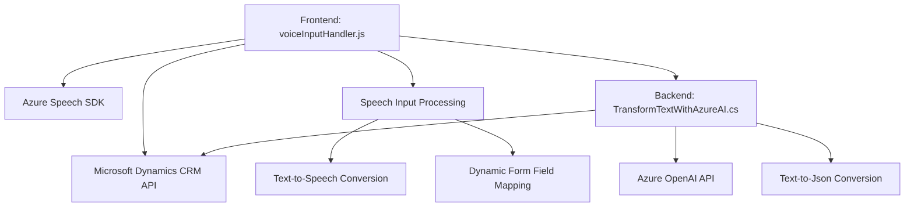

### Análisis técnico

#### Breve resumen técnico
El repositorio descrito contiene archivos que implementan funcionalidades relacionadas con la interacción entre formularios dinámicos, entrada de voz y procesamiento de texto mediante reconocimiento de voz y sistemas inteligentes basados en Azure. Se observa una clara orientación a la arquitectura modular y uso de APIs externas para ampliar funcionalidades en entornos de Dynamics 365.

---

#### Descripción de arquitectura
La solución se centra en la integración de múltiples componentes basados en comunicación cliente-servidor (Frontend y Plugins). Sus características incluyen:
1. **Integración nativa y externa**:
   - En el lado **cliente (frontend)**, se incluye funcionalidad para entrada y salida de voz basada en SDK específico (Azure Speech), interacción directa con formularios de Dynamics 365 y procesamiento de comandos semiestructurados.
   - En el lado **servidor (plugins)**, se procesa texto dinámico mediante Azure OpenAI usando un _plugin_ de Dynamics para transformar datos en JSON según normas que pueden ser predefinidas.
2. **Arquitectura n-capas**:
   - Conformada por capas claras: frontend (entrada de voz y presentación), backend (plugin para procesamiento externo) y servicios externos (Azure).

---

#### Tecnologías usadas
1. **Frontend (JavaScript)**:
   - **Frameworks y APIs**:
     - Azure Speech SDK.
     - Microsoft Dynamics CRM API.
   - **Patrones**:
     - Modularización de funciones.
     - Factory Method para configurar componentes dinámicos.
     - Gestión dinámica de dependencias externas (carga condicional del SDK).
2. **Backend (Plugin en C#)**:
   - **Plataforma**: Dynamics 365.
   - **Servicios externos**: Azure OpenAI API.
   - **Patrones**:
     - Plugin Pattern.
     - External API Integration.

---

#### Diagrama **Mermaid** válido para GitHub

---

#### Conclusión final
La estructura del proyecto y los archivos analizados indican una solución bien diseñada para integrar procesamiento avanzado de voz y texto con Dynamics 365. El uso de dependencias externas como Azure Speech SDK y OpenAI API refuerzan su capacidad de manejar contextos empresariales habilitados por IA. La arquitectura sigue el principio de **n-capas**, separando las operaciones entre interfaz de usuario, procesamiento de datos y APIs externas, lo que permite escalabilidad y mantenimiento según las mejores prácticas.