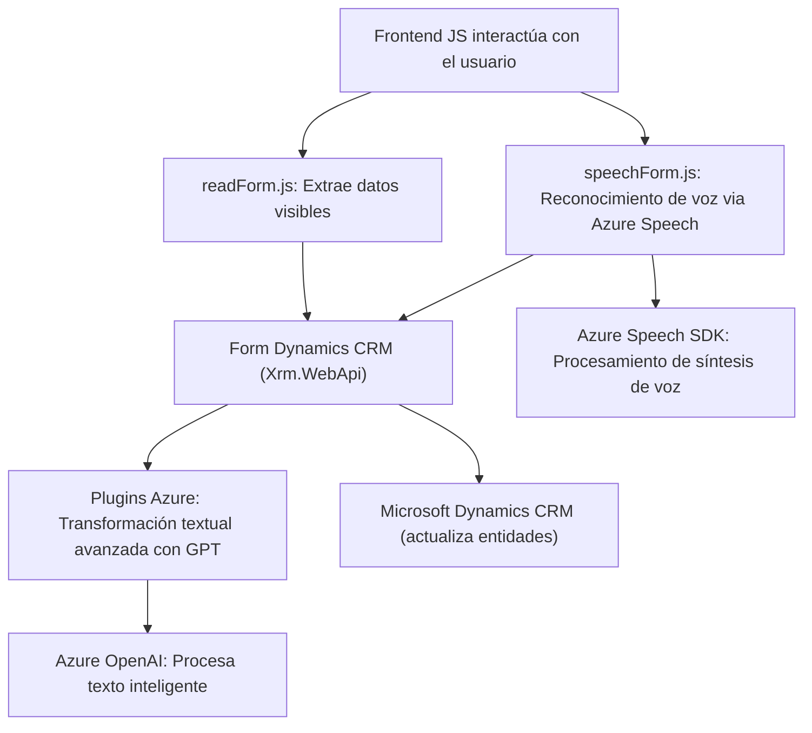

### Breve resumen técnico:
El repositorio contiene tres componentes principales que integran Microsoft Dynamics CRM con capacidades cognoscitivas de Azure. Dos archivos implementan funciones para recoger entradas y procesarlas en front-end (`readForm.js`) y reconocimiento de voz (`speechForm.js`), mientras que el tercero define un plugin de CRM para procesar texto usando la API de Azure OpenAI (`TransformTextWithAzureAI.cs`).

---

### Descripción de la arquitectura:
La solución usa una arquitectura de **n capas** combinada con una aproximación orientada a servicios. Los archivos de front-end gestionan la interacción del usuario y la comunicación con servicios externos (Azure Speech y APIs de Dynamics CRM). Por otro lado, el backend (implementado como plugins de Dynamics CRM) se integra directamente con Azure OpenAI para manejar la transformación de texto mediante servicios cognoscitivos.

**Capas detectadas:**
1. **Capa de presentación:** Gestionada principalmente por los archivos JavaScript, que interactúan con formularios y componentes visuales de Dynamics.
2. **Capa lógica:** Delegación de procesamiento de voz y texto, con uso de SDKs y APIs externas.
3. **Capa de integración:** Comunicación directa con servicios de Azure y Dynamics CRM desde los plugins.

---

### Tecnologías usadas:
1. **Frontend:**
   - Azure Speech SDK (sintetización de voz, reconocimiento de entrada).
   - Microsoft Dynamics CRM API (`Xrm.WebApi` para operaciones en formularios).
   - ECMAScript (modularidad y programación asincrónica).

2. **Backend:**
   - Microsoft Dynamics CRM SDK (IPlugin, IPluginExecutionContext).
   - Azure OpenAI (GPT-4): Modelos cognoscitivos para procesar datos textuales.
   - Newtonsoft.Json & System.Net.Http: Librerías para manejar APIs y JSON en C#.

3. **Integración:**
   - Uso de principios RESTful para consumir servicios de Azure y API personalizada en Dynamics CRM.
   - Arquitectura basada en delegación: lógica del plugin centra funciones específicas en servicios especializados (voz, IA).

---

### Dependencias o componentes externos:
- **Azure Speech SDK:** Facilita la interacción con servicios cognitivos para voz.
- **Azure OpenAI API:** Permite la transformación avanzada de texto con GPT-4.
- **Microsoft Dynamics CRM API:** Para manejar las entidades y facilitar extensiones a nivel de plugin (IPlugin).
- **Newtonsoft.Json:** Serialización/deserialización de objetos JSON en el backend.
- **Sistema gestor de formularios:** Dynamics proporciona un sistema de gestión de atributos que funciona como puente entre capas visuales y de datos.

---

### Diagrama Mermaid:

---

### Conclusión final:
La solución es un sistema modular para integrar Microsoft Dynamics CRM con capacidades cognitivas modernas, utilizando Azure Speech SDK y Azure OpenAI. Combina frontend dinámico con plugins backend, asegurando extensibilidad y procesamiento avanzado. Su arquitectura n capas es adecuada para proyectos empresariales que interactúan con múltiples APIs y componentes distribuidos.