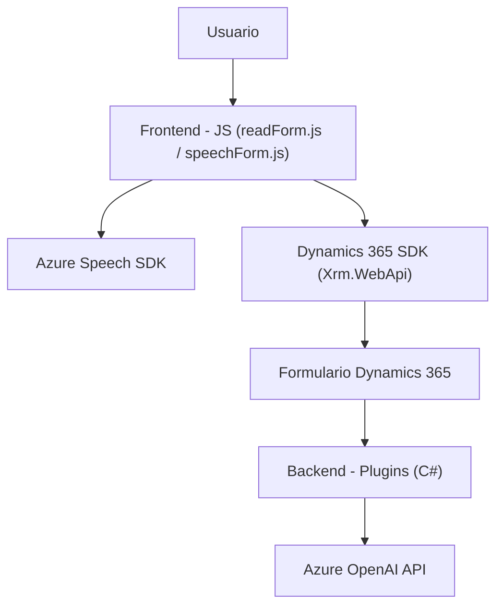

### Análisis y Explicación del Repositorio

---

#### Breve Resumen Técnico

El repositorio contiene múltiples archivos específicos diseñados para extender funcionalidades de Dynamics 365 mediante servicios externos, como Azure Speech SDK y Azure OpenAI. Los archivos muestran una clara separación entre la lógica del frontend (interfaz del usuario y procesamiento de datos) y el backend (manipulación de texto y reglas de negocio), destacando una solución híbrida entre cliente-API y servicios en la nube.

---

#### Descripción de Arquitectura

La solución está basada en una arquitectura **client-server** con elementos de **microservicios**.  
1. **Frontend (JavaScript):**
   - Se construye modularmente para integrar Azure Speech SDK, procesar formularios, manejar voz y texto.
   - Usa patrones de programación asíncrona y Delegación con callbacks para la carga del SDK y el manejo de eventos en tiempo real.
   - Contiene un flujo de trabajo bien estructurado para la gestión de entrada y salida de datos de Dynamics 365.

2. **Backend (C# Plugin):**
   - Adopta el modelo estándar de plugins para Dynamics CRM, encapsulando reglas específicas de negocio e interacción con Azure OpenAI.
   - El plugin se comunica con un servicio REST externo (Azure OpenAI API) para transformar y devolver texto estructurado al usuario.

3. **Microservicios:**
   - Servicios altamente desacoplados, como Azure Speech SDK y Azure OpenAI, se integran mediante REST API en diversas partes de la solución.

---

#### Tecnologías Usadas

1. **Frontend:**
   - **JavaScript**: Principal lenguaje para manejar lógica del cliente.
   - **Azures Speech SDK**: Reconocimiento y síntesis de voz para funciones como lectura y transcripción.
   - **Dynamics 365 SDK (Xrm.WebApi)**: Manipulación de datos en contexto de formularios CRM.

2. **Backend:**
   - **C#**: Lenguaje usado para crear los plugins.
   - **Azure OpenAI API (GPT-4)**: Procesamiento inteligente de texto.
   - **Newtonsoft.Json**: Deserialización/serialización de datos JSON en el formato requerido.
   - **HTTP Client**: Para realizar solicitudes externas al servicio de OpenAI.

3. **General:** 
   - **REST APIs**: Integración estándar con servicios externos.

---

#### Dependencias o componentes externos

Las principales dependencias son:
1. **Azure Speech SDK**: Carga directa a través de su URL pública.
2. **Dynamics 365 SDK**: Para manipulación del contexto del CRM (entidades, formularios, etc.).
3. **Azure OpenAI API**: Proporciona transformaciones de texto inteligentes mediante inteligencia artificial.
4. Herramientas de desarrollo modernas:
   - `System.Net.Http` para solicitudes HTTP en plugins.
   - JSON libraries (`System.Text.Json`, `Newtonsoft.Json`) para manejar estructuras de datos.

Adicionalmente, la arquitectura podría depender de servicios de autenticación de Microsoft Azure y configuraciones sensibles como claves API, endpoints regionales y permisos de usuario en Dynamics 365.

---

#### Diagrama **Mermaid** compatible con **GitHub Markdown**

---

#### Conclusión Final

La solución combina principios de modularidad, programación asíncrona y desacoplamiento mediante integración con servicios externos. Está diseñada para proporcionar procesamiento avanzado mediante herramientas cloud (Azure Speech y Azure OpenAI), permitiendo una interacción enriquecida de usuario dentro de Dynamics 365. 

El diseño puede ser clasificado como:
1. **Distribuido con microservicios**: con Azure integrado como un servicio externo.
2. **Capas tradicionales en el diseño CRM**: separando frontend, lógica de negocio y backend.

El diagrama refleja la estructura global y deja claro cómo cada componente depende e interactúa con los demás.