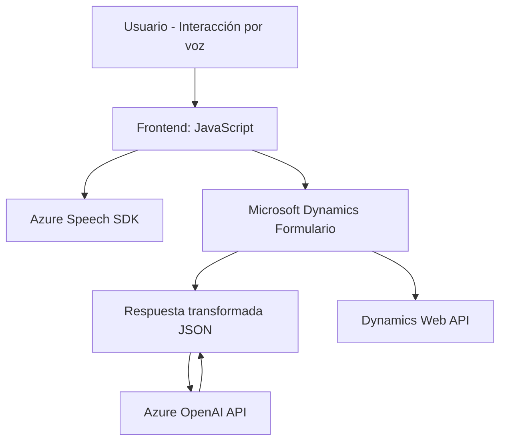

# Resumen técnico

Este repositorio combina diversas tecnologías, principalmente orientadas a una **integración entre Dynamics CRM** y el **Azure Speech SDK**, para lograr interacciones avanzadas mediante voz y procesamiento de lenguaje natural. La solución incluye módulos de frontend para la interacción por voz y backend personalizado en forma de plugins de Dynamics CRM que se conectan a OpenAI para procesamiento de texto.

# Descripción de arquitectura

La arquitectura presenta las siguientes características:
1. **Frontend**
   - Implementación con JavaScript, formando parte de una solución que interactúa con formularios de Dynamics.
   - Integración con SDK externos, específicamente **Azure Speech SDK**.
   - Uso de patrones de diseño modular con separación clara de lógica para lectura y escritura en formularios, síntesis y reconocimiento de voz.
2. **Backend**
   - Basado en plugins que extienden Dynamics CRM, siguiendo el patrón de **plugin Dynamics**.
   - Comunicación directa con servicios como **Azure OpenAI API**.
   - Manejo de lógica empresarial en el plugin, utilizando entradas desde Dynamics y servicios externos.

En términos generales, la arquitectura es **n capas** en el backend (separación entre capas de presentación [formularios], lógica [plugins] y datos [Dynamics CRM y APIs]), mientras que el frontend está orientado a **eventos y modularidad funcional**.

---

# Tecnologías usadas

1. **Frontend**:
   - **JavaScript**: Desarrollo modular con funciones especializadas.
   - **Azure Speech SDK**: Sintetizador de voz y reconocimiento de voz basado en servicios cloud.
   - **Dynamics Web API**: Permite comunicación entre el frontend y el backend de Dynamics CRM.
2. **Backend**:
   - **C# y Dynamics SDK**: Extensiones personalizadas dentro de Dynamics bajo el diseño de plugins.
   - **Azure OpenAI API**: Procesamiento avanzado de texto usando inteligencia artificial.
3. **Dependencias**:
   - **Newtonsoft.Json** (deserialización de JSON en el backend).
   - **System.Net.Http** (realización de llamadas HTTP al servicio OpenAI).
   - Otros espacios de nombres estándar .NET para manipulación de datos.

---

# Diagrama Mermaid

---

# Conclusión final

Este repositorio define una solución que aprovecha servicios cloud como **Azure Speech SDK** y **Azure OpenAI** para interactuar con los formularios de Dynamics CRM. El diseño permite manejar tanto la síntesis como el reconocimiento de voz en el frontend, mientras el backend transforma y procesa datos usando inteligencia artificial. Adicionalmente, la arquitectura **n capas** facilita la escalabilidad y modularización. Sin embargo, la dependencia con SDK externos debe ser gestionada cuidadosamente para evitar futuras problemas de acoplamiento con servicios de terceros.