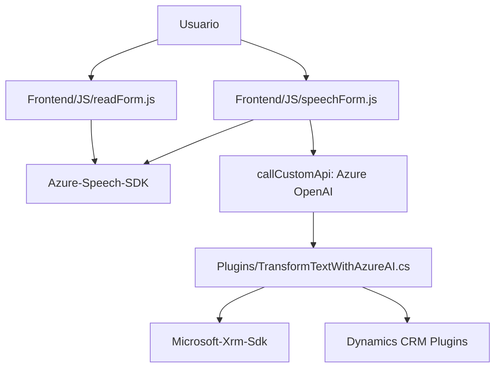

### Breve Resumen Técnico

El repositorio contiene archivos relacionados con la gestión de formularios y funcionalidades de procesamiento de voz asistidos por servicios externos (como Azure Speech SDK y Azure OpenAI). Está orientado principalmente a la integración de formularios dinámicos en sistemas como Dynamics CRM y al enriquecimiento de texto mediante APIs inteligentes.

---

### Descripción de Arquitectura

La arquitectura es modular, divida en dos principales capas:

1. **Frontend**: Implementa lógica de interacción con usuarios finales para la entrada de voz y la extracción/mapa de datos de formularios. Utiliza SDK y APIs externas.
2. **Dynamics CRM Plugins**: Extiende la funcionalidad de CRM mediante la transformación de texto (usando Azure OpenAI) y la implementación de reglas personalizadas como servicios backend en forma de plugins.

La solución exhibe elementos de **arquitectura n-capas**, con una capa de presentación (Front-end) conectada a una capa de lógica de negocio (CRM Plugin/Servicios externos). Además, integra características de **microservicios** mediante llamadas a APIs externas (Azure Speech y Azure OpenAI). Esto permite un enfoque desacoplado y extensible.

---

### Tecnologías Usadas

1. **Javascript Frontend**: Gestión de lógica en el navegador y manejo del SDK para entrada/salida de voz.
2. **Azure Speech SDK**: Procesamiento de reconocimiento de voz, síntesis de audio, y transcripción.
3. **Dynamics CRM SDK**: Gestión de formularios y plugins centrados en el ecosistema de Dynamics CRM.
4. **Azure OpenAI Service**: Análisis y transformación avanzada de texto según normas.
5. **Newtonsoft.Json**: Procesamiento de JSON en servicios REST del plugin de Dynamics CRM.
6. **Dependencias HTTP y JSON**: `System.Net.Http` y `System.Text.Json` permiten realizar integraciones ágiles con servicios Azure.

---

### Diagrama Mermaid Válido para GitHub

---

### Conclusión Final

Este proyecto combina tecnologías modernas (Azure Speech SDK, Azure OpenAI Service, Dynamics SDK) en una arquitectura **modular y n-capas**. La capa de front-end basada en JavaScript se comunica con servicios externos para entrada y síntesis de voz, mientras que los plugins en la capa de negocio extienden la funcionalidad de Dynamics CRM para integración avanzada con Azure. Hay un gran enfoque en **separación de responsabilidades** y patrones como integración API, control asíncrono, y procesamiento modular.