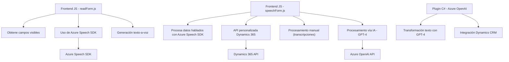

### Breve Resumen Técnico
El repositorio presenta tres componentes principales:  
1. **Frontend** con funcionalidades orientadas a la interacción con formularios y procesamiento de voz/texto mediante Azure Speech SDK.  
2. **Plugins para Dynamics CRM**, donde se utiliza Azure OpenAI (GPT-4) para transformar contenido, integrándose como parte del ecosistema de Dynamics CRM mediante el patrón plugin.  
3. Comunicación con servicios externos como Dynamics 365 Web API y Azure Speech/OpenAI SDK para potenciar capacidades con Inteligencia Artificial y funcionalidades de reconocimiento/síntesis de voz.

---

### Descripción de Arquitectura
La arquitectura muestra una combinación de **n capas** y **integración basada en SDKs/APIs externas**:  
1. **Frontend JS**: Trabaja como una capa de presentación que interactúa con un sistema web o CRM. Utiliza un patrón modular basado en funciones.  
2. **Plugin C#**: Funciona como una extensión de la capa de lógica de negocio en Microsoft Dynamics CRM, integrando capacidades desde Azure OpenAI.  
3. Uso de servicios externos como Azure Speech SDK y Dynamics 365 Web API para proporcionar funcionalidades específicas (procesamiento de voz, datos transaccionales, inteligencia artificial).  

Potencialmente podría evolucionar hacia **microservicios** si se desacopla cada módulo (synth voice, process AI, etc.) y se distribuye funcionalmente.

---

### Tecnologías Usadas
1. **Frontend**:  
   - Lenguaje: JavaScript.  
   - Framework/capacidad: Azure Cognitive Speech SDK.  
   - API externa: Dynamics 365 Web API.  

2. **Backend Plugin**:  
   - Lenguaje: C#.  
   - Framework: Microsoft Dynamics SDK.  
   - API externa: Azure OpenAI, Dynamics Web API.

3. **Patrones**:  
   - Modular design: Funciones separadas por responsabilidades específicas.  
   - SDK integration: Utilización de SDKs y APIs externos como dependencias centrales, manejados con operaciones asincrónicas.  
   - Dynamic loading: Carga condicional de librerías como el Speech SDK.  
   - Mapper: Traducción de etiquetas a claves técnicas en formularios.  
   - Plugin pattern: Extensión de Dynamics CRM con lógica definida y evaluada en tiempo de ejecución.  

---

### Diagrama Mermaid válido para GitHub

---

### Conclusión Final
El repositorio muestra un enfoque combinado de presentación dinámica (Frontend), gestión de negocio (Plugin), e integración con capacidades avanzadas proporcionadas por servicios en la nube como Azure (Speech SDK, OpenAI). La arquitectura es **modular**, fácil de integrar dentro de un sistema CRM (Dynamics 365), y muestra un uso eficiente del principio de responsabilidad única en su implementación. Sin embargo, se podrían mejorar aspectos como la separación de dependencias sensibles (e.g., API keys) y la abstracción de funcionalidades repetitivas para simplificar el código y facilitar el mantenimiento.