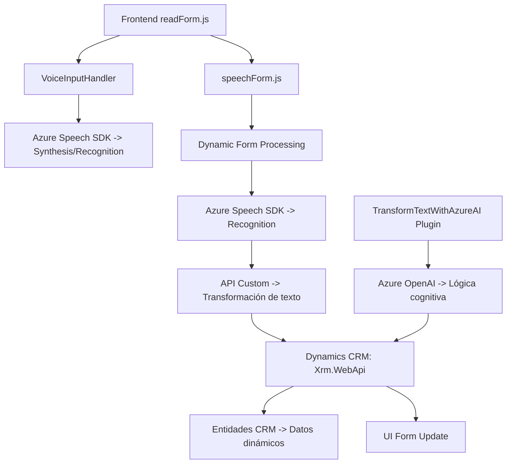

### Resumen técnico:
Los archivos analizados pertenecen a un sistema orientado a la interacción dinámica entre formularios de Dynamics CRM y servicios de procesamiento cognitivo (Azure Speech SDK, Azure OpenAI). La solución parece ser una **API extendida**, diseñada para enriquecer funcionalidades de un entorno CRM utilizando reconocimiento y síntesis de voz, transcripción dinámica y transformación de textos con inteligencia artificial.

---

### Descripción de arquitectura:
1. **Tipo de solución:** 
   - **API y frontend extendidos:** Facilita interacción en tiempo real con formularios, usando datos transcritos que se procesan mediante servicios cognitivos de Azure.

2. **Arquitectura y patrones usados:**
   - **Integración n capas con servicios externos:**
     - Plugins y scripts JavaScript interactúan entre sí a través de Dynamics CRM en una arquitectura de capa lógica, interactuando con servicios web (Azure Speech SDK, OpenAI).
   - **Integración Modular:**
     - Uso de funciones modulares en JavaScript y un patrón plugin para Dynamics CRM.
   - **Wrapper dinámico:**
     - Carga de SDKs gestionada de manera asíncrona, asegurando compatibilidad y rendimiento.
   - **DTO y adaptación de datos:**
     - Se transforman los datos del formulario, aplicándolos como valores en tiempo real.

3. **Dependencias externas presentes:**
   - **SDKs externos:**
     - Azure Speech SDK.
     - Azure OpenAI API para procesamiento cognitivo.
   - **Microsoft Dynamics API (Xrm.WebApi):**
     - Para interacción con formularios y entidades dentro del CRM.
   - **HTTP Networking (C#):**
     - Implementado en el plugin con `HttpClient` para enviar solicitudes externas.
   - **Lógica auxiliar para inteligencia artificial:**
     - Manejo y transformación de datos con patrones de norma establecidos.

---

### Tecnologías usadas:
1. **Frontend/JavaScript:**
   - Interacción con el navegador mediante scripts para leer o escribir en formularios.
   - Azure Speech SDK para síntesis de voz y transcripciones en tiempo real.
   - Métodos asíncronos con llamada a funciones backend (APIs).

2. **Backend/C#:**
   - Plug-in que actúa como microservicio dentro de Dynamics CRM.
   - Consumo de Azure OpenAI mediante solicitudes HTTP y un modelo JSON para estructurar respuestas procesadas.
   - Librerías estándar .NET para manejo de datos, manipulación de cadenas y consumo de API externas.

3. **APIs externas:**
   - Azure Speech SDK para voz a texto y viceversa.
   - Azure OpenAI para aplicar lógica cognitiva en procesamiento textual.

---

### Diagrama Mermaid:
Representación de los componentes principales y su interacción basada en los elementos descritos.

### Conclusión final:
Esta solución implementa una arquitectura híbrida, basada en una aproximación de **n capas integrada**. Utiliza capacidades de frontend para interactuar dinámicamente con los formularios de un sistema CRM, mientras que los plugins en backend gestionan inteligencia artificial y síntesis de voz conectando servicios externos como **Azure Speech SDK** y **Azure OpenAI**. La modularidad del diseño destaca por segmentar la lógica de manera eficiente y adaptable, permitiendo una extensión escalable de las funciones del sistema CRM.

El sistema es óptimo para entornos corporativos que requieren integración avanzada de voz a texto, procesamiento cognitivo y aplicación en formularios dinámicos con datos enriquecidos mediante IA.